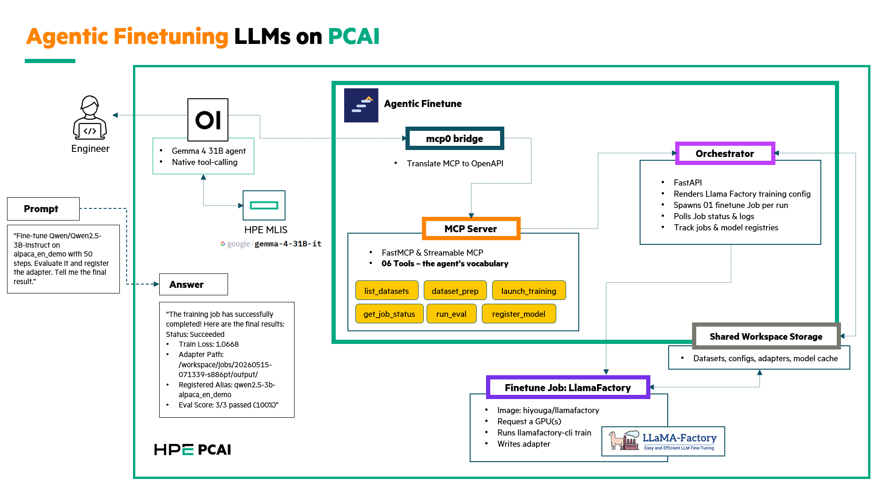

# Agentic Fine-Tuning

| Owner                 | Name     | Email              |
| --------------------- | -------- | ------------------ |
| Use Case Owner        | Daniel Cao      | daniel.cao@hpe.com      |
| PCAI Deployment Owner | Daniel Cao      | daniel.cao@hpe.com      |

## Abstract

Fine-tuning has become a routine production workflow, but the engineer's day-to-day still involves a manual chain of dataset preparation, YAML config authoring, `kubectl` invocations, log tailing, evaluation, and adapter registration. Most of that work is mechanical coordination, not judgment. This demo replaces that chain with a single conversational interface: an agent in Open-WebUI exposes six MCP tools that wrap LlamaFactory and drive Kubernetes Jobs on PCAI.

A natural-language prompt like *"fine-tune Qwen2.5-3B on alpaca_en_demo, evaluate it, and register the adapter"* triggers the full pipeline — dataset prep, training Job creation, status polling, evaluation, and model registration — without the engineer touching a YAML file or running a single `kubectl` command.

- **Accelerates** the experimental fine-tuning loop by collapsing six manual steps into one prompt.
- **Standardizes** training runs through a single orchestration layer that always emits structured artifacts (config, adapter, training loss curve, registry entry).
- **Enables** non-ML engineers to launch and observe fine-tuning runs without learning the LlamaFactory CLI or Kubernetes Job mechanics.

Features:

- Six-tool MCP interface: `list_datasets`, `dataset_prep`, `launch_training`, `get_job_status`, `run_eval`, `register_model`
- Bring-your-own-agent: works with any Open-WebUI compatible model that supports native tool-calling (validated on Gemma 4 31B-it)
- Stateless orchestrator with persistent state on a shared ReadWriteMany volume
- One ephemeral Kubernetes Job per training run, isolated by namespace and RBAC
- Upstream LlamaFactory image used unmodified — no fork, no patches
- Demo-safe stub evaluation mode by default; flip to real evaluation for production benchmarking

Recordings:

- *To be added after recording.*

## Description

### Overview

The demo runs entirely inside a single PCAI namespace. An engineer opens a chat in Open-WebUI, selects an agent model configured with the Agentic Fine-Tuning tool server, and types a request in English. The agent decomposes the request into a sequence of MCP tool calls. Each tool call resolves to a REST call against an orchestrator service, which in turn creates and observes Kubernetes Jobs running LlamaFactory.



Components:

- **Open-WebUI** — chat interface and agent runtime. Validated PCAI framework.
- **Agentic Fine-Tuning pod** — one Helm chart, three containers:
  - `mcpo` — MCP-to-OpenAPI bridge so Open-WebUI's Tool Servers UI can register the toolset
  - `mcp-server` — FastMCP server exposing the six tools
  - `orchestrator` — FastAPI service that renders LlamaFactory configs, creates K8s Jobs, polls status, and maintains the jobs and models registries
- **Kubernetes Job (LlamaFactory)** — ephemeral GPU workload that runs `llamafactory-cli train`, writes the LoRA adapter, and exits
- **Shared workspace** — RWX PersistentVolumeClaim holding datasets, training configs, model adapters, the HuggingFace model cache, and the registries

### Workflow

A typical end-to-end run progresses through these phases:

1. **Prompt** — the engineer asks the agent in English to fine-tune a model on a specific dataset
2. **Dataset preparation** — the agent calls `dataset_prep`, which validates that the requested dataset is present on the workspace volume and registered in `dataset_info.json`
3. **Training launch** — the agent calls `launch_training` with the base model, dataset, LoRA rank, and step count. The orchestrator renders a LlamaFactory training config, writes it to the workspace, and creates a Kubernetes Job via the cluster API
4. **Polling** — the agent calls `get_job_status` periodically (capped per turn by the system prompt) while the Job downloads the base model, trains, and saves the adapter
5. **Evaluation** — once training reaches `succeeded`, the agent calls `run_eval`. In stub mode this returns synthetic pass results immediately; in real mode it spawns a second Job that loads the adapter and runs inference on probe prompts
6. **Registration** — the agent calls `register_model` to record the adapter path under a user-provided alias in `models.json`
7. **Summary** — the agent reports status, train loss, adapter path, registered alias, and eval score back into the chat

Data flow:

- Datasets are seeded into the workspace volume at install time by an init container that copies LlamaFactory's bundled examples (`alpaca_en_demo`, `glaive_toolcall_en_demo`, etc.) into `/workspace/data/`
- Training configs flow from the orchestrator to the Job via `/workspace/jobs/<job-id>/config.yaml`
- Trained adapters flow back from the Job to the orchestrator's view via `/workspace/jobs/<job-id>/output/`
- Base model weights are cached in `/workspace/.cache/huggingface/` and reused across all subsequent training runs
- Registries (`jobs.json`, `models.json`) are written by the orchestrator only and survive pod restarts and reinstalls

## Deployment

### Prerequisites

PCAI cluster requirements:

- AI Essentials Software (AIE) 1.10 or later
- At least one GPU node with the `nvidia.com/gpu` device plugin. Validated on H200 (143GB HBM) and L40S (48GB)
- A StorageClass that supports **ReadWriteMany**. PCAI's default `gl4f-filesystem` (VAST CSI over NFS) works. Verify on a new cluster by trial-binding an RWX PVC against the target class
- Egress to `huggingface.co`, either direct or through an HTTP proxy. The chart pre-configures the HPE corporate proxy (`hpeproxy.its.hpecorp.net:8080`); customize `trainingJob.env` in `values.yaml` for other environments
- Istio service mesh with the `istio-system/ezaf-gateway` available (standard on AIE)

Co-deployed frameworks:

- **Open-WebUI** — must be installed in the same cluster, network-reachable from the Agentic Fine-Tuning pod via service DNS

Other:

- The chart pulls three images: `caovd/agentic-finetune-orchestrator`, `caovd/agentic-finetune-mcp-server`, and `hiyouga/llamafactory`. All three must be pullable from the cluster (directly or via a configured registry mirror).

### Installation and configuration

**Step 1 — Import the framework**

In the AIE UI, navigate to **Tools & Frameworks** → **Import Framework**. Upload the `agentic-finetune-<version>.tgz` chart artifact. Use the default wizard inputs unless your cluster requires overrides.

The default install creates a dedicated namespace, an RWX PVC (`workspace`, 50 GiB on `gl4f-filesystem`), a Deployment with three containers plus an Istio sidecar, RBAC scoped to Jobs and Pod logs in the namespace, a VirtualService at `agentic-finetune.<DOMAIN_NAME>`, and a Kyverno ClusterPolicy for Istio sidecar injection.

First-time installation downloads the LlamaFactory image (~10 GiB) on the assigned node. Expect 3-8 minutes before the pod reaches `4/4 Ready`. Subsequent installs on the same node skip the pull.

**Step 2 — Register the toolset in Open-WebUI**

In Open-WebUI, go to **Settings** → **Tools** → **Tool Servers** → **+**. Add a new OpenAPI tool server:

- URL: `http://agentic-finetune.<framework-namespace>.svc.cluster.local:8000/openapi.json`
- Name: `Agentic-Finetune`

After saving, six tools should be visible under the tool server.

**Step 3 — Create the agent model**

In Open-WebUI, go to **Workspace** → **Models** → **+**. Create a new model configuration:

- Base model: any model with native tool-calling support (Gemma 4 31B-it validated)
- Function Calling: **Native**
- Tools: enable **only** `Agentic-Finetune`
- System prompt: include guidance to cap status polling at 5 per turn and to treat exploratory questions (`what datasets are available`) as questions, not training commands

Save the model as `Agentic Finetune Assistant`.

## Running the demo

### Demo 1 — Single-prompt fine-tune

The canonical end-to-end demo. Total wall-clock: 6-8 minutes, dominated by training time.

Open a fresh chat in Open-WebUI, select the `Agentic Finetune Assistant` model, and send:

> *Fine-tune `Qwen/Qwen2.5-3B-Instruct` on `alpaca_en_demo` with 50 steps. Evaluate it and register the adapter. Tell me the final result.*

The agent autonomously:

1. Calls `dataset_prep` to validate `alpaca_en_demo` on the workspace volume
2. Calls `launch_training` with the requested parameters and receives a job ID
3. Polls `get_job_status` up to 5 times per turn until the Job state is `succeeded`
4. Calls `run_eval` against the trained adapter
5. Calls `register_model` to record the adapter under an alias
6. Replies with status, train loss, adapter path, registered alias, and eval score

If the agent pauses at the polling cap with *"the job is still running, let me know when to check again"*, reply `continue` to resume polling.

For a more compelling side-by-side view, open a terminal next to the chat and watch the Kubernetes side react in real time:

```bash
watch -n 2 'echo "=== Jobs & Pods ===" && \
  kubectl get jobs,pods -n agentic-finetune && \
  echo && echo "=== Recent trainer log ===" && \
  kubectl logs -n agentic-finetune \
    -l agentic-finetune/component=trainer --tail=10 2>/dev/null \
    || echo "(no trainer Job yet)"'
```

When the agent calls `launch_training`, a new `ft-<timestamp>` Job appears in the watch output within seconds.

### Demo 2 — Discovery-first prompt

Demonstrates the agent's question-vs-action distinction. Use this when the audience is interested in agentic UX patterns rather than the fine-tuning machinery.

Send:

> *What datasets are available for fine-tuning?*

The agent calls `list_datasets`, summarizes the available datasets by category (instruction-following, tool-use, reasoning, quick tests), and **stops** — it does not chain into training. This validates that the system prompt's question-vs-action guidance is working.

Follow up with a specific action prompt:

> *Pick a small one and fine-tune Qwen2.5-3B on it. Register the adapter under an obvious alias.*

The agent picks a dataset, justifies the choice in chat, and proceeds through the same six-tool sequence as Demo 1.

## Limitations

**First model download is slow on PCAI clusters with throttled egress.** The first training run on a fresh workspace volume downloads the base model (~6 GiB for Qwen2.5-3B) through whatever egress path the cluster provides. On HPE corp-proxy clusters this can take 60-90 minutes for the first run, dropping to near-instant for subsequent runs. Pre-warm the cache before customer demos.

**Real evaluation requires HF egress from the eval Job.** The default `EVAL_MODE=stub` returns synthetic pass results in milliseconds, which is appropriate for demos but not for production validation. Switching to `EVAL_MODE=real` requires that the eval Job container can reach HuggingFace through the same proxy used by training.

**Single-replica orchestrator.** The orchestrator Deployment uses `strategy: Recreate` because the workspace PVC is mounted RWX-but-single-writer for the registries (`jobs.json`, `models.json`). Horizontal scaling would require migrating the registries to a coordination backend (Postgres, etcd, or similar). Acceptable for D0; revisit if traffic grows.

**Polling-based status, not push.** The agent polls `get_job_status` repeatedly while training runs. A more efficient design would have the orchestrator stream status updates over SSE or webhooks, but that requires Open-WebUI to support streaming MCP responses, which the current Tool Servers UI does not.

**Stub eval is not predictive of real model quality.** The demo's `EVAL_MODE=stub` is structural, not analytical. It confirms the agent's full tool chain completes successfully but tells the audience nothing about whether the fine-tune actually improved the model. For production use cases, replace the stub with domain-specific probe prompts.

**Tool-calling model quality dominates demo robustness.** Smaller agent models (under ~30B parameters) struggle to follow the polling cap and question-vs-action guidance reliably. Gemma 4 31B-it is the smallest model validated to behave consistently across the full six-tool sequence; smaller models may chain incorrectly or ignore the system prompt.

**RWX storage is a hard requirement.** This chart will not function on clusters that only offer RWO storage. Multi-Attach errors will occur the moment a training Job pod is scheduled on a different node from the orchestrator.
