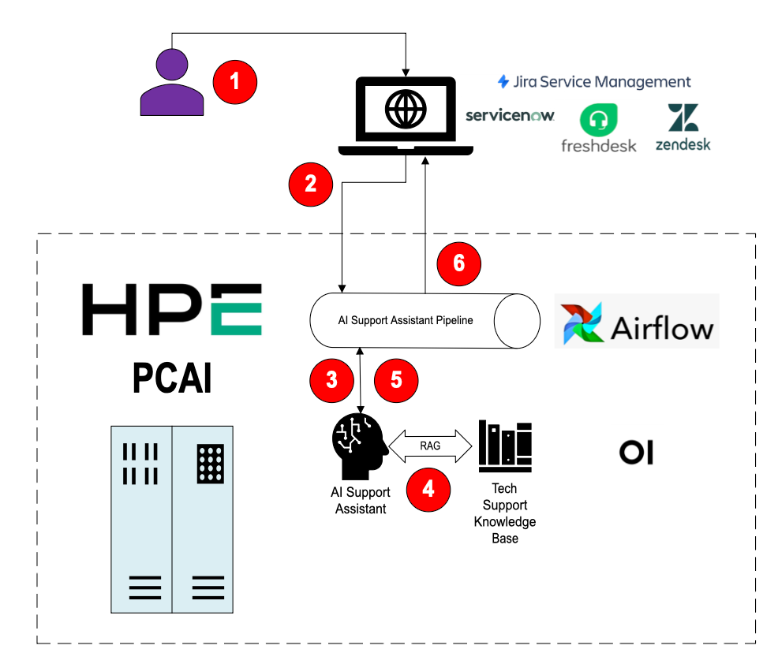
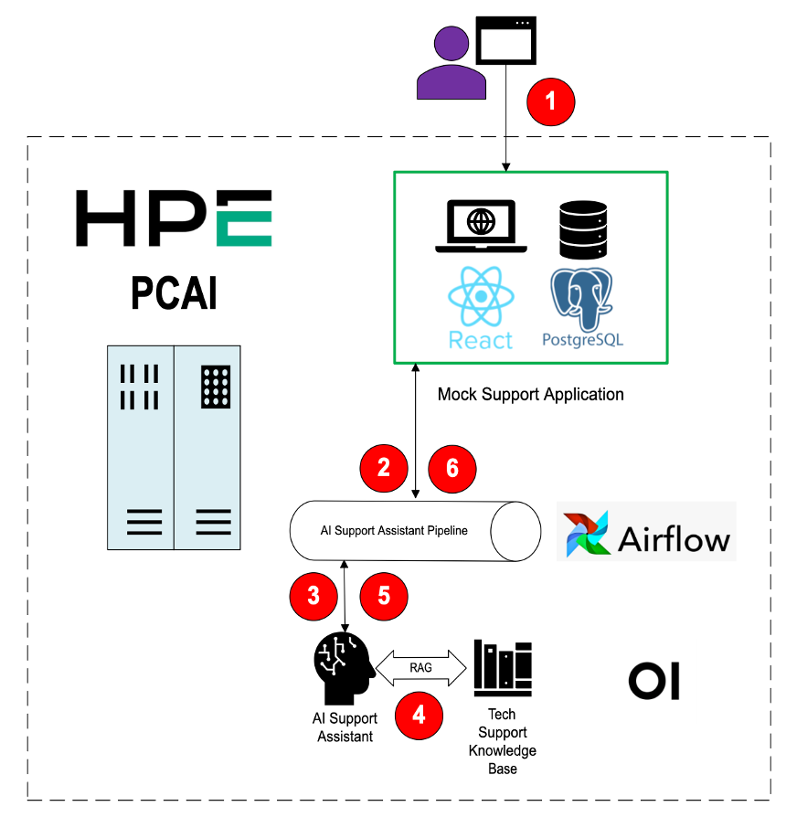

# PCAI Use Case Demo: AI Support Assistant
## Value Proposition

Technical support requests filed by end users can be broadly classified into two groups:

1. **Requests that are fairly common** - Many different users hit the same types of issues, or have similar product usage questions. The answers/solutions to these requests can typically be found in FAQs, knowledge base articles, and/or the product documentation itself. The availability of these answers doesn’t stop customers from opening support cases to ask the questions, though, and therefore technical support teams end up spending a lot of time responding to the same questions over and over.
2. **Unique requests** - These typically concern issues that may be specific to a customer’s environment, or to the specific way they are using a product feature that differs from the norm. The unique nature of these issues means that answers are not likely to be found in any documentation. Thus, technical support personnel need to dedicate time and resources to work with the customer on investigating, troubleshooting, and ultimately finding a solution.

If we could use AI to triage incoming support requests, and automatically respond to the customer with solutions to the common well-documented issues, this would free up more time for the technical support team to work on the unique and more challenging issues.

## Production Workflow

The workflow of the AI Support Assistant in Production would look something like this:

1. A user opens a new support case in whatever case management system they use;
2. An Airflow pipeline is triggered with the details of the support case;
3. The pipeline invokes the AI Support Assistant model running in OpenWebUI;
4. The AI Support Assistant model leverages RAG to search for an answer to the user’s support issue;
5. The AI Support Assistant provides its response to the pipeline;
6. The pipeline updates the support case appropriately.

## Demo Workflow

For the demo, we use a Mock Support Application, running within PCAI, to stand in for an actual case management system. A case can be opened in the Mock Support Application, and then the core of the workflow remains the same.

## Installation and Configuration Requirements

### OpenWebUI

OpenWebUI needs to be installed in the PCAI environment. It is recommended to use the version at the following URL: [https://github.com/ai-solution-eng/frameworks/tree/main/open-webui](https://github.com/ai-solution-eng/frameworks/tree/main/open-webui)

> NOTE: This repo contains two different versions of OpenWebUI, specifically 5.4 and 7.6. As of September 2025, the AI Support Assistant has only been tested against 5.4.

Once installed, OpenWebUI should be configured to use the embedded Ollama Server for inferencing, and the `llama-3` model should be downloaded.

> NOTE: It is also theoretically possible to use an external Ollama Server, or to host the `llama-3` model in MLIS, but neither of these approaches were tested.

Once OpenWebUI is installed and the `llama-3` model has been made available, the next step is to create the RAG knowledge base. The knowledge base must be called "EZUA Troubleshooting Articles". Once created, import all of the documents from the `openwebui/EZUA Troubleshooting Articles` directory.

Finally, the AI Support Assistant model itself can be imported. The file to import is `./openwebui/ai-support-assistant-model.json`

### Postgres

Postgres needs to be installed in the PCAI environment. It is recommended to use the version at the following URL: [https://github.com/ai-solution-eng/frameworks/tree/main/postgresql](https://github.com/ai-solution-eng/frameworks/tree/main/postgresql)

**TBD - Need to write scripts that create the database and then provide instructions on how to run.**

### Airflow

Airflow is already installed on PCAI by default, however there are a number of configuration changes which must be made.

First, if Airflow is not configured with the location from which to read DAG files, then this must be configured. Typically this location will be a Github repository. The file `./airflow/ai-support-assistant-dag.py` must be placed in this location.

**TBD - Use aie02 as an example.**

Next, a connection for Postgres must be configured.

**TBD - Use aie02 as an example.**

Finally, variables must be defined to provide the connection paramters for OpenWebUI.

**TBD - Use aie02 as an example.**

### Mock Support Application

The Mock Support Application can be added to PCAI via the "Import Framework" feature. The tar file to import is `./mock-support-app/helm/mock-support-app-1.0.1.tgz`. The file `./mock-support-app/helm/logo small.png` can be used as the framework icon.

