# PCAI Use Case Demo: AI Support Assistant

| Owner                       | Name                              | Email                                     |
| ----------------------------|-----------------------------------|-------------------------------------------|
| Use Case Owner              | Dale Georg                        | dale.georg@hpe.com                        |
| PCAI Deployment Owner       | Dale Georg                        | dale.georg@hpe.com                        |

## Value Proposition

Technical support requests filed by end users can be broadly classified into two groups:

1. **Requests that are fairly common** - Many different users hit the same types of issues, or have similar product usage questions. The answers/solutions to these requests can typically be found in FAQs, knowledge base articles, and/or the product documentation itself. The availability of these answers doesn’t stop customers from opening support cases to ask the questions, though, and therefore technical support teams end up spending a lot of time responding to the same questions over and over.
2. **Unique requests** - These typically concern issues that may be specific to a customer’s environment, or to the specific way they are using a product feature that differs from the norm. The unique nature of these issues means that answers are not likely to be found in any documentation. Thus, technical support personnel need to dedicate time and resources to work with the customer on investigating, troubleshooting, and ultimately finding a solution.

If we could use AI to triage incoming support requests, and automatically respond to the customer with solutions to the common well-documented issues, this would free up more time for the technical support team to work on the unique and more challenging issues.

## Production Workflow

The workflow of the AI Support Assistant in Production would look something like this:

1. A user opens a new support case in whatever case management system they use;
2. An Airflow pipeline is triggered with the details of the support case;
3. The pipeline invokes the AI Support Assistant model running in OpenWebUI;
4. The AI Support Assistant model leverages RAG to search for an answer to the user’s support issue;
5. The AI Support Assistant provides its response to the pipeline;
6. The pipeline updates the support case appropriately.

## Demo Workflow

For the demo, we use a Mock Support Application, running within PCAI, to stand in for an actual case management system. A case can be opened in the Mock Support Application, and then the core of the workflow remains the same.

## Installation and Configuration

### OpenWebUI

OpenWebUI needs to be installed in the PCAI environment via the "Import Framework" functionality. It is recommended to use the version at the following URL: [https://github.com/ai-solution-eng/frameworks/tree/main/open-webui](https://github.com/ai-solution-eng/frameworks/tree/main/open-webui)

> NOTE: This repo contains two different versions of OpenWebUI, specifically 5.4 and 7.6. As of September 2025, the AI Support Assistant has only been tested against 5.4.

#### Configure the Ollama Server

Once installed, OpenWebUI should be configured to use the embedded Ollama Server for inferencing.

> NOTE: It is also theoretically possible to use an external Ollama Server, or to host the base models in MLIS instead, but neither of these approaches were tested.

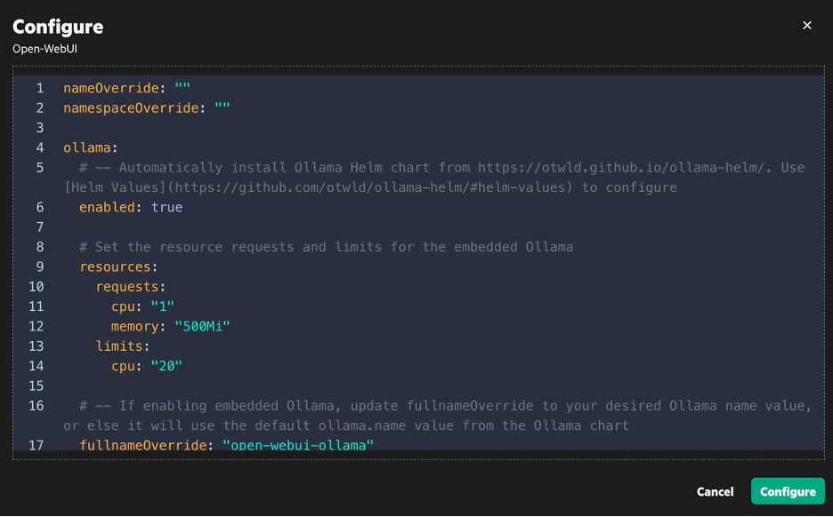

#### Deploy the llama3 Model

To download the `llama-3` model, navigate to the `Settings / Connections` page in the Admin Panel and click the wrench icon next to the Ollama URL. In the "Manage Ollama" dialog box, enter `llama-3` and click the download icon next to the field. Be patient, as it will look like nothing is happening, but after a minute or so you should see a successful download notification.

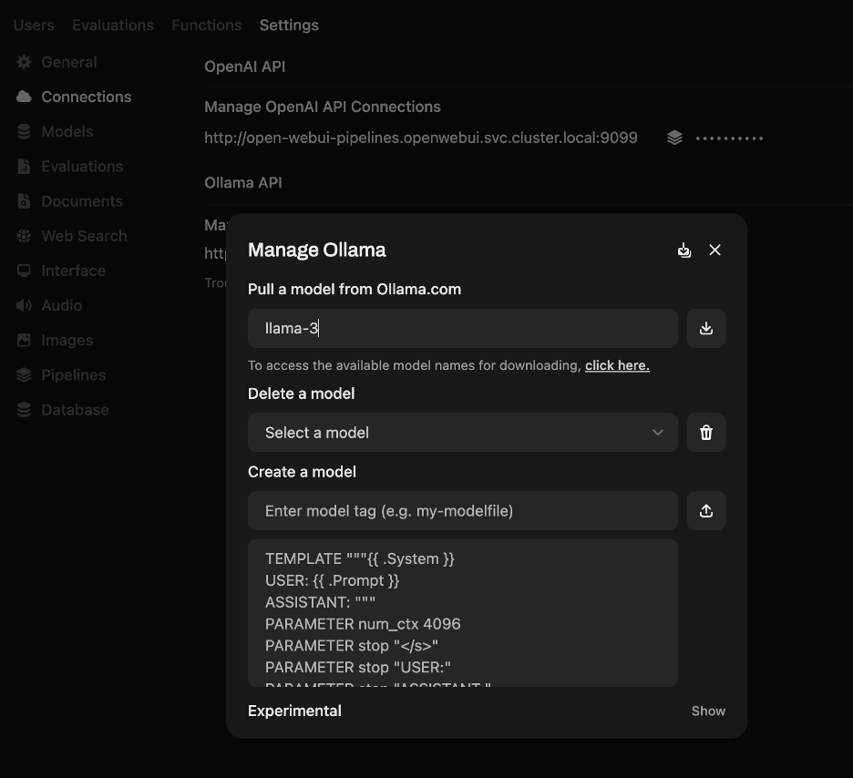

#### Update Document Embedding Parameters

Before we upload our documents to create the knowledge base for the AI Support Assistant, we must first update some of the embedding parameters to ensure we get the best results for this use case. All of these changes will be made by going to the Admin Panel and navigating to the `Settings / Documents` page.

* Set `Hybrid Search` to `On`

* Change the `Embedding Model` to `mixedbread-ai/mxbai-embed-large-v1` (be sure to click the download icon next to the field to download the new embedding model)

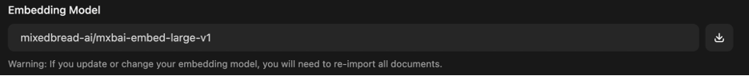

* In the `Query Params` section, set `Minimum Score` to 80

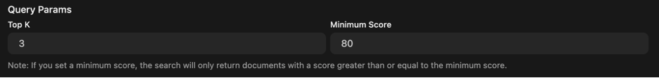

* In the `Chunk Params` section, set `Text Splitter` to `Token (TikToken)` and set `Chunk Overlap` to 200

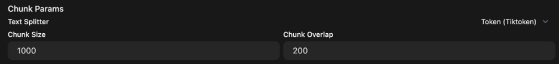

Once all of these options are set, click the `Save` button.

> 	NOTE: It's a good idea after saving to navigate away from the `Documents` tab, then navigate back and double-check that all of the settings you changed were saved. I've observed some flakiness from time to time where, after making multiple changes, not all of them were persisted.

#### Create the RAG Knowledge Base

The next step is to create the RAG knowledge base. The knowledge base must be called "EZUA Troubleshooting Articles". 

Once created, import all of the documents from the `./openwebui/EZUA Troubleshooting Articles` directory.

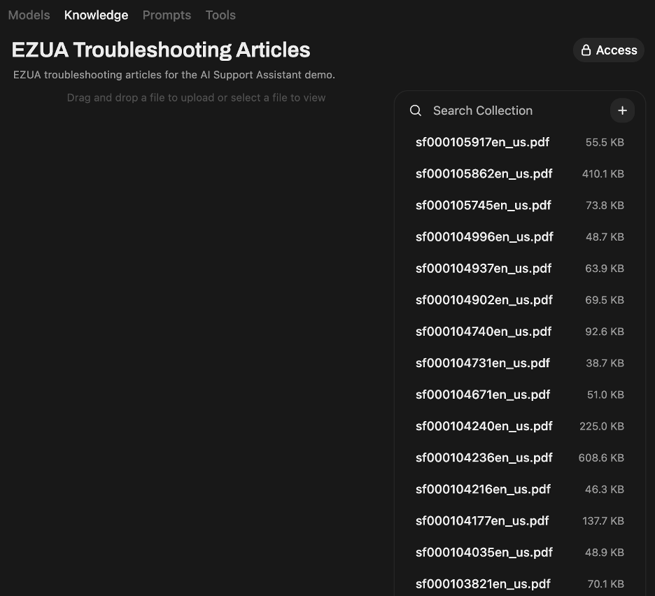

#### Import the AI Support Assistant Model

Next, the AI Support Assistant model itself can be imported. The file to import is `./openwebui/ai-support-assistant-model.json`

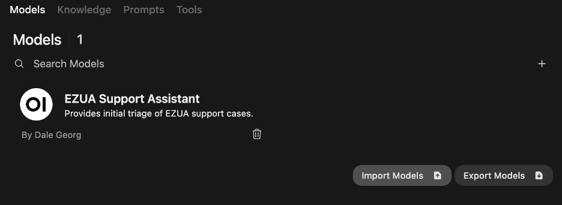

#### Create an API Key

Finally, in order to access the model, you will need an API key. From the "Settings" screen, select "Account" and then under "API Keys" click on the "+ Create new secret key" button.

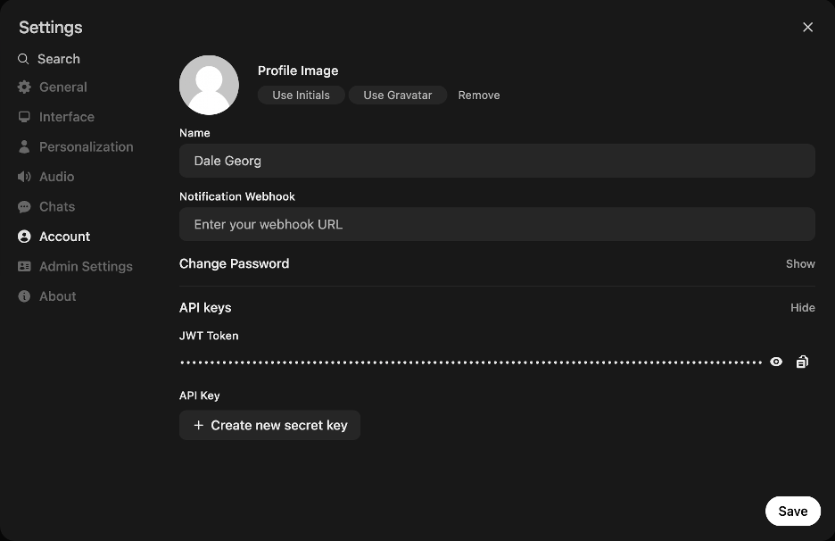

After doing this, you will have an API key that you can copy and save for later.

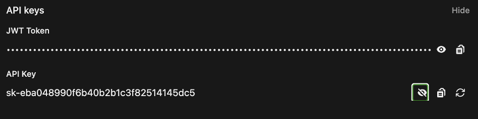

### Postgres

#### Install Postgres

Postgres needs to be installed in the PCAI environment. It is recommended to use the version at the following URL: [https://github.com/ai-solution-eng/frameworks/tree/main/postgresql](https://github.com/ai-solution-eng/frameworks/tree/main/postgresql)

When installing, be sure to set a password for the "postgres" super-user in the Framework Values. The screenshot below is an example where we have changed `postgresPassword` from an empty string to `admin123`.

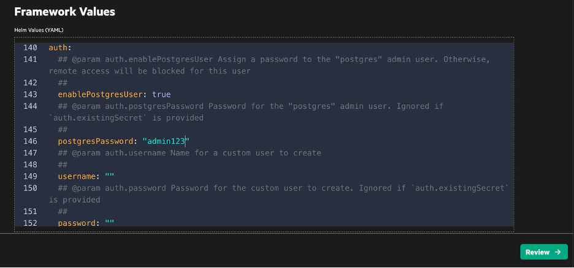

#### Create the Database for the Mock Support Application

The file `./postgres/db-create.pynb` is a Python Notebook which performs the following tasks:
* Logs in to PostgreSQL with the `postgres` super-user account;
* Creates the demo user if it does not already exist;
* Deletes the demo database if it does exist;
* Creates the demo database;
* Creates the required tables in the demo database.

This notebook can be run to create the database initially, and can also be run after a demo in order to wipe the database and start clean for a new demo. The only change which may need to be made is to change the PostgreSQL connection parameters to match your environment.

### Airflow

Airflow is already installed on PCAI by default, however there are a number of configuration changes which must be made.

#### DAG File Location

If Airflow is not configured with the location from which to read DAG files, then this must be configured. Typically this location will be a Github repository. For example, the following was used in the configuration of Airflow in the `aie02` environment:

    ###########################
    ## CONFIG | Airflow DAGs
    ###########################
    dags:
      git:
        repo: "https://github.com/ai-solution-eng/internal-projects.git"
        branch: "dougdet-20250723-airflowdags"
        subDir: "aie02-airflow-dags"
        cred:
          username: "REDACTED"
          password: "REDACTED"

The file `./airflow/ai-support-assistant-dag.py` must be placed in this location.

#### Postgres Connection

Next, a connection for Postgres must be configured. Navigate to "Admin / Connections" and click the plus sign to add a new connection.

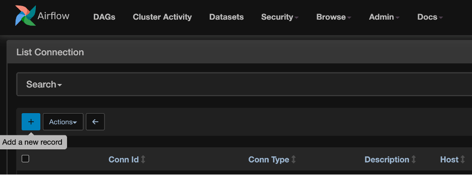

Enter "postgres" as the Connection ID, select "Postgres" as the Connection Type, and then fill in the connection parameters.  Click "Save" to save the connection definition.

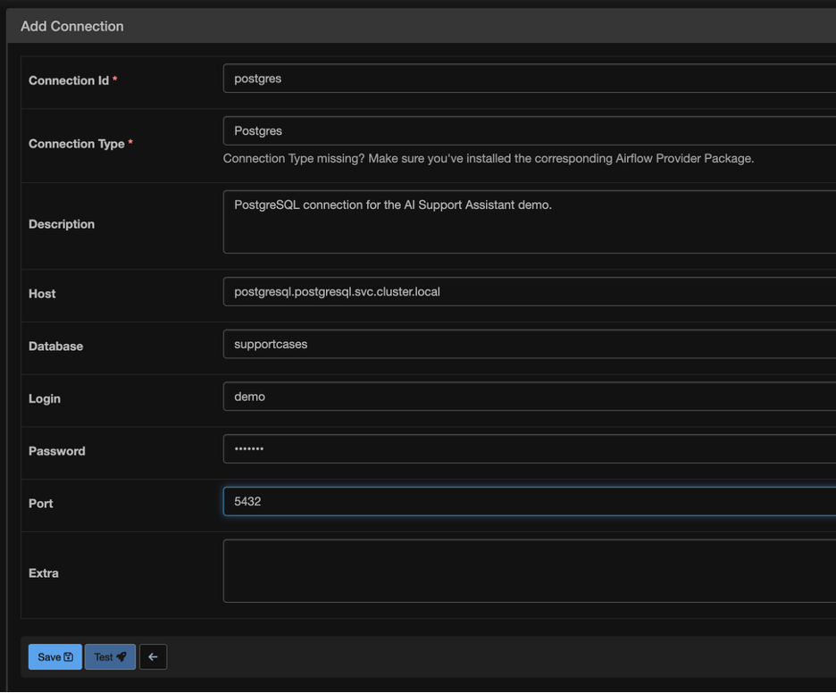

#### OpenWebUI Connection Variables

Finally, variables must be defined to provide the connection paramters for OpenWebUI. Navigate to "Admin / Variables" and click the plus sign to add a new variable.

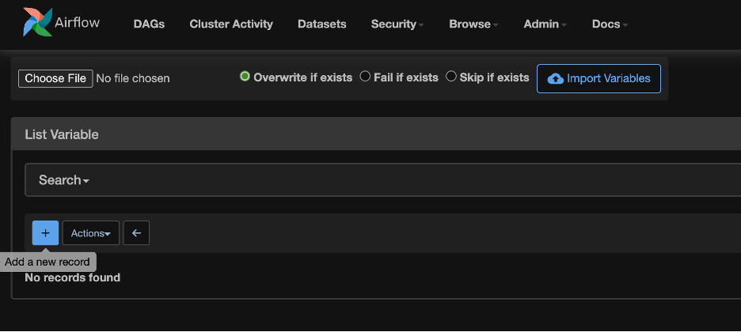

The first variable is `aisa-model-url` and should be set to the OpenWebUI URL. This URL will be of the form `http://open-webui.<<NAMESPACE>>.svc.cluster.local/api/chat/completions`, where `<<NAMESPACE>>` is replaced by the name of the namespace where OpenWebUI was deployed. Click "Save" to save the variable.

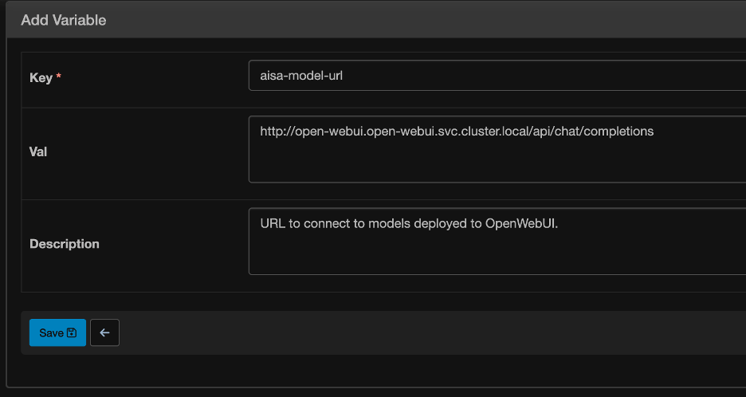

Click the plus sign to add another variable. This one will be called `aisa-model-authtoken` and should be set to the value of the API key that you created earlier in OpenWebUI.

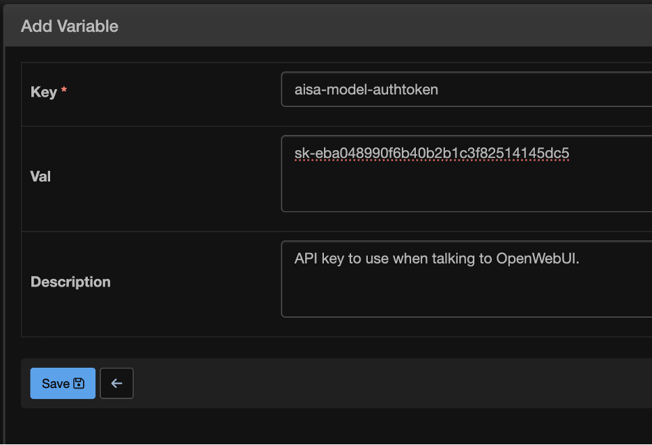

### Mock Support Application

The Mock Support Application can be added to PCAI via the "Import Framework" feature. The tar file to import is `./mock-support-app/helm/mock-support-app-1.0.1.tgz`. The file `./mock-support-app/helm/logo small.png` can be used as the framework icon.

## Running the Demo

The Mock Support Application can be opened from the Frameworks page in the AIE user interface. Once opened, you will want to create a new support case to show how the AI Support Assistant processes it. Below are a few examples you can try.

### Example 1

Enter the following subject and description when creating the new support case.

#### Subject

>Unable to Fetch Connected Data Sources Error

#### Description

>Sometimes when we re-deploy ezpresto using ezappconfig in UA 1.3 and once the application becomes ready but we get the error when we try to vistit the endpoint of DataSources from UI we get this error: Unable to fetch connected data sources. Failed to list catalogs.. CAUSE: Query failed (#20240521_055946_00001_avyxg): java.io.UncheckedIOException: Server refused connection: http://localhost:8181/v1/data/ezuadb/batch/allowed_indices_list

#### Expected Response

It may take the AI Assistant 2-3 minutes to respond. You can use this time to talk to the user about what is going on behind the scenes. When you click on the support case, you should see the response from the AI, which should be something like the following:

> I am an AI support assistant for Ezmeral Unified Analytics. I can help you troubleshoot the issue you're experiencing.

> Based on the error message, it appears that there is a connectivity issue between ezpresto and the DataSources endpoint. This could be due to various reasons such as network issues, configuration problems, or ezpresto not being properly deployed.

> To resolve this issue, I recommend checking the following:

>* Ensure that ezpresto is properly redeployed using ezappconfig. 
* Verify that the DataSources endpoint is correctly configured in the UI. 
* Check the network connectivity between the ezpresto server and the DataSources endpoint. 
* Review the ezpresto logs for any errors or warnings related to the connection issue.

> If none of these steps resolve the issue, please provide more information about your environment and configuration, and I'll do my best to assist you further.

Note also that the `Message Type` should show as `Response to Customer`.

### Example 2

Enter the following subject and description when creating the new support case.

#### Subject

>How to Send an Alert with a Custom Email Template

#### Description

>Prometheus was recently installed by your Professional Services team. I would like to change the default email template and then, when an Airflow job fails, I want the alert to be sent to a specific individual or group using that custom email template. Can you help me with this?

#### Expected Response

Again, it may take the AI Assistant 2-3 minutes to respond. When you click on the support case, you should see the response from the AI, which should be something like the following:

> Hello! I'm an Ezmeral Unified Analytics support assistant. I'd be happy to help you with changing the default email template and configuring alerts for Airflow job failures.

>To change the default email template, you can follow these steps:

>1. Log in to your Ezmeral Unified Analytics instance.
2. Go to the "Alerts" section.
3. Click on the "Email" tab.
4. Select the desired email template from the dropdown list or click on "Edit" to create a new one.

>Regarding sending alerts to a specific individual or group when an Airflow job fails, you can configure this by:

>1. Creating a custom alert rule in Ezmeral Unified Analytics that triggers when an Airflow job fails.
2. In the alert rule, specify the email template you created earlier.
3. Add the recipient's email address or group to the "To" field.

> If you need further assistance or have any questions about these steps, please let me know!

Note again that the `Message Type` should show as `Response to Customer`.

### Example 3

For this example, we want to demonstrate how the AI Support Assistant will not respond to questions that are outside of its domain of knowledge. Enter the following subject and description when creating the new support case.

#### Subject

>Sky Color

#### Description

>Why is the sky blue?

#### Expected Response

In this case, the response from the AI should be:

> I am sorry, but I am unable to answer this question / concern.

Note also that the `Message Type` for this response is `Internal Response`.