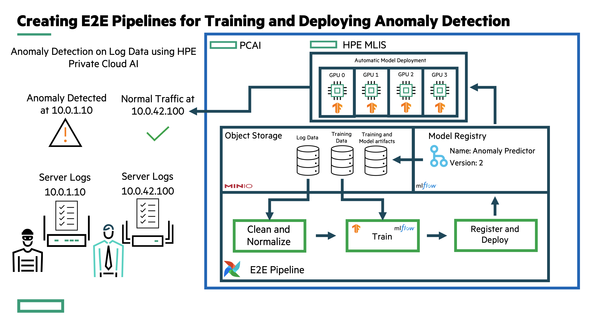

# End to End Anomaly Detection Pipeline on Server logs

Author: andrew.mendez@hpe.com

This repo showcases how to leverage HPE's Private Cloud AI Platform to implement and end to end pipeline to train and deploy an anomaly detection model

# Overview 

We worked with a customer in the networking industry to streamline detecting anomalies in server logs using HPE’s Private Cloud AI. 

This customer was looking for an end to end pipeline that automatically aggregate server logs, clean logs with malformed input, train a machine learning model to predict anomalies, and deploy the model to detect anomalies on live logs. They wanted all orchestrated as a scalable pipeline that can scale as data volume increases.

# Demo Recording
Download and watch `static/final_juniper_compressed.mp4` to see recorded demo. 

<video width="720" height="480" controls>
  <source src="static/final_juniper_compressed.mp4" type="video/mp4">
</video>

# Architecture

Using HPE’s Private Cloud AI, we developed an end to end pipeline that collected and normalized server log data, trained a auto encoder model to detect anomalies, and deployed the model as a scalable endpoint to scale in production. We leveraged built in object storage to store log data at scale, we used tensorflow to train the auto encoder model,  we used the HPE Machine Learning inference software to deploy our trained model , and used MLFLow to track training experiments to version models using MLFlow Model’s registry.

# Code Artifacts
[Coming soon]

# Installation Instructions
[Coming soon]

# Questions or Request for more details

Contact andrew.mendez@hpe.com or hoang.phan@hpe.com for more information.
