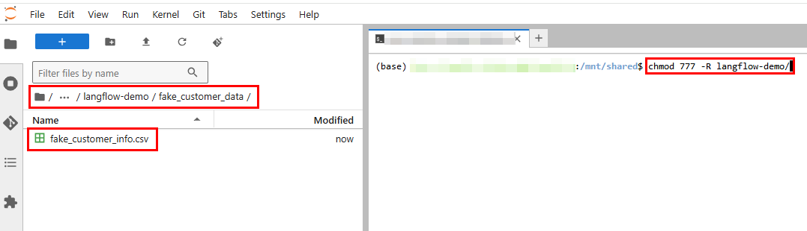
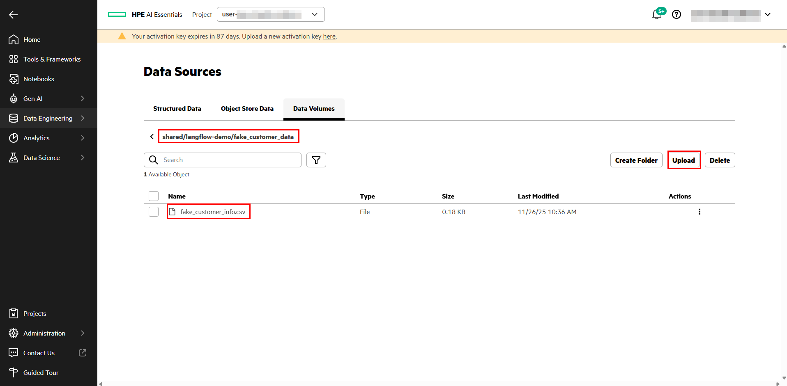
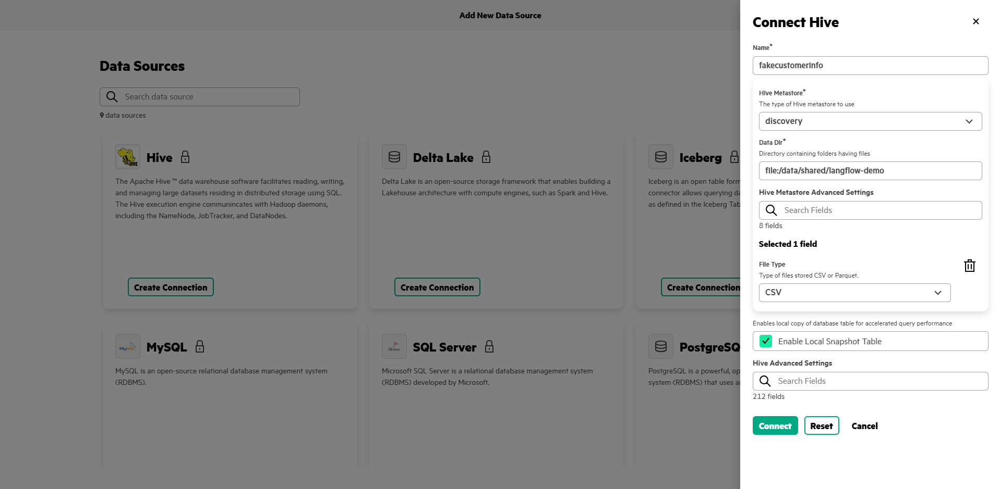
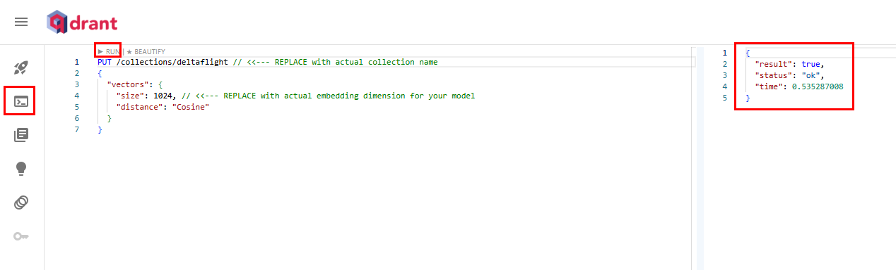
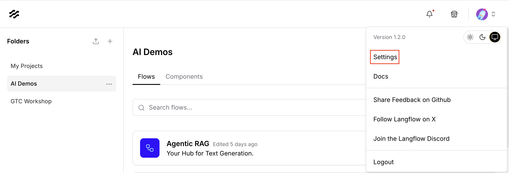
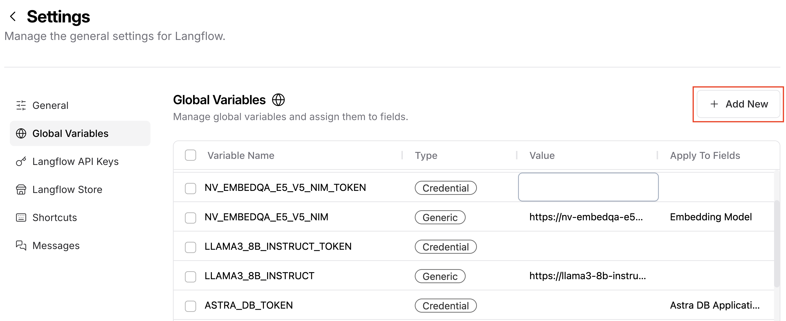
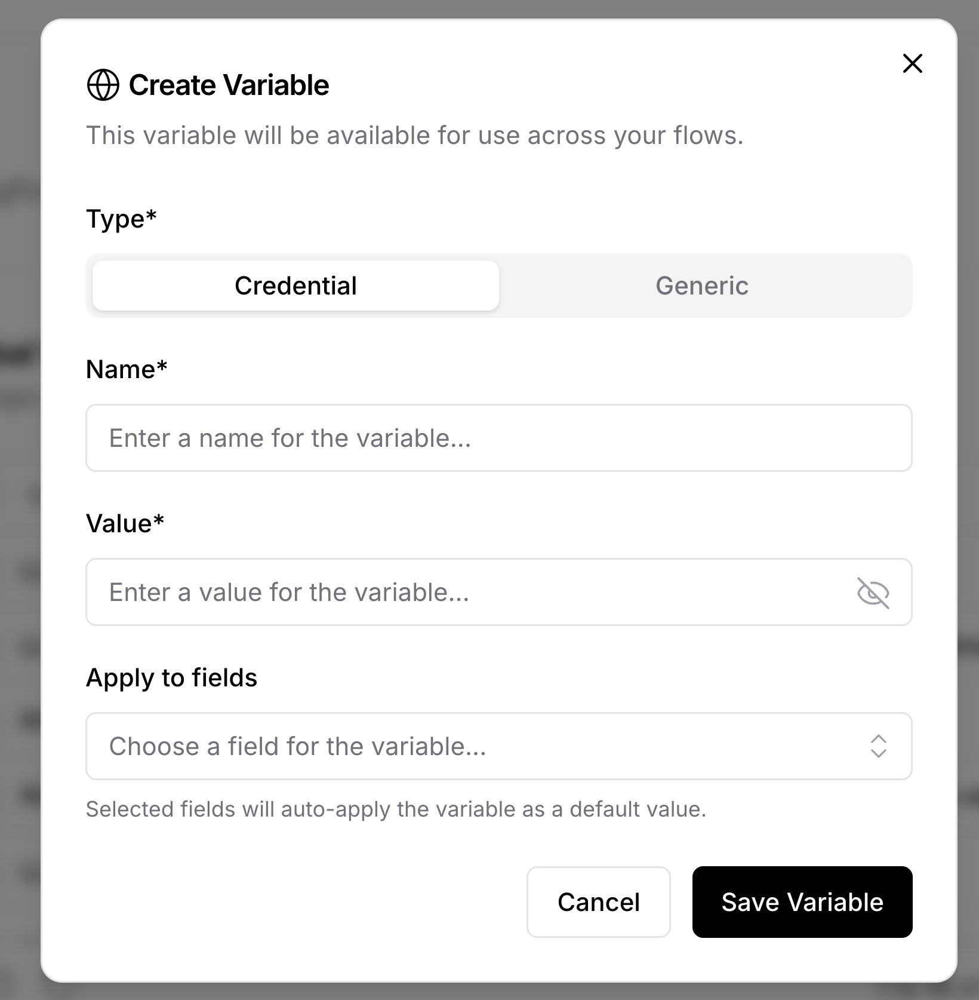
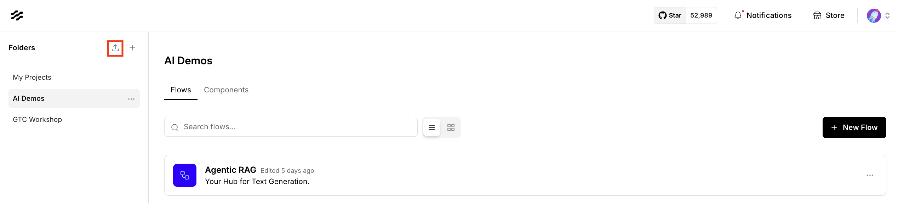
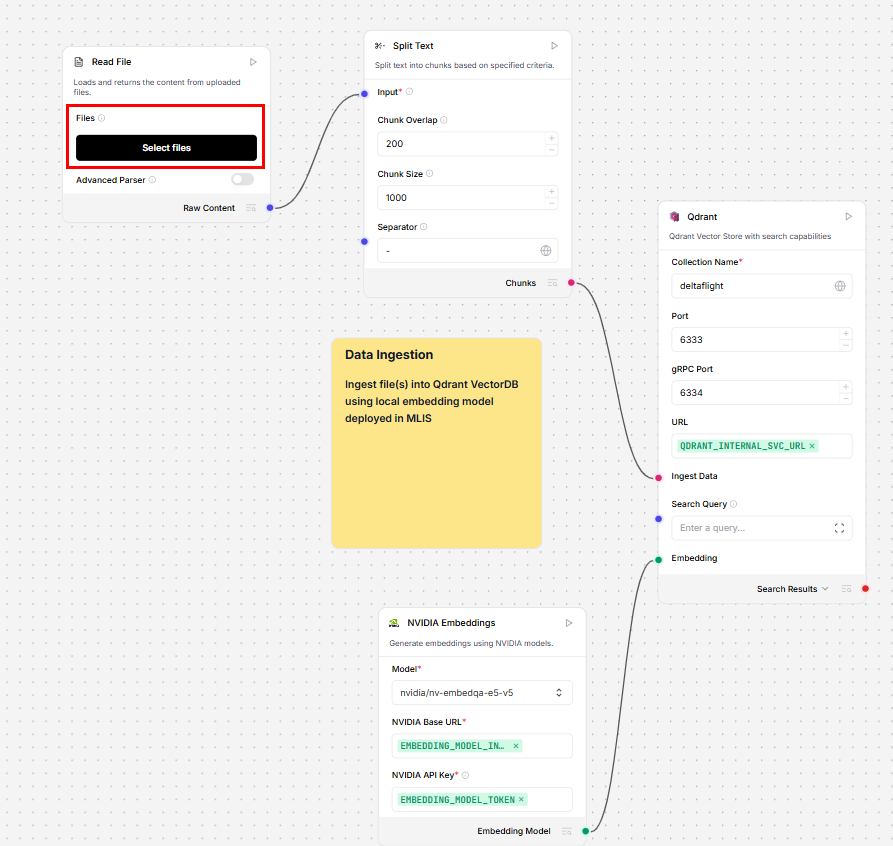

# Basic Agent Langflow Demo

| Owner                       | Name                                | Email                                                        |
| ----------------------------|-------------------------------------|--------------------------------------------------------------|
| Use Case Owner              | Alejandro Morales, Francesco Caliva, Isabelle Steinhauser                   | alejandro.morales-martinez@hpe.com, francesco.caliva@hpe.com, isabelle.steinhauser@hpe.com                           |
| PCAI Deployment Owner       | Alejandro Morales, Francesco Caliva, Isabelle Steinhauser                   | alejandro.morales-martinez@hpe.com, francesco.caliva@hpe.com, isabelle.steinhauser@hpe.com                           |

## Abstract

This demo showcases how to build a simple AI Agent on HPEs Private Cloud AI leveraging Langflow. The agent has two tools available to itneract with a PDF (RAG) and infromation in a Table (Presto). Langflow is used as imported Framework, Qdrant as VectorDB, ezPrestoMCP Server (for AIE 1.12 and above) or custom written component to interact with the database information.

The models used are:
- Embbedding Model: NVIDIA nv-embedqa-e5-v5 as NIM
- LLM: NVIDIA-Nemotron-3-Nano-30B-A3B-FP8 as NIM or Qwen 3 8B from HuggingFace

We provide two flavors of the demo, the flight assistant agent and the citizen passport support agent. You can easily switch between those two datasets or even use your own. You will require a PDF and a CSV file.


Recordings:
- [Short version Flight Customer Service Agent [almost 3 min]](https://storage.googleapis.com/ai-solution-engineering-videos/public/Customer%20Flight%20Support%20Agent%20short.mp4)
- [Short version Flight Customer Service Agent leveraging MCP [4 min]](https://storage.googleapis.com/ai-solution-engineering-videos/public/MCP%20Customer%20Flight%20Support%20Agent%20Short.mp4)
- [Short version Citizen Passport Support Agent [4 min]](https://storage.googleapis.com/ai-solution-engineering-videos/public/Citizen%20Passport%20Support%20Agent.mp4)
- [Long version Flight Customer Service Agent [almost 8 min]](https://storage.googleapis.com/ai-solution-engineering-videos/public/Customer%20Flight%20Support%20Agent%20Long.mp4)
- [Long version Flight Customer Service Agent leveraging MCP [6 min]](https://storage.googleapis.com/ai-solution-engineering-videos/public/MCP%20Customer%20Flight%20Support%20Agent%20Short.mp4)

# Summary
- [Demo overview video](#demo-overview-video)
- [Langflow installation in PCAI](#langflow-installation-in-pcai)
- [MLIS setup in PCAI](#mlis-setup-in-pcai)
- [Langflow setup in PCAI](#setup-before-the-demo)


## Qdrant installation in PCAI

1. [Install Qdrant within a PCAI environment using the following chart](https://github.com/ai-solution-eng/frameworks/tree/main/qdrant)
2. [Follow these instructions to install the helm chart](https://support.hpe.com/hpesc/public/docDisplay?docId=a00aie16hen_us&docLocale=en_US&page=ManageClusters/importing-applications.html)

## Langflow installation in PCAI

1. [Install Langflow within a PCAI environment using the following chart](https://github.com/ai-solution-eng/frameworks/tree/main/langflow)
2. [Follow these instructions to install the helm chart](https://support.hpe.com/hpesc/public/docDisplay?docId=a00aie16hen_us&docLocale=en_US&page=ManageClusters/importing-applications.html)

**Note:** The latest workflow version (i.e. `langflow-agent-v1-4.json` and `langflow-agent-v1-5.json`) were tested in Langflow version `1.7.3`. Please consider installing this version to avoid conflicts or issues with it in older/newer versions.
The latest workflow `langflow-agent-v1-5.json` uses the ezPrestoMCP sever which is a feature in AIE 1.12 and above.
---

# MLIS setup in PCAI

1. Deploy the `nvidia/nv-embedqa-e5-v5` model using the following configuration:
    - General:
        - Registry: `NGC` (create an NGC registry if there is none)
        - NGC Supported Models: `nvidia/nv-embedqa-e5-v5`
2. Once successfully deployed, save the endpoint url and append `/v1` for later, as well as add an API token under the `Users` and save that as well.
3. Deploy the LLM (decide between NVIDIA Nemotron and Qwen)
    - Deploy the `nvidia/NVIDIA-Nemotron-3-Nano-30B` model using the following configuration:
        - General:
            - Registry: `None`
            - Image: `vllm/vllm-openai:latest`
        - Resources:
            - CPU: 2 -> 6
            - Memory: 20Gi -> 40Gi
            - GPU: 1
        - Advanced:
            - Environment Variables (add you HF token)
                - HUGGING_FACE_HUB_TOKEN
            - Arguments (vLLM serve arguments)
                - `--model nvidia/NVIDIA-Nemotron-3-Nano-30B-A3B-FP8 --max-model-len 32000 --trust-remote-code --enable-auto-tool-choice --tool-call-parser qwen3_coder --reasoning-parser deepseek_r1 --kv-cache-dtype fp8 --port 8080`
    OR
    -  Deploy the `Qwen/Qwen2.5-7B-Instruct` model using the following configuration:
        - General:
            - Registry: `None`
            - Image: `vllm/vllm-openai:latest`
        - Advanced:
            - Environment Variables (add you HF token)
                - HUGGING_FACE_HUB_TOKEN
            - Arguments (vLLM serve arguments)
                - `--model Qwen/Qwen2.5-7B-Instruct --enable-auto-tool-choice --tool-call-parser hermes --port 8080`
4. Once successfully deployed, save the endpoint url and append `/v1` for later, as well as add an API token under the `Users` and save that as well.

---

# Fake customer data setup

## EzPresto Table Setup - Adding as Data Source in PCAI 

Upload the [flight fake customer data](data/flight/fake_customer_info.csv) or [passport fake customer data](data/passport/fake_passport_requests.csv) in the  `/shared` folder.

### Option 1: Upload via Jupyter Notebook
- Launch a Jupyter Notebook and navigate to `/shared`
- Create a new folder there named `langflow-demo` and a sub-directory named `fake_customer_data`
- Upload the CSV file into this folder (drag and drop in the Notebook)
- Open a terminal in the Notebook. Navigate to  `/shared` and execute the following command to grant permissions on the file: `chmod 777 -R langflow-demo`



### Option 2: Upload from Data Volumes
- In AI Essentials, navigate to **Data Engineering --> Data Sources --> Data Volumes**
- Click in `shared`
- Create a folder named `langflow-demo` and click it to navigate inside
- Create a sub-directory named `fake_customer_data` and click it to navigate inside
- Click "Upload", select the CSV file and upload it



## Add Datasource
Once the file is uploaded, Add New Data Source in the Structured Data section
- In AI Essentials, navigate to **Data Engineering --> Data Sources --> Structured Data**
- Click "Add New Data Source"
- Under the "Hive" card, select "Create Connection" and fill it up with the following values:
```
  Name: fakecustomerinfo
  Hive Metastore: Discovery
  Data Dir: file:/data/shared/langflow-demo
  File Type: CSV
```


- Once the connection is successful, if it was created as private (lock icon), click the three docs on the new `fakecustomerinfo` card and select "Change to public access" to make it public (globe icon)

---

# Setup before the demo

## Qdrant Setup 

1. Once Qdrant has been deployed, in AI Essentials navigate to "Tools & Frameworks", search for the Qdrant card and click "Open" to access the UI (you may need to append `/dashboard` at the end of the URL)
2. Navigate to "Console" in the Qdrant UI
3. Copy paste the following code and click the "RUN" button above it to create a new Collection named `anywhere`
    ```
    PUT /collections/anywhere
    {
      "vectors": {
        "size": 1024,
        "distance": "Cosine"
      }
    }
    ```
    
4. Save the Qdrant endpoint URL without the `https://` at the beginning and the `/dashboard` part we added earlier (e.g. `qdrant.<your.domain>.com`)

## Retrieve AI Essentials User Token
1. From the AI Essentials UI open your Jupyter Notebook.
2. Create a new Python file and execute the following code to retrieve your user token and save it
```
secret_file_path = "/etc/secrets/ezua/.auth_token"
with open(secret_file_path, "r") as file:
    token = file.read().strip()
print(token)
 ```

**CAUTION:** User tokens expire after 30 minutes. Please ensure to get an updated token when needed. If needed, it's possible to extend the lifetime of these tokens following [this procedure](https://support.hpe.com/hpesc/public/docDisplay?docId=a00aie110hen_us&page=Security/keycloak-change-auth-token-settings.html).

## Langflow setup

1. Once Langflow has been deployed, go to the top right menu next to the profile picture as shown in the image below:

2. In the settings select `Global Variables` and select `Add New` as shown below:

3. You will need to add the following variables that are configured previously:
    
    - **`NV_EMBEDQA_E5_V5_NIM` (Generic):**
        - Set this to your embedding model endpoint URL created earlier during MLIS setup step
        - If you want to skip SSL verify, set this to the predictor's internal K8s service name (e.g. `http://<model_deployment_name>.<deployment_namespace>.svc.cluster.local/v1`)
    - **`NV_EMBEDQA_E5_V5_NIM_TOKEN` (Credential):**
        - Set this to your embedding model API Token created earlier during MLIS setup step
    - **`LLM_ENDPOINT` (Generic):**
            - Set this to your LLM model endpoint URL created earlier during MLIS setup step
            - If you want to skip SSL verify, set this to the predictor's internal K8s service name (e.g. `http://<model_deployment_name>.<deployment_namespace>.svc.cluster.local/v1`)
    - **`LLM_TOKEN` (Credential):**
            - Set this to your LLM model API Token created earlier during MLIS setup step
    - **`QDRANT_ENDPOINT` (Generic):**
            - Set this to the Qdrant endpoint URL from Qdrant setup step
            - If you want to skip SSL verify, set this to the Qdrant internal K8s service name (e.g. `http://<qdrant_service_name>.<qdrant_namespace>.svc.cluster.local`)
    - **`QDRANT_COLLECTION` (Generic):**
            - Set this to the name of the collection we created during Qdrant setup step (i.e. `anywhere`)
4. For `langflow-agent-v1-5.json` you need to configure the MCP Server connection in Langflow, remember this is only available in AIE 1.12 and above. Therefore navigate within the Langflow settings to `MCP Servers` and select `Add MCP Server`
    - Type `Streamable HTTP/SSE`
    - Name `ezpresto`
    - Streamable HTTP/SSE URL > take this from AIE navigating to Data Engineering > Data Sources > MCP Server
    - Headers `Authorization` `Bearer JWT Token` Set this JWT to your AI Essentials user token you saved in an earlier step (remember that by default these tokens expire after 30 minutes)
5. Upload the [provided flow if using `Langflow 1.4.X`](langflow-agent-v1-4-localvectordb.json) into any project by clicking the upload button
    - if you want to use Presto MCP server use the Langflow 1.5.X either with [`passport`](langflow-agent-v1-5-passport-localvectordb-mcp.json) or  [`flight data`](langflow-agent-v1-5-localvectordb-mcp.json). 

6. Upload the [provided `EzPresto Tool`](EzPresto_tool.json) by clicking the upload button (not required for `langflow-agent-v1-5.json`)
7. Open the flow and make sure to re-upload the PDF file either the [refund policy](data/flight/anywhere_airlines_refund_policy.pdf) or the [passport information](data/passport/passports_anywhere.pdf) to the `File` component

8. Ensure you configure the necessary components' fields with the Langflow Global Environment Variables we configured earlier (**Note:** If you cannot see any of the fields mentioned before for a given component, hover over the component and click "Controls", select the fields to display them in the component and close)
    - **NVIDIA Embeddings Component** (there are two of these)
        - NVIDIA Base URL: Click in the Globe icon and select the `NV_EMBEDQA_E5_V5_NIM` environment variable
        - NVIDIA API Key: Click in the Globe icon and select the `NV_EMBEDQA_E5_V5_NIM_TOKEN` environment variable
    - **NVIDIA Component** (LLM connected to the Agent Component)
        - NVIDIA Base URL: Click in the Globe icon and select the `LLM_ENDPOINT` environment variable
        - NVIDIA API Key: Click in the Globe icon and select the `LLM_TOKEN` environment variable
    - **Qdrant Component** (there are two of these)
        - Collection Name: Click in the Globe icon and select the `QDRANT_COLLECTION` environment variable
        - If your `QDRANT_ENDPOINT` variable is set to the Qdrant VirtualService endpoint URL
            - Host: Click in the Globe icon and select the `QDRANT_ENDPOINT` environment variable
            - Port: `443`
            - URL: Leave blank
        - If you want to skip SSL verify and your `QDRANT_ENDPOINT` variable is set to the Qdrant internal K8s service name
            - Host: Leave blank
            - Port: `6333`
            - URL: Click in the Globe icon and select the `QDRANT_ENDPOINT` environment variable       
        - gRPC Port: `6334`
    - **EzPresto tool Component** (not required for `langflow-agent-v1-5.json`)
        - User Token: Set this to your AI Essentials user token you saved in an earlier step (remember that by default these tokens expire after 30 minutes)
9. Open the playground and test the workflow with a question like:
    > "My name is John and my flight is A105, I was downgraded to coach from first class, what is my refund?"     
    - The agent should return the correct answer of $90 after calling both tools included (`FlightPolicy` and `ezprestomcp`) for `langflow-agent-v1-5.json` requesting the schema of the table before executing a query
    or for the passport use case
    > "Hi there my name is Isabelle and I requested a passport. Where can I pick it up and how much does it cost?"
     - The agent should return the correct answer of 37.50€ for a below 24 years old standard passport with the pickup at Anywhere2 after calling both tools included (`Passport` and `ezprestomcp`) for `langflow-agent-v1-5.json` requesting the schema of the table before executing a query

