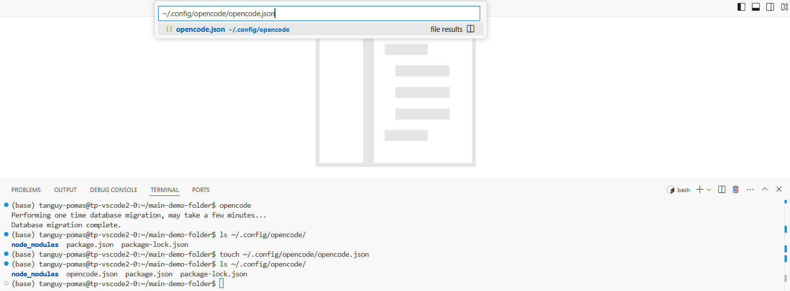
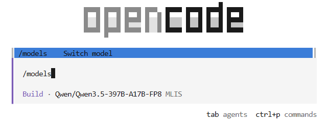

# Basic Opencode Code Assistant

| Owner                       | Name                              | Email                                     |
| ----------------------------|-----------------------------------|-------------------------------------------|
| Use Case Owner              | Tanguy Pomas                      | tanguy.pomas@hpe.com                     |
| PCAI Deployment Owner       | Tanguy Pomas                      | tanguy.pomas@hpe.com                      |


## Abstract

This demo details how to set up and use [OpenCode](https://opencode.ai/docs/), an open source AI coding agent, on PCAI. OpenCode is used in this demo for simple code writing, editing, as well as troubleshooting, but its capabilities largely exceed what is shown here. This demo is meant to be a **minimalist setup of OpenCode for basic coding assistance usage**. Advanced users may be interested to dig into [OpenCode documentation](https://opencode.ai/docs/) for a more comprehensive view of the possibilities OpenCode offers.


This demo uses:
- **HPE Machine Learning Inference Software (MLIS)**: To host the LLM to be used by OpenCode
- **VS Code**: Coding interface, with embedded terminal on which OpenCode will run

**Recording:**

- [**Demo recording**](https://storage.googleapis.com/ai-solution-engineering-videos/public/basic-opencode-demo-video.mp4)

## Description


### Overview

This demo consists in setting up OpenCode in a VS Code server and using it for arbitrary code writing/completion/analysis/troubleshooting. It does not include specific applications to import, nor prompts to test OpenCode with. Demo users are expected to provide their own code, or have OpenCode write code from scratch.

### Architecture Diagram


### Workflow

Once the demo has been set up, the workflow is straightforward:
* Open the VS Code server in which you have set up OpenCode
* Use OpenCode to showcase its capabilities however you want: have it write code from scratch, edit existing code, analyze folder structure of its working directory...


## Deployment


### Prerequisites

OpenAI API compatible chat model deployed on MLIS. The deployed model should support tool calling and be fit for agentic workloads (it should be the case for most of the recent popular models):
- MLIS deployment endpoint
- MLIS deployment API token
- Model ID

Using **larger, more powerful models will make a big difference** compared to using smaller models, even if those support tool calling. This is why we expect this demo to leverage models that have to be deployed on multiple GPUs.

openai/gpt-oss-120b can be used as a starting point, and can fit on two L40S.

**Note**
* The model ID corresponding to your MLIS deployment often matches the model name as found on Huggingface, but you can get also get it directly with the following curl command:
```
curl -X 'GET' \
  'DEPLOYMENT_URL/v1/models' \
  -H "Authorization: Bearer DEPLOYMENT_TOKEN" \
  -H 'accept: application/json' -k
```
### Installation and configuration

1. **Create a VS Code server**
Go to Tools & Frameworks, Kubeflow, Notebooks -> Click on + New Notebook, and chose "1 VisualStudio Code", rather than JupyterLab:


While most of the computing resources required for this demo comes from the LLM deployed on MLIS, which has dedicated resources for it (one or multiple GPUs), **you may still need to increase the CPU/Memory requirements of your VScode server**: this will be useful if you need to download files, libraries or run the code that OpenCode will write for you. 

**Optional: Unmount default PVCs**

By default, notebooks and VS Code servers mount two PVC: your personal user-pvc, only accessible to your user, and the kubeflow-shared-pvc, accessible to everyone. While Opencode cannot access by default files outside the folder it is started on, and its permissions can be restricted, a poorly defined Opencode setup may grant it access to content from your user-pvc, or the kubeflow-shared-pvc.

If this a source of concern, you may want to remove the volumes listed under "Data Volumes" when creating your VS Code server:


2. **Open VS Code server, set up demo folder and install Opencode**

* **Open VS Code and find the terminal:** Once your VS Code server created, open it. You should be able to access a terminal by highlighting a line towards the bottom of the interface, and dragging that line upwards:


* **Create the demo folder:** Using the terminal create a folder you will use for this demo, using mkdir. For example `mkdir main-demo-folder`

* **Open the demo folder:** Once the demo folder created, open it using the search bar at the top of the interface. This is to ensure the explorer content on the left matches the demo folder content (empty for now):


* **Install Opencode:** On the terminal execute the command `curl -fsSL https://opencode.ai/install | bash` The `opencode` command used to start Opencode won't work until a new terminal is started:


* **Restart a terminal and start Opencode:** Click on the bin icon to kill the current terminal, it should hide the bottom panel where the terminal was located. Next time you reopen that panel, a new terminal should be started. Alternatively, you can also create a new terminal by clicking on the "+" icon:


Once done, go to your demo folder, and execute the command `opencode`, the following should appear:

You can exit this interface with ctrl-C or ctrl-D.

3. **Create Opencode config file**

In order for Opencode to use the model deployed using MLIS, a custom configuration file needs to be created. By default, Opencode will use free, cloud-hosted models ("Big Pickle - OpenCode Zen" refers to one such model).

Opencode configuration file can be placed at different locations (see [Opencode documentation](https://opencode.ai/docs/config/#locations) for more details). In this demo, we will create the config file at the "global configuration" location:
  * Create an empty file at the location `~/.config/opencode/opencode.json`, for example using the `touch` command on the terminal: `touch ~/.config/opencode/opencode.json`
  * Open this file on the editor, typing its location on the search bar:
  
  * Copy-paste the following content in that file:
  ```
  {
    "$schema": "https://opencode.ai/config.json",
    "provider": {
      "myprovider": {
        "npm": "@ai-sdk/openai-compatible",
        "name": "MLIS",
        "options": {
          "baseURL": "DEPLOYMENT URL/v1",
          "apiKey" : "DEPLOYMENT TOKEN"
        },
        "models": {
          "DEPLOYMENT MODEL ID": {
            "name": "MODEL NAME DISPLAYED IN OPENCODE"
          }
        }
      }
    },
    "permission": {
    "*": "ask",
    "bash": {
      "*": "ask",
      "ls *": "allow",
      "grep *": "allow",
      "glob *": "allow",
      "rm *": "deny",
    },
    "edit": "ask",
	"read": "allow",
	"glob": "allow",
	"question": "allow",
	"webfetch": "ask",
	"websearch": "ask",
	"codesearch": "ask",
	"external_directory": "deny",
	"doom_loop": "deny"
    }
  }
  ```
  * Replace the following values:
    * `DEPLOYMENT URL/v1` with the endpoint of the model deployed in MLIS. Remember to add/keep `/v1` at the end.
    * `DEPLOYMENT TOKEN` with an API key that has been created for the MLIS deployment.
    * `DEPLOYMENT MODEL ID` with the ID of the model deployed by MLIS, see the Prerequisites section for details.
    * `MODEL NAME DISPLAYED IN OPENCODE` with what you want Opencode to display as model name, setting it to be identical to model ID is fine.
  * Check each individual tool permission and edit them according to your preferences:
    * For reference, permissions can be either:
      * `allow`: Opencode can execute the action without approval
      * `ask`: Opencode will prompt for approval, and execute the action only after you manually allowed it
      * `deny`: Opencode won't be able to execute the action.
    * And the different actions tools are:
      * `read` — reading a file (matches the file path)
      * `edit` — all file modifications (covers edit, write, patch, multiedit)
      * `glob` — file globbing (matches the glob pattern)
      * `grep` — content search (matches the regex pattern)
      * `list` — listing files in a directory (matches the directory path)
      * `bash` — running shell commands (matches parsed commands like git status --porcelain)
      * `task` — launching subagents (matches the subagent type)
      * `skill` — loading a skill (matches the skill name)
      * `lsp` — running LSP queries (currently non-granular)
      * `question` — asking the user questions during execution
      * `webfetch` — fetching a URL (matches the URL)
      * `websearch`, `codesearch` — web/code search (matches the query)
      * `external_directory` — triggered when a tool touches paths outside the project working directory
      * `doom_loop` — triggered when the same tool call repeats 3 times with identical input
    * The provided set of permission should be fairly safe, but may feel tedious at times when Opencode repetedly asks for your approval. Change permissions at your discretion.
    * More details on permissions in the [Opencode documentation](https://opencode.ai/docs/permissions/)
  * Restart Opencode and select your model using the `/models` command. Your model should be listed alongside the default models Opencode provide:
  
  * Once your model deployed on MLIS selected, its name should appear on the Opencode interface with "MLIS" if you left this as your provider name, as visible on the screenshot above.

4. **Use Opencode**

At this stage, the Opencode setup is complete, you can use it by simply typing questions and instructions. A non-exhaustive list of things you could do with it is:
  * If starting from an empty demo folder ask it to write some code (preferably in Python as Python code can be executed in this environment, assuming the required libraries are installed)
  * Ask it to execute some code
  * Ask it to troubleshoot failing code, have it install libraries if needed
  * Ask it to analyze/explain code you made available in the demo folder.
  * Ask it to reorganize file/folder structure (always under you demo folder)
  * ...

Note that pressing Tab will switch between the two default agents: the Build one, that has access to all tools (with execution limitations defined in the config file), and the Plan one, with much more restricted permissions, meant to be used for planning and analysis tasks requiring no code change. See [Opencode documentation](https://opencode.ai/docs/agents/) for more details.

## Advanced Opencode usage

The purpose of this demo was to present a simple Opencode setup that can be used for basic code writing/completion/troubleshooting.

See the official [Opencode documentation](https://opencode.ai/docs/) for more advanced usage, utilizing more powerful features that were not used in this demo (custom agents, sub-agents, MCP servers, skills...).
