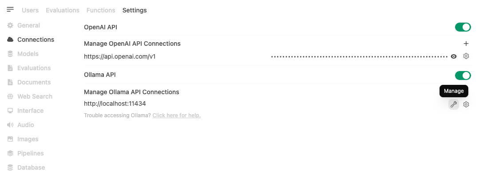
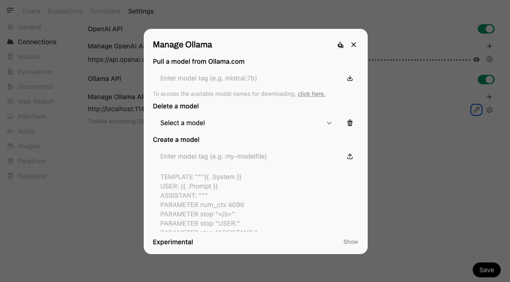
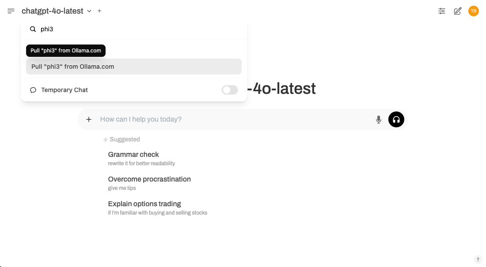

# Basic RAG Setup

This document will go through all the necessary steps to enable interaction with an entirely on-prem, RAG workflow in the simplest possible way.

Commands provided in this document assumes that your distribution is __Ubuntu__.

The chosen combination of software components to achieve this are:
* __Open WebUI__, to provide chat interface, as well as built-in RAG capabilities with embedding model and Chroma Vector DB bundled in
* __Ollama__, to run the chat models locally, as well as for its ease of integration with Open WebUI and ability to quickly download multiple models from a UI

# Prerequisites

Make sure that python3 is already installed, and that you can create virtual environments. 

If this is not the case, run the following command:
```
sudo apt install python3-venv
```

# Installing Open WebUI

To install Open WebUI, follow these steps:
* Create a Python virtual environment:
```
python3 -m venv venv
```
* Activate the virtual environment:
```
source venv/bin/activate
```
* Install Open WebUI:
```
pip install open-webui
```
* Start the server:
```
open-webui serve
```

At this stage, Open WebUI should be available at __http://localhost:8080/__


# Installing Ollama

To install Ollama, execute the following command:
```
curl -fsSL https://ollama.com/install.sh | sh
```

This command will download and execute Ollama's installation script, that will also take care of installing the necessary NVIDIA drivers to leverage your GPUs.

# Downloading models with Ollama on Open WebUI

Once Ollama has been installed, Open WebUI should automatically connect to it.

You can manage the Open WebUI's connection to Ollama from the Admin Settings section:
* Go to Admin Settings in Open WebUI.
* Navigate to Connections > Ollama > Manage (click the wrench icon):

* From here, you can download models, configure settings, and manage your connection to Ollama:


__Alternatively__, to get started even faster, you can download models directly from the Model Selector. Simply type the name of the model you want, and if it’s not already available, Open WebUI will prompt you to download it from Ollama:


Once downloaded, you can chat with them on Open WebUI.

If Open WebUI cannot connect to your Ollama instance, please refer to [this troubleshooting page](https://docs.openwebui.com/troubleshooting/connection-error/) from Open WebUI documentation.

# Sources

Open WebUI Quick Start page: https://docs.openwebui.com/getting-started/quick-start/

Ollama Download page: https://ollama.com/download/linux

Starting with Ollama page, from Open WebUI documentation: https://docs.openwebui.com/getting-started/quick-start/starting-with-ollama/  
