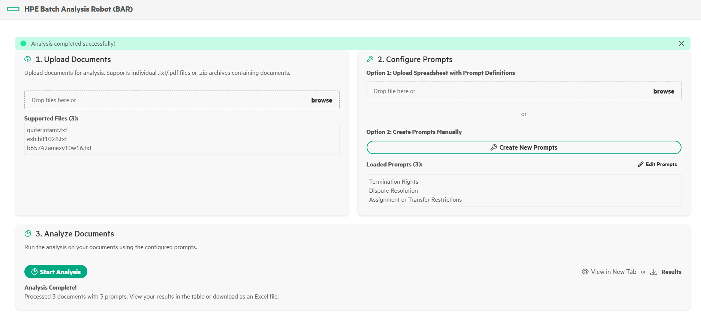

# BAR (Batch Agreement Robot)

A containerized web application for batch document analysis through automated prompt execution using AI. BAR processes multiple PDF and TXT documents simultaneously with custom analysis prompts, delivering consolidated results in Excel format.

## Benefits of BAR

For some use cases (e.g. legal documents analysis), **documents need to be analyzed in their entirety**, meaning **RAG is not recommended** (as it only leverage a few passages at most).
- **BAR leverages all the text of large documents (100+ pages) at once** when analyzing them.

Traditional chat only allow you to interact with one prompt at a time, with limited document interactions (RAG)
- **BAR can analyze hundreds of documents versus dozens of prompts at the same time**
- BAR places document analysis into a spreadsheet to better export the results. 

## Features

- **File Upload and Management**: Upload zipped folders containing `.txt` or `.pdf` documents (up to 100MB)
- **Prompt Definition**: Define analysis prompts via spreadsheet templates or manually
- **Batch Processing**: Concurrent document processing with real-time progress tracking
- **Result Generation**: Download consolidated results as Excel spreadsheets
- **Production Ready**: Security contexts, health checks, and monitoring support

## Prerequisites

OpenAI API compatible chat model deployed on MLIS:
- MLIS deployment endpoint
- MLIS deployment API token
- Model ID

## Installation steps

1. **Set up environment variables:**
Download the provided helm chart, **bar-0.1.0.tgz**

2. **Import the framework to PCAI:**
    - Navigate to Tools & Frameworks
	- Click on Import Framework
	- Fill the mandatory fields:
	   - Framework Name: BAR
	   - Description: Batch document analysis application
	   - Category: Select whichever
	   - Framework icon: Upload any icon image

	- Upload the provided helm chart, **bar-0.1.0.tgz** and set Namespace value to **bar**

	- In the Framework Values, edit the following fields, under backend.env:
	  - **BAR_API_KEY**: Copy your MLIS deployment API token here
	  - **BAR_API_BASE**: Copy your MLIS deployment endpoint here, adding /v1 at the end 
	  - **BAR_MODEL_ID**: Copy the deployed model ID here

	- You can now complete the framework import

3. **Access the application:**
   - Application will be accessible in the Tools & Frameworks category page chosen during the import process

## Usage

1. **Upload Documents**: Upload a zipped folder containing `.txt` or `.pdf` documents, or individual files directly. Example `.txt` files are provided at **example_files/sample_BAR_input_docs.zip**
2. **Define Prompts**: Upload a spreadsheet with analysis prompts and field definitions, or create prompt manually. Example of expected spreadsheet format is provided at **example_files/sample_BAR_prompts.csv**
3. **Review Setup**: Verify files and prompts before processing
4. **Start Analysis**: Click "Start Analysis" to begin batch processing with real-time progress
5. **Download Results**: Download the consolidated analysis results as an Excel file, or inspect them in a new tab

## Real-time Features
- Live progress tracking during document processing
- Concurrent processing of multiple documents
- Streaming updates from backend to frontend
- Error handling and retry capabilities

## Limitations

BAR will extract the text from entire documents and add it to the prompts. This process assumes that **the documents' content fits into the model context window**. For very large files (100s of pages) and/or models with small context windows (a few thousands tokens), the analysis is expected to fail.

## Acknowledgements

The BAR application has been developed internally by a Hewlett Packard Labs team.
BAR original GitHub repository is available at https://github.hpe.com/hpe/BAR/tree/main

