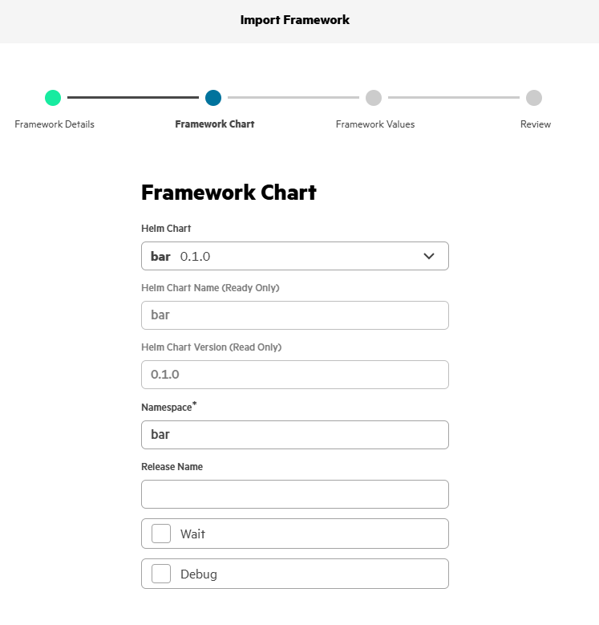

# BAR (Batch Agreement Robot)

| Owner                       | Name                              | Email                                     |
| ----------------------------|-----------------------------------|-------------------------------------------|
| Use Case Owner              | Jeffrey Fougere                   | jeffrey.fougere@hpe.com                   |
| PCAI Deployment Owner       | Tanguy Pomas                      | tanguy.pomas@hpe.com                      |

## Abstract

For some use cases that require text analysis (e.g. legal documents analysis), **documents need to be analyzed in their entirety**, meaning **RAG is not recommended**, as it only leverage a few passages at most. Additionally, traditional chat only allow you to interact with one prompt at a time, with limited document interactions (when using RAG). The Batch Agreement Robot (BAR) application overcomes both of these issues.

BAR is a containerized web application for batch document analysis through automated prompt execution using AI. It processes multiple PDF and TXT documents simultaneously with custom analysis prompts, delivering consolidated results in Excel format.
 
Unlike traditional chatbots and RAG flows:
- **BAR leverages all the text of large documents (100+ pages) at once** when analyzing them
- **BAR can analyze hundreds of documents versus dozens of prompts at the same time**
- BAR places document analysis into a spreadsheet to easily export the results

The BAR application features:
- **File Upload and Management**: Upload zipped folders containing `.txt` or `.pdf` documents (up to 100MB)
- **Prompt Definition**: Define analysis prompts via spreadsheet templates or manually
- **Batch Processing**: Concurrent document processing with real-time progress tracking
- **Result Generation**: Download consolidated results as Excel spreadsheets

## Description

### Overview

This demo simply consists in showing the BAR application in action: uploading txt/pdf files to it, defining a list of prompts to pass to all documents and viewing the results on the UI.

Showing the model endpoints on MLIS and the Import Framework button is recommended to better explain what BAR is in the context of PCAI.

### Workflow

Ideally, the customer has, or has chosen a few (non-sensitive) txt/pdf files he is willing to test the application on, along with a few queries he prepared. 

If this is not the case, you may use this application with the default (zipped) txt files and prompt list (in csv format), but preferably you have tested the application beforehand with documents and prompts of your chosing, and should reuse those.

Once you know which documents you plan to process and which prompts/queries you plan to ask, simply use BAR with them:
- Open the BAR application
- Upload the documents (one by one or multiple at once in a .zip archive), dragging-and-dropping them to the "Upload Documents" on the UI, or using the "Browse" button
- Upload your list of prompts in the Configure Prompts panel, or manually write them down using the "Create new prompts" button
- Click on the "Start Analysis" button
- Monitor analysis progress
- Once analysis is complete, click on "View in New Tab" to view the results of the queries in table format directly in the UI

## Deployment

### Prerequisites

OpenAI API compatible chat model deployed on MLIS:
- MLIS deployment endpoint
- MLIS deployment API token
- Model ID

We recommend using meta-llama/Llama-3.1-8B-Instruct as a starting point, but any open-source chat model can be used. Models with large context windows are preferred.

### Installation and configuration

1. **Set up environment variables:**
Download the provided helm chart, **bar-0.1.0.tgz**

2. **Import the framework to PCAI:**
    - Navigate to Tools & Frameworks
	- Click on Import Framework
	- Fill the mandatory fields:
	   - Framework Name: BAR
	   - Description: Batch document analysis application
	   - Category: Select whichever
	   - Framework icon: Upload any icon image

Upload the provided helm chart, **bar-0.1.0.tgz** and set Namespace value to **bar**:

In the Framework Values, edit the following fields, under backend.env:
  - **BAR_API_KEY**: Copy your MLIS deployment API token here
  - **BAR_API_BASE**: Copy your MLIS deployment endpoint here, adding /v1 at the end 
  - **BAR_MODEL_ID**: Copy the deployed model ID here

   

You can now proceed with completing the framework import

3. **Access the application:**
   - Application will be accessible in the Tools & Frameworks category page chosen during the import process

## Running the demo

Running the demo basically consists in using the BAR application:
1. **Upload Documents**: Upload a zipped folder containing `.txt` or `.pdf` documents, or individual files directly. Example `.txt` files are provided at **deploy/data/sample_BAR_input_docs.zip**
2. **Define Prompts**: Upload a spreadsheet with analysis prompts and field definitions, or create prompt manually. Example of expected spreadsheet format is provided at **deploy/data/sample_BAR_prompts.csv**
3. **Review Setup**: Verify files and prompts before processing
4. **Start Analysis**: Click "Start Analysis" to begin batch processing with real-time progress
5. **Download Results**: Download the consolidated analysis results as an Excel file, or inspect them in a new tab

## Limitations

BAR will extract the text from entire documents and add it to the prompts. This process assumes that **the documents' content fits into the model context window**.

For very large files (100s of pages) and/or models with small context windows (a few thousands tokens), the analysis is expected to fail.
