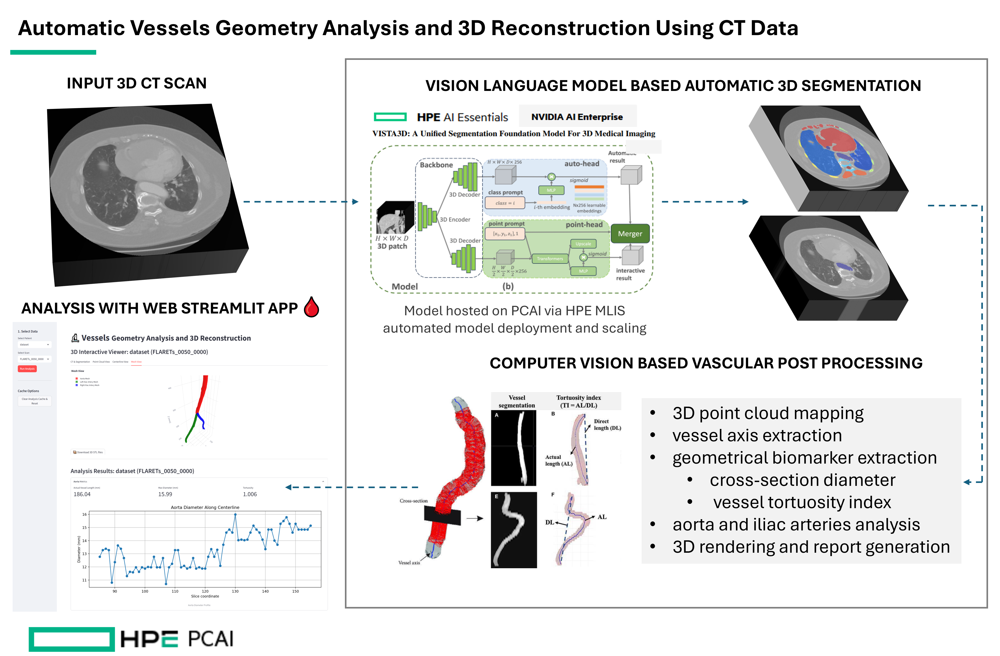
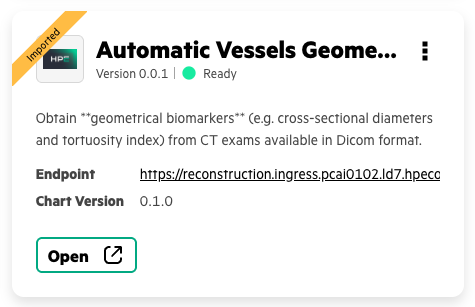
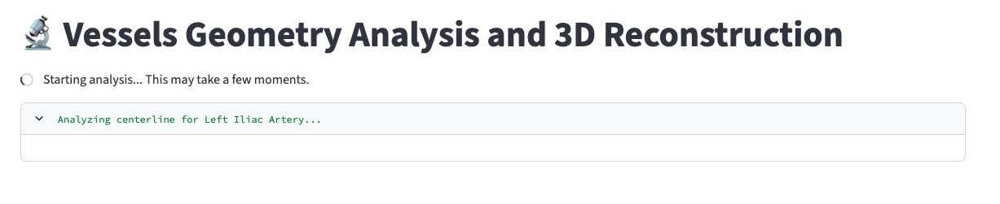
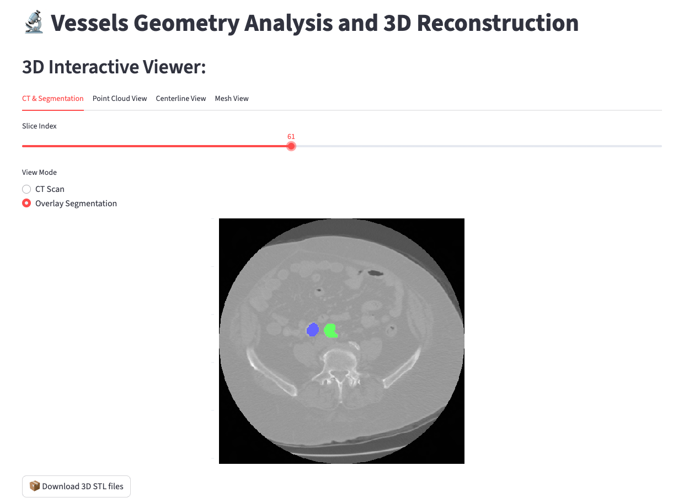
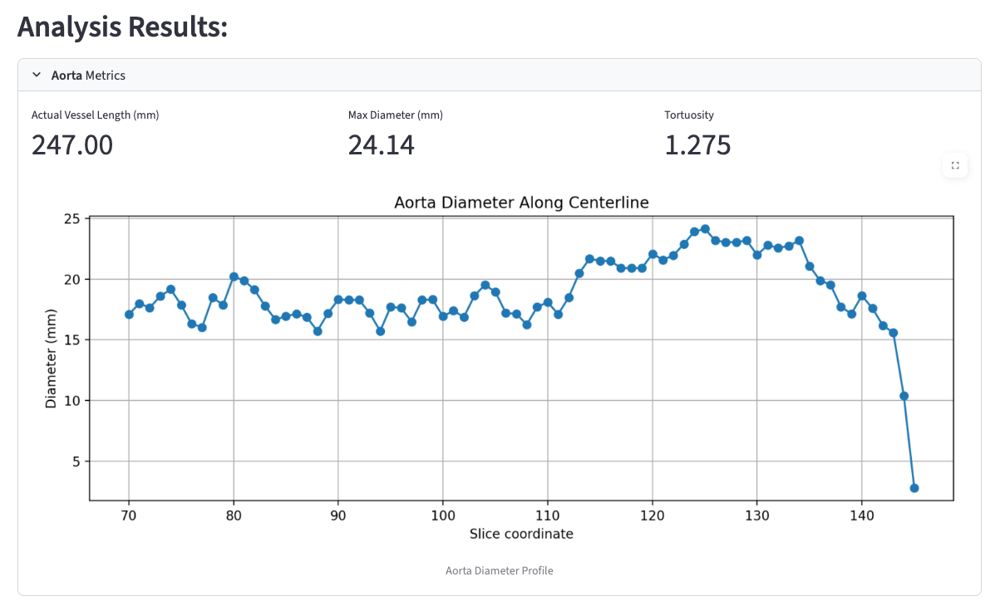
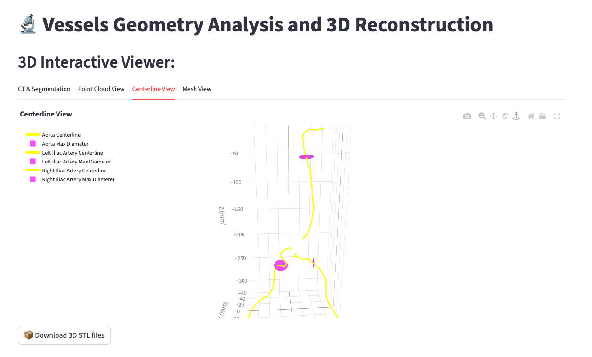
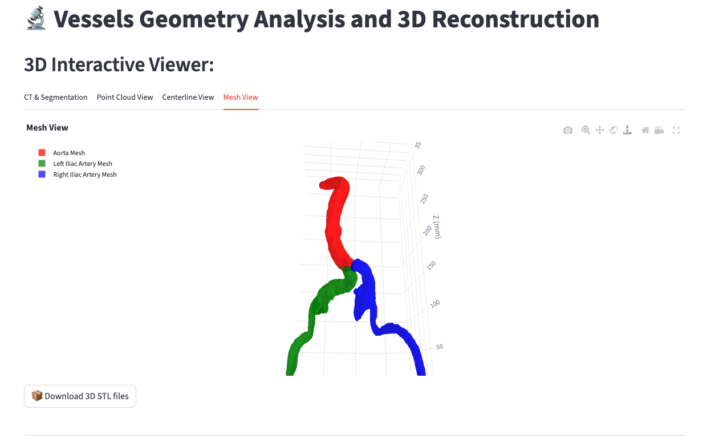

# End-to-End 🩸 Automatic Vessels Geometry Analysis and 3D Reconstruction

| Owner                 | Name              | Email                              |
| ----------------------|-------------------|------------------------------------|
| Use Case Owner              | Alejandro Morales, Francesco Caliva | alejandro.morales-martinez@hpe.com, francesco.caliva@hpe.com |
| PCAI Deployment Owner       | Andrew Mendez, Francesco Caliva     | andrew.mendez@hpe.com, francesco.caliva@hpe.com              |

## Abstract

This demo shows how to obtain **geometrical biomarkers** (e.g. cross-sectional diameters and tortuosity index) from CT exams available in Dicom format. In order to achieve this the following steps are conducted:

- Automatic segmention of the aorta, right and left common iliac arteries visible in the CT scans by using Nvidia Vista 3D model.
- Postprocessing of the segmentation output, preparing it for geometrical analysis and 3D rendering.
- Computer vision-based vascular geometry analysis and interactive visualization of the results via a dedicated Streamlit web application.


Video recording:
[**Click to watch demo**](https://storage.googleapis.com/ai-solution-engineering-videos/public/Enhancing%20Healthcare%20with%20AI_%20Blood%20Vessel%20Analysis%20and%203D%20Reconstruction(1).mp4)

### Overview




### Workflow

This application provides a complete workflow for medical imaging analysis:

-   **Input:** It takes 3D segmentation predictions from NVIDIA's VISTA-3D model (a model that is deployed in Private Cloud AI via its Machine Learning Inference Software (MLIS)).
-   **Processing:** It performs 3D reconstruction of three main blood vessels, such as aorta, common right and left iliac arteries.
-   **Analysis:** It calculates key clinical geometrical markers such as maximum diameter and tortuosity index.
-   **Visualization:** It presents segmentation output overlayed to the CT, and shows 3-D rendering of the segmented blood vessels. It also shows the analysis results in an interactive Streamlit web interface for review by clinicians.
- **Deployment:** It deploys the application with turn-key infrastructure for guaranteed resource allocation, persistent storage, and scalability.

## Deployment

### Deployment prerequisites

Before deploying this chart, you must have the following:

1.  Access to an HPE Private Cloud AI (PCAI) environment.
2.  An existing **PersistentVolumeClaim (PVC)** available in your target namespace (e.g., `kubeflow-shared-pvc`) for storing input and output data.
3.  Deploy Nvidia Vista-3D NIM model on MLIS. Please follow instruction on [how to deploy NIM to MLIS](./docs/deploy-NIM-to-MLIS.pdf) to complete this step.

### Data Preparation:
Let's begin by preparing the data for further analysis.
Data preparation entails 3 steps:
1.  **Conversion** of CT Dicom data to Nifti format.
2.  **Feeding** the Nifti data to NVIDIA NIM Vista-3D model to achieve the blood vessels segmentation.
3.  **Post-processing** of the segmentation output and **conversion** to a point-clouds format.

These steps are described in details within the [dataprep_demo.ipynb](./notebooks/dataprep_demo.ipynb) notebook. 

At this point, please complete data preparation as shown in the notebook [dataprep_demo.ipynb](./notebooks/dataprep_demo.ipynb) before you proceed.


## Codebase Structure
The codebase contains the application code and Dockerfile used to containerize this application. The latest docker image is available at `fcaliva/vessel-analysis-app:0.0.10`. This codebase also contains the Helm chart to deploy this application in PCAI.

## Helm Chart Structure
The application is packaged as a Helm chart with the following structure:

```
deploy
    |
    └─charts/
        ├ Chart.yaml          # Metadata about the chart (name, version, etc.).
        ├── values.yaml         # Default configuration values for the chart.
        ├── templates/
        │   ├── _helpers.tpl    # Helper templates for labels and names.
        │   ├── deployment.yaml # Manages the application pod and its resources.
        │   ├── fileserver.yaml # Manages the creation of a fileserver to load data into the app
        │   ├── pvc.yaml    # Manages creation of a PVC in the specified namespace, linking it to the shared already existing GL4FILE storage
        │   ├── service.yaml    # Exposes the application internally within the cluster.
        |   ├── 
        │   └── virtual-service.yaml # Exposes the service externally via the Istio gateway.
        └── .helmignore         # Specifies files to ignore when packaging the chart.
```

## Deployment Instructions

To deploy this application in PCAI, follow these steps:

1.  **Clone the Repository**
    Clone this repository to your local machine.

2.  **Package the Helm Chart**
    Navigate to the `deploy/charts/v.0.1.3` directory and use the `helm package` command. This will create a compressed `.tgz` archive of the chart.
    ```bash
    cd deploy/charts
    helm package .
    # This will create a file like vessel-reconstruction-0.1.3.tgz
    ```

4.  **Import into PCAI**
    -   Navigate to your PCAI dashboard.
    -   Go to **Tools & Frameworks > Data Science** tab.
    -   Click **Import Framework**.
    -   Follow the on-screen instructions, and when prompted, upload the `vessel-reconstruction-0.1.3.tgz` file you just created.
    -   During the import or deployment phase, PCAI will use the values from `values.yaml` to configure the application. 

## Accessing the Application

Once the deployment is complete, the application will be accessible at the URL https://reconstruction.\${DOMAIN_NAME}, where ${DOMAIN_NAME} is the domain name PCAI is deployed with. You can find the exact link in the PCAI **Tools & Frameworks** dashboard for your deployed instance.


Similarly the fileserver will be created at https://fileserver.\${DOMAIN_NAME}. Use that to feed data to the NVIDIA 3D VISTA model.

## Helm charts configurations

For a full list of the configurable parameters of the Vessels Analysis and Reconstruction helm charts and their default values, as defined in `values.yaml` please refer to this [helm_chart_config.md](docs/helm_chart_config.md) file.


## Running the demo
- **Step 1:** Data preparation using [dataprep_demo.ipynb](./notebooks/dataprep_demo.ipynb) notebook
- **Step 2:** Install the helm chart into PCAI using the Import Tools & Framework wizard. 

Suggested values for *Framework details* are:
 
    - **Framework Name:** Automatic Vessels Geometry Analysis and 3D Reconstruction
    - **Description:** Obtain geometrical biomarkers (e.g. cross-sectional diameters and tortuosity index) from CT exams available in Dicom format.
    - **Category:**  Data Science
    - **Framework icon:** [framework icon](./hpe_2025_logo.png)

Follow instructions on screen to upload the helm chart `.tgz` file, **e.g.** [vessel-reconstruction-0.1.0.tgz](deploy/charts/vessel-reconstruction-0.1.0.tgz)

Specify the namespace and adjust the `values` files if need to in the following window. Be sure that the name space has access to the specified PVC.

Successful import should result in a framework that appears as:



- **Step 3:** Click Open to launch the application

- **Step 4:** Execute analysis

    - `Select Patient` and `Select Scan` using the dedicated dropdown menus
    - Click `Run analysis`to execute the analysis




- **Step 5:** Inspect results on dedicated panels:
    - Segmentation results
        
    - Diameter across along the centerline
        
    - Centerline and Max diameter location
        
    - 3D rendering of the vessels
        

## Limitations

- At the time of this writing, Nvidia Vista 3D model is not able to segment brain CT, alternative segmentation models would need to be used.
- Currently, as described within the dataprep notebook, the application relies on finding the data within folder `/shared/califra/outputs`. This will be improved in the next iterations of the work.
