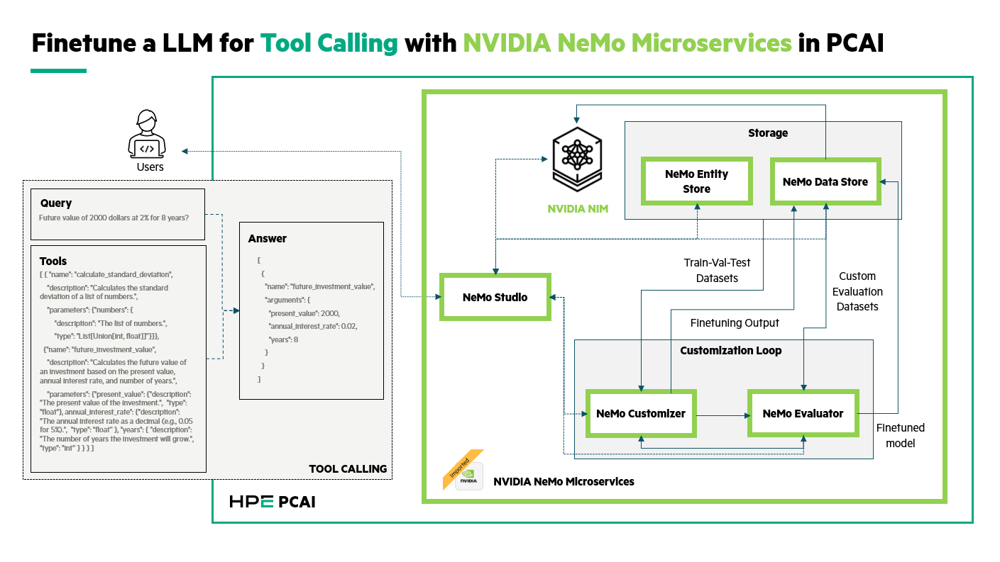

# Fine-Tune Tool-Calling LLM on PCAI with NeMo Microservices 25.12.1

| Owner                       | Name                                | Email                                                        |
| ----------------------------|-------------------------------------|--------------------------------------------------------------|
| Use Case Owner              | Daniel Cao                          | daniel.cao@hpe.com                                           |
| PCAI Deployment Owner       | Daniel Cao                          | daniel.cao@hpe.com

Fine-tunes `meta/llama-3.2-1b-instruct` for tool-calling using LoRA on HPE PCAI, achieving ~92% function name accuracy (up from ~12% baseline) and ~72% argument accuracy (up from ~8%).

Adapted from [NVIDIA GenerativeAIExamples](https://github.com/NVIDIA/GenerativeAIExamples/tree/main/nemo/data-flywheel/tool-calling) for HPE AI Essentials (AIE) / PCAI.

Note: This repository superseds the [archived one](https://github.com/ai-solution-eng/ai-solution-demos/tree/main/archived-demos/finetune-tool-calling-llm) built with NeMo Microservices 25.8.0.



[Demo - 8m28s](https://storage.googleapis.com/ai-solution-engineering-videos/public/Finetune_llm_tool_call_short.mp4)

[Demo - 30m23s](https://storage.googleapis.com/ai-solution-engineering-videos/public/Finetune_llm_tool_call_long.mp4)

## Prerequisites

- NeMo Microservices 25.12.1 deployed on PCAI (namespace: `nemo-microservices-25121`)
- At least 01 GPU (L40S, H100, or H200) is available in the cluster
- HuggingFace account with access to [xLAM dataset](https://huggingface.co/datasets/Salesforce/xlam-function-calling-60k)
- Jupyter notebook environment on PCAI
- **Outbound HTTPS access from worker nodes** to `api.ngc.nvidia.com`, `nvcr.io`, `huggingface.co`, `cdn-lfs.hf.co`

## Setup

```bash
export HF_TOKEN=<your-huggingface-token>
```

Edit `config.py` to set your PCAI hostname if different from the default.

In each notebook, run the first two cells:
1. `!pip install -r requirements.txt --quiet`
2. Restart kernel
3. `from pcai_setup import *`

## Files

| File | Purpose |
|---|---|
| `config.py` | PCAI environment config — URLs, model, namespace, SSL settings |
| `pcai_setup.py` | Shared setup — SSL fixes, SDK client init, HfApi init |
| `requirements.txt` | Python dependencies |
| `1_data_preparation.ipynb` | Download xLAM from HuggingFace, convert to OpenAI format, split train/val/test |
| `2_finetuning_and_inference.ipynb` | Upload data, create namespace, LoRA fine-tune, test inference |
| `3_model_evaluation.ipynb` | Evaluate base vs fine-tuned model accuracy |

## PCAI-Specific Adaptations

These notebooks include the following PCAI-specific changes from the NVIDIA originals:

| Adaptation | Reason |
|---|---|
| `pcai_setup.py` shared module | Centralizes SSL, client init, HfApi config |
| `httpx.Client(verify=False)` | PCAI internal SSL certificates |
| `requests.post(..., verify=False)` | Data Store API calls |
| `huggingface_hub` session patch | HfApi SSL verification bypass |
| `NDS_INTERNAL_URL` for HfApi | Bypasses Istio to avoid LFS http/https mismatch |
| `HF_TOKEN` env var on customizer pod | Required for HuggingFace model downloads |

## Architecture

All NeMo Microservices are exposed through a single PCAI Istio VirtualService:

```
https://nemo-microservices-25121.<domain>/
├── /studio              → NeMo Studio UI (3000)
├── /v1/namespaces       → Entity Store (8000)
├── /v1/projects         → Entity Store (8000)
├── /v1/datasets         → Entity Store (8000)
├── /v1/models           → Entity Store (8000)
├── /v1/datastore        → Data Store (3000)
├── /v1/hf               → Data Store HF API (3000)
├── /*.git/*             → Data Store Git LFS (3000)
├── /v1/customization    → Customizer (8000)
├── /v1/evaluation       → Evaluator (7331)
├── /v1/guardrail        → Guardrails (7331)
├── /v1/deployment       → Deployment Mgmt (8000)
├── /v1/jobs             → Core API (8000)
├── /v2/                 → Core API (8000)
└── /                    → NIM Proxy (8000)
```

## Expected Results

| Metric | Base Model | Fine-Tuned | Improvement |
|---|---|---|---|
| Function Name Accuracy | ~12% | ~92% | +80% |
| Function Name + Args Accuracy | ~8% | ~72% | +64% |

## Known Issues

- **Firewall**: Worker nodes may not have outbound HTTPS access. The customizer needs to reach `api.ngc.nvidia.com` or `huggingface.co` to load model targets and download weights. See `troubleshoot_deployment.md` Issue 10.
- **Studio "Failed to fetch" toast**: Benign UI timing issue when creating projects. The operation succeeds — refresh the page.
- **HfApi LFS upload**: The Data Store returns `http://` LFS upload URLs. Use `NDS_INTERNAL_URL` (internal cluster DNS) to bypass Istio for uploads.
