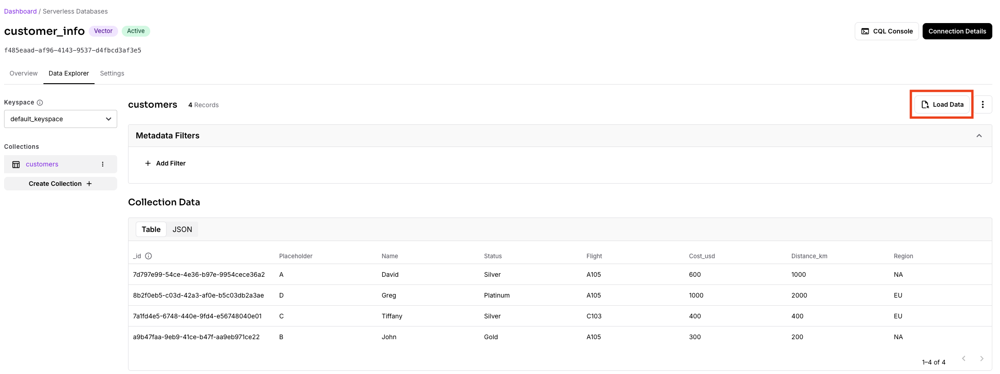
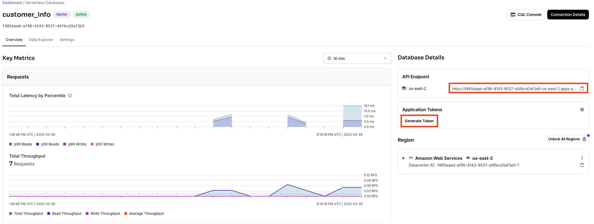
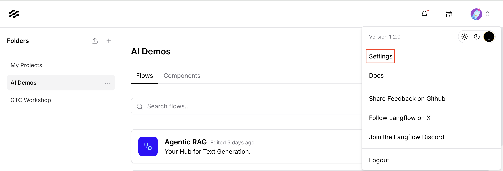
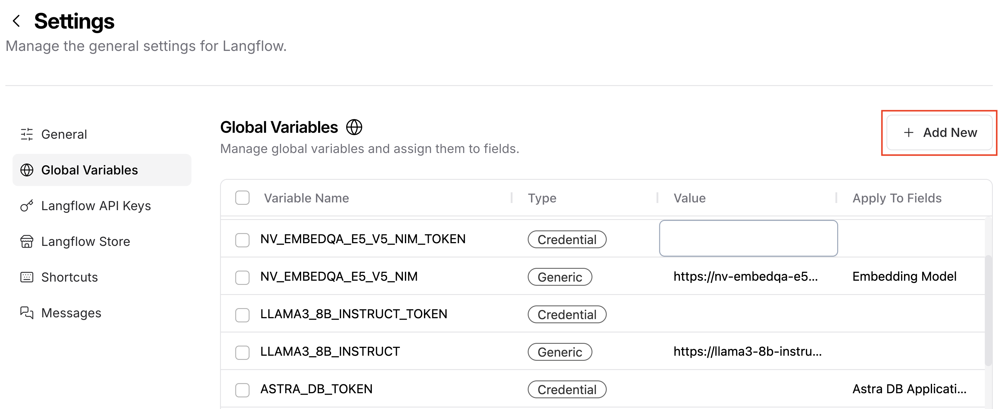
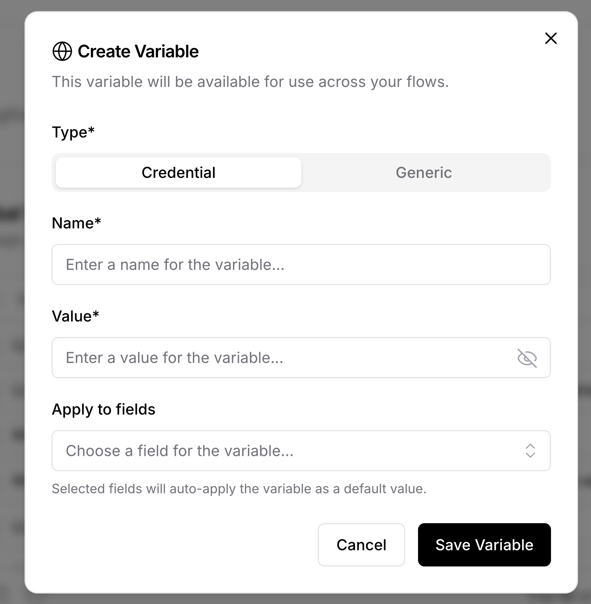
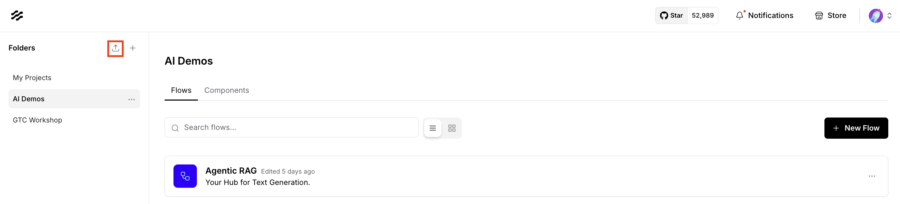
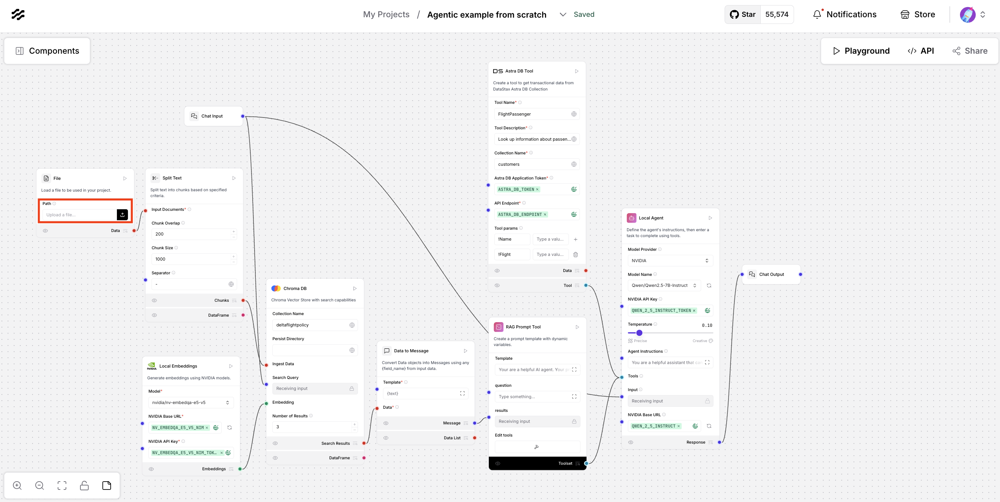

# Langflow Agent Flight Assistant Demo

## Summary
- [Demo overview video](#demo-overview-video)
- [Langflow installation in PCAI](#langflow-installation-in-pcai)
- [MLIS setup in PCAI](#mlis-setup-in-pcai)
- [Langflow setup in PCAI](#setup-before-the-demo)

### Demo overview video

- [Short version](https://hpe-my.sharepoint.com/:v:/p/hoang_phan/ETTbL85pQ-VIohgLUTD4sMgBcLXQeHdDHaFekOtubfLTTA?e=dS352V&nav=eyJyZWZlcnJhbEluZm8iOnsicmVmZXJyYWxBcHAiOiJTdHJlYW1XZWJBcHAiLCJyZWZlcnJhbFZpZXciOiJTaGFyZURpYWxvZy1MaW5rIiwicmVmZXJyYWxBcHBQbGF0Zm9ybSI6IldlYiIsInJlZmVycmFsTW9kZSI6InZpZXcifX0%3D)
- [Long version](https://hpe-my.sharepoint.com/:v:/p/hoang_phan/EUVnjGRr8wJGlCk2Hw5IwOkB8WQ0gpZ5zV9KKUXIHCSl5g?e=uexDHe&nav=eyJyZWZlcnJhbEluZm8iOnsicmVmZXJyYWxBcHAiOiJTdHJlYW1XZWJBcHAiLCJyZWZlcnJhbFZpZXciOiJTaGFyZURpYWxvZy1MaW5rIiwicmVmZXJyYWxBcHBQbGF0Zm9ybSI6IldlYiIsInJlZmVycmFsTW9kZSI6InZpZXcifX0%3D)

### Langflow installation in PCAI

1. [Install Langflow within a PCAI environment using the following chart](https://github.com/ai-solution-eng/frameworks/tree/main/langflow)

2. [Follow these instructions to install the helm chart](https://support.hpe.com/hpesc/public/docDisplay?docId=a00aie16hen_us&docLocale=en_US&page=ManageClusters/importing-applications.html)

### MLIS setup in PCAI

1. Deploy the `Qwen/Qwen2.5-7B-Instruct` model using the following configuration:
    - General:
        - Registry: `None`
        - Image: `vllm/vllm-openai:latest`
    - Advanced:
        - Environment Variables (add you HF token)
            - HUGGING_FACE_HUB_TOKEN
        - Arguments (vLLM serve arguments)
            - `--model Qwen/Qwen2.5-7B-Instruct --enable-auto-tool-choice --tool-call-parser hermes --port 8080`
2. Once successfully deployed, save the endpoint url and append `/v1` for later, as well as add an API token under the `Users` and save that as well.
3. Deploy the `nvidia/nv-embedqa-e5-v5` model using the following configuration:
    - General:
        - Registry: `NGC` (create an NGC registry if there is none)
        - NGC Supported Models: `nvidia/nv-embedqa-e5-v5`
4. Once successfully deployed, save the endpoint url and append `/v1` for later, as well as add an API token under the `Users` and save that as well.
5. [Sign in to AstraDB or create an account if you don't have one already](https://accounts.datastax.com/session-service/v1/login)
6. Create a new vector database and a new collection called `customers` where you can upload the [provided fake customer data](data/fake_customer_info.csv)

6. Once the data is uploaded, copy the endpoint and generate a token, you will need both of these for later

### Setup before the demo

1. Once Langflow has been deployed, go to the top right menu next to the profile picture as shown in the image below:

2. In the settings select `Global Variables` and select `Add New` as shown below:

3. You will need to add the following variables that are configured previously:
    
    - `NV_EMBEDQA_E5_V5_NIM`
    - `NV_EMBEDQA_E5_V5_NIM_TOKEN`
    - `QWEN_2_5_INSTRUCT`
    - `QWEN_2_5_INSTRUCT_TOKEN`
    - `ASTRA_DB_ENDPOINT`
    - `ASTRA_DB_TOKEN`
4. Upload the [provided flow if using `Langflow 1.3.X`](langflow-agent-v1-3.json) (or [this older flow if using `Langflow 1.2.X`](langflow-agent-v1-2.json)) into any project by clicking the upload button

5. Finally, make sure to [re-upload the flight policy file](data/delta_refund_policy.pdf) to the `File` component

6. Open the playground and test the workflow with a question like:
    > "My name is John and my flight is A105, I was downgraded to coach from first class, what is my refund?"
    - The model should return the correct answer of $90 after calling both tools included (`FlightPolicy` and `FlightPassenger`)