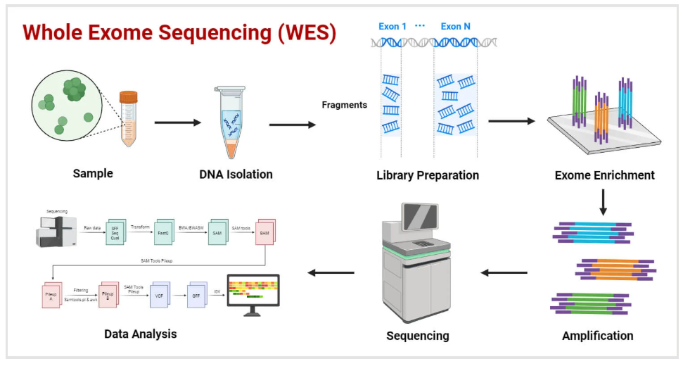
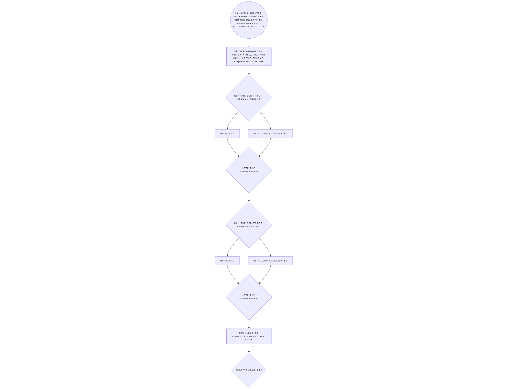
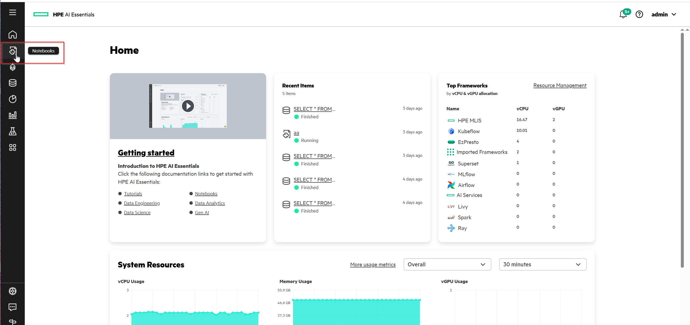
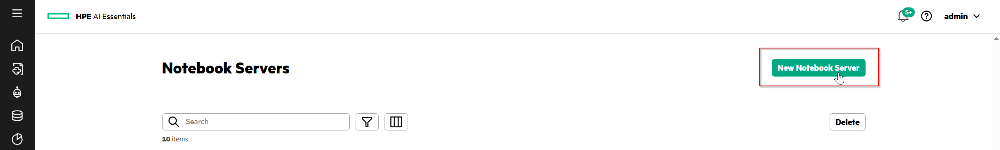
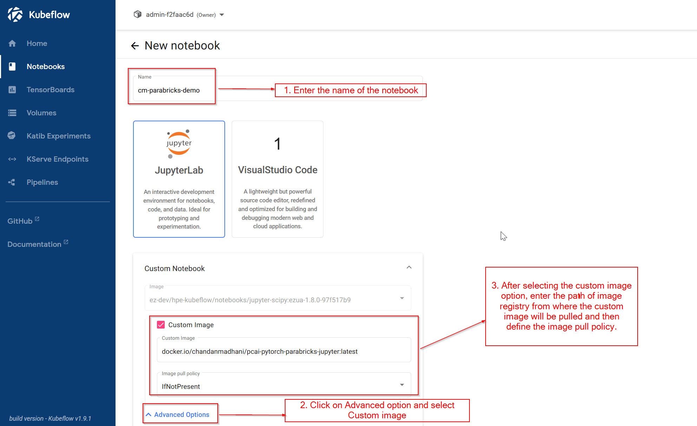
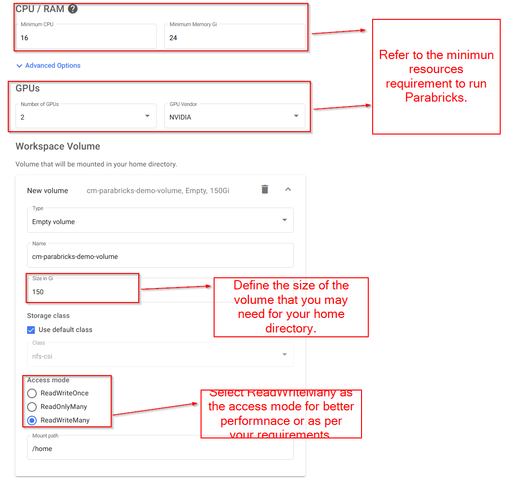

# Genome Sequencing Acceleration with NVIDIA Parabricks on PCAI

| Owner                       | Name                              | Email                                     |
| ----------------------------|-----------------------------------|-------------------------------------------|
| Use Case Owner              | Chandan Madhani                   | chandan.madhani@hpe.com                   |
| PCAI Deployment Owner       | Chandan Madhani                   | chandan.madhani@hpe.com                   |

## 🧩 Problem Statement

Traditional genome sequencing pipelines—covering alignment, sorting, recalibration, and variant calling—are CPU-bound and highly time-consuming, often taking **18–48 hours or more**. This delays critical research and diagnosis. Moreover, bioinformaticians often struggle with manual setup across Kubernetes and Slurm HPC environments.

---

## 🎯 Target Outcome

- Accelerate genome sequencing pipelines **from days to hours** using **NVIDIA Parabricks**.
- Provide a **custom Jupyter Notebook image (PCAI-compatible)** preloaded with Parabricks and essential bioinformatics tools.
- Enable bioinformaticians to run pipelines **without Kubernetes or Slurm knowledge**, directly from the terminal or Python kernel inside a PCAI notebook.

---

## Genome Sequencing Process



---

## 📊 High-Level Demo Flow

1. Launch a Jupyter Notebook using the custom image.
2. Prepare/download data for genome sequencing.
3. Run **read alignment workflows (CPU & GPU)**.
4. Run **variant calling workflows (CPU & GPU)**.
5. *(Optional)* Visualize or download BAM and VCF files.



---

## 🛠️ Step-by-Step Instructions

### ✅ Step 1: Launch a PCAI Jupyter Notebook with the Custom Image

Open the **AI Essentials WebUI > Notebooks** tab.



Follow the steps outlined in the image below to create the notebook with a custom image. Use the following custom image:

```bash
docker.io/chandanmadhani/pcai-pytorch-parabricks-jupyter:latest
```




> 📝  *Note: The image is publicly accessible on DockerHub for demo purposes.*

**Resource Recommendations:**

For the demo purpose, we need to run and show the genome sequencing pipeline on both CPUs and GPUs separately. So, while creating the notebook, select as per the below recommendation.
- **CPU**: 16 cores (minimum 8)
- **RAM**: 24 GB (minimum 16 GB)
- **GPU**: 2× NVIDIA GPUs (minimum 16 GB each; recommended: ≥48 GB memory)

> The ideal system requirement from Nvidia for Parabricks is as below:

- Parabricks can be run on any NVIDIA GPU that supports CUDA architecture and has at least 16GB of GPU RAM. NVIDIA Parabricks has been tested on the following NVIDIA GPUs:
	- V100, T4, A10, A30, A40, A100, A6000, L4, L40, H100, H200, Grace Hopper™ Superchip.
- A 2-GPU system should have at least 100GB of CPU RAM and at least 24 CPU threads.
- A 4-GPU system should have at least 196GB of CPU RAM and at least 32 CPU threads.
- An 8-GPU system should have at least 392GB of CPU RAM and at least 48 CPU threads.




---

### 🔧 Step 2: Environment Preparation & Data Download

#### Prepare Environment

```bash
source prepare_env.sh
```

This sets up the environment with required environment variables and dependencies.

#### Download and Process Data

You can find scripts for two different data sources in `data_preparation_scripts/`, **data_source_arabidopsis_thaliana** and **data_source_human_genome_NA12878**. For this demo, we will be using **data_source_arabidopsis_thaliana**.

You can choose either of the below script at location `data_preparation_scripts/data_source_arabidopsis_thaliana` and it will download the same data: 
- **data_prep.sh**: Simple execution without any logs or debugging enabled. For our demo, we can use this.
- **data_prep_with_logging.sh**: Includes step-wise logging and debugging.

Example:

```bash
cd data_preparation_scripts/data_source_arabidopsis_thaliana/
./data_prep.sh
```
You can see the files below as a result of **data_prep.sh** script execution.

```bash
(base) admin@cm-test-parabricks-0:~/shared/cm-parabricks-demo/data-source-1$ ls -ltr
total 27822110
-rw-rw-r--. 1 admin users 19230910695 Sep 25  2015 1001genomes_snp-short-indel_only_ACGTN.vcf.gz
-rw-r-----. 1 admin users  3266686581 Aug 23  2016 1001genomes_snp-short-indel_only_ACGTN.BIALLELIC.hdf5
-rw-r-----. 1 admin users  1244852100 Aug 24  2016 1001genomes_snp-short-indel_only_ACGTN.BIALLELIC.acc.hdf5
-rw-rw-r--. 1 admin users   121164952 Jun 16  2023 GCF_000001735.4_TAIR10.1_genomic.fna
drwxrwsr-x. 2 admin users        4096 Jun  1 19:09 ncbi_dataset
-rwxrwxr-x. 1 admin users        1300 Jun  2 06:07 data_prep.sh
-rw-rw-r--. 1 admin users  2147763172 Jun  2 06:16 TDr-7_10M_R1.fastq
-rw-rw-r--. 1 admin users  2147763172 Jun  2 06:17 TDr-7_10M_R2.fastq
-rw-rw-r--. 1 admin users   121164952 Jun  2 06:17 TAIR10_chr_all.fasta
-rw-rw-r--. 1 admin users         244 Jun  2 06:17 TAIR10_chr_all.fasta.fai
-rw-rw-r--. 1 admin users   119668728 Jun  2 06:18 TAIR10_chr_all.fasta.bwt
-rw-rw-r--. 1 admin users    29917160 Jun  2 06:18 TAIR10_chr_all.fasta.pac
-rw-rw-r--. 1 admin users         616 Jun  2 06:18 TAIR10_chr_all.fasta.ann
-rw-rw-r--. 1 admin users        7535 Jun  2 06:18 TAIR10_chr_all.fasta.amb
-rw-rw-r--. 1 admin users    59834368 Jun  2 06:19 TAIR10_chr_all.fasta.sa
-rw-rw-r--. 1 admin users         994 Jun  2 06:19 TAIR10_chr_all.dict
-rw-r--r--. 1 admin users      101020 Jun  2 06:32 1001genomes_snp-short-indel_only_ACGTN.vcf.gz.tbi
```

💡 *Optional*:  If you want to try and play around and test the rest of the steps yourself on another sample dataset, you can try executing `data_preparation_scripts/data_source_human_genome_NA12878/data_prep.sh` script in a different folder and retry the complete workflow yourself.

---

### 🧬 Step 3: Execute read alignment workflow scripts on CPU & GPU-accelerated tools

Since we are going to execute the genome sequencing pipelines on both CPUs and GPUs separately and observe the differences, it is recommended to create 2 different folders for CPUs and GPUs, respectively, from where the respective scripts will be executed. In this repo, you can find 2 folders containing the respective scripts,

- `cpu_workflow_scripts/`
- `cpu_workflow_scripts/`

Update the following paths in your scripts to reflect the correct location of the `.fasta` and `.fastq` files.

```bash
REF=/mnt/shared/genome-sequencing-acceleration-pcai/data_preparation_scripts/data_source_arabidopsis_thaliana/TAIR10_chr_all.fasta

TDR_1=/mnt/shared/genome-sequencing-acceleration-pcai/data_preparation_scripts/data_source_arabidopsis_thaliana/TDr-7_10M_R1.fastq
TDR_2=/mnt/shared/genome-sequencing-acceleration-pcai/data_preparation_scripts/data_source_arabidopsis_thaliana/TDr-7_10M_R2.fastq
```

#### ⚙️ CPU Execution

```bash
cd cpu_workflow_scripts/

./read_alignment_cpu.sh
```

**Expected Output:**

- `TDr-7_10M_cpu_sorted.bam`
- `TDr-7_10M_cpu_sorted_marked.bam`
- `TDr-7_10M_cpu_metrics.txt`
- `TDr-7_10M_cpu_sorted_marked.bam.bai`

#### ⚡ GPU Execution (Parabricks)

```bash
cd gpu_workflow_scripts/

./read_alignment_gpu.sh
```

> ⚠️ *When using Nvidia T4 GPUs or similar that have less memory (16GB), use the `--low-memory` option in the script by simply commenting line 10 and uncommenting line 13. Otherwise, you will notice an out-of-memory error.*

**Expected Output:** Same as the CPU execution, but the name of the generated files would be `*_gpu*`.

> *After executing the read alignment workflow on standard CPU-based tools and GPU-accelerated parabricks tools, you can note the improvements in the execution time.*

---

### 🧬 Step 4: Variant Calling (CPU vs GPU)

Update the following paths in your scripts to reflect the correct path. The variant calling workflow takes the reference genome (same as the read alignment workflow) and the .bam file generated as an output from the read alignment script.

```bash
REF=/mnt/shared/genome-sequencing-acceleration-pcai/data_preparation_scripts/data_source_arabidopsis_thaliana/TAIR10_chr_all.fasta

TDR_BAM=TDr-7_10M_cpu_sorted_marked.bam
```

#### ⚙️ CPU Execution

```bash
cd cpu_workflow_scripts/

./variant_calling_cpu.sh
```

**Expected Output:**

- `TDr-7_10M_cpu.vcf`
- `TDr-7_10M_cpu.vcf.idx`

#### ⚡ GPU Execution (Parabricks)

```bash
cd gpu_workflow_scripts/

./variant_calling_gpu.sh
```

> ⚠️ *When using Nvidia T4 GPUs or similar that have less memory (16GB), use the --htvc-low-memory option in the script by simply commenting line 9 and uncommenting line 12. Otherwise, you will notice an out-of-memory error.*

**Expected Output:**

- `TDr-7_10M_pb.vcf`
- `TDr-7_10M_pb.vcf.idx`

---

## 🧪 Benchmark and Comparison

Compare runtime performance between CPU-based and GPU-accelerated workflows for:

- ✅ Read Alignment
- ✅ Variant Calling

You should observe **significant reduction in execution time** when using Parabricks.

---

## 🚀 What's Next? (Optional Extension)

After generating the `.vcf` file, you can proceed to **sample identification based on genotype** (tertiary analysis). For example:

- Use the **AraGeno web portal** (from 1001 Genomes project)
- Run the **SNPmatch** tool locally *(beyond current demo scope)*

A common and powerful application of this is sample identification based on genotype.

Think of it this way: just as your unique genetic variants can reveal your human ancestry, a plant's specific alleles can pinpoint its exact crop variety. As a next step, we can verify the identity of the sample we've been analyzing. While the 1001 Genomes project offers a web portal called AraGeno for SNP-based sample identification, we can instead run the SNPmatch tool manually to achieve the same goal. But this is beyond the scope of the current demo.

---

## 📁 Repository Structure

```
genome-sequencing-acceleration-pcai/
├── cpu_workflow_scripts/
├── gpu_workflow_scripts/
├── data_preparation_scripts/
├── prepare_env.sh
├── preloaded_data/
├── images/
└── README.md
```

---
