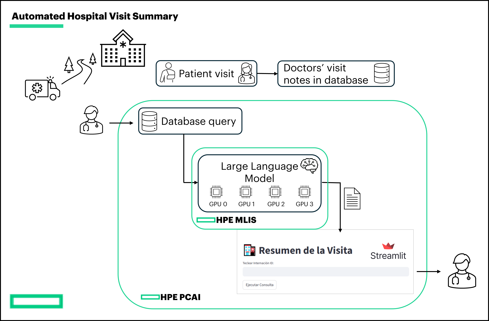
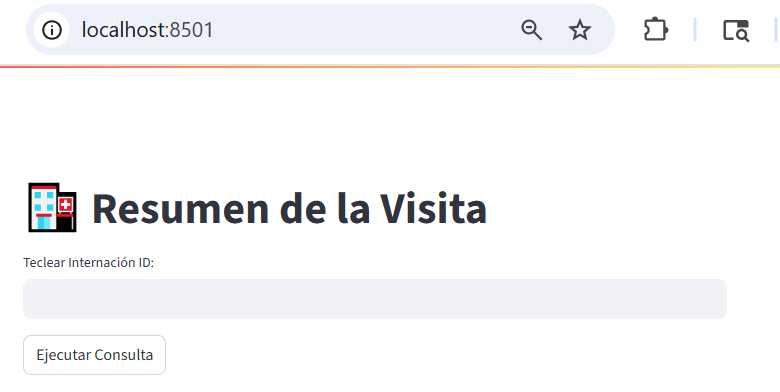

# Hospital Visit Summary App 🏥

This project is a **Streamlit-based web application** that connects to an Informix database, retrieves patient visit data, and generates a **structured summary of hospital visits** using an NVIDIA LLM via the `langchain_nvidia_ai_endpoints` library.

**Authors:**
- Francesco Caliva francesco.caliva@hpe.com
- Andrew Mendez andrew.mendez@hpe.com
- Akash Khanna akash.khanna@hpe.com

**High level demo flow** 


 
[**Click to watch demo**](https://storage.googleapis.com/ai-solution-engineering-videos/public/PatientVisitSummariesApp.mp4) 

---

## Features

- Connects to an Informix database via **JDBC**.
- Executes queries for patient visit data.
- Displays query results in a **Streamlit table**.
- Generates **structured summaries** of patient visits using a medical AI assistant.
- Output is organized in predefined categories:
  - Datos Generales de Identificación
  - Antecedentes Relevantes
  - Motivo del Ingreso/Tratamiento
  - Diagnóstico Principal
  - Métodos Diagnósticos y Tratamientos
  - Evolución del Paciente
  - Complicaciones
  - Condición al Alta
  - Recomendaciones para Cuidados Futuros

---

## Requirements

- Python 3.10+
- Java JDK (for JPype and JDBC)
- Dependencies listed in `requirements.txt`:

```txt
jpype1
jaydebeapi
pandas
streamlit
langchain
langchain_nvidia_ai_endpoints
python-dotenv
```
---

## Setup

1. Clone the repository:

```bash
git clone git@github.com:ai-solution-eng/hosted-trials.git
cd hosted-trials/fm-visit-summary
```

2. Create a .env file in the project root with the following variables:

```.env
# Database
DB_USER=<your_db_user>
DB_PASSWORD=<your_db_password>
JDBC_DATABASE_URL=<your_jdbc_url>

# LLM
LLM_URL=<llm_endpoint_url>
LLM_MODEL=<llm_model_name>
LLM_API_KEY=<your_llm_api_key>
```

3. Install Python dependencies:

```bash
pip install -r requirements.txt
```

## Launch the app from terminal

Run the Streamlit app:

```bash
streamlit run app.py
```

## Launch the app with Docker

You can run the app in a Docker container without installing Python or dependencies locally.

**a.** Pull the Docker image

```bash
docker pull fcaliva/medical_summary_app:0.0.1
```

**b.** Run the container
```
docker run -p 8501:8501 --env-file .env fcaliva/medical_summary_app:0.0.1
```
where:
    
``-p 8501:8501`` maps the container port ``8501`` to your ``local machine``.

``--env-file .env`` passes your environment variables into the container.

**c.** Open ``http://localhost:8501`` in your browser.

**d.** (Optional) build your own image

```bash
docker build -t medical_summary_app:latest .
```

**e.** Run it:

```bash
docker run -p 8501:8501 --env-file .env medical_summary_app:latest
```

**f.** Open http://localhost:8501 in your browser.

## How to use the app

Upon completion of the steps above:

1. Enter the `Internación ID` to fetch patient visit records from Informix database.



2. Click `Ejecutar Consulta` to query the database.

3. After the results are displayed, click Crear Resumen to generate a structured summary using the NVIDIA LLM.

The summary is displayed in editable text areas for review.


## Installation with Helm Chart

The Hospital Visit Summary Streamlit application can be deployed on **HPE Private Cloud AI (PCAI)** using a Helm chart.

### Workflow Overview
- **Input:** Retrieves data from an Informix database via SQL query.
- **Processing:** Constructs a prompt and sends it to an LLM using the LangChain framework.
- **Visualization:** Displays the query results and the generated clinical summary. Users can review and edit the report.
- **Extensibility:** 
1. Support for additional database backends.
2. Option to write the generated summary back into the database.
3. Integration with other LLMs and frameworks.

### PCAI Deployment Benefits
Deploying on PCAI provides:

- Guaranteed resource allocation
- Persistent storage
- Horizontal scalability with turnkey infrastructure

## Prerequisites

Before deploying this chart, you must have the following:

1.  Access to an HPE Private Cloud AI (PCAI) environment.
2.  An existing **PersistentVolumeClaim (PVC)** available in your target namespace (e.g., `kubeflow-shared-pvc`).
3.  Deploy `Nvidia meta/llama-3`.1-8b-instruct NIM model on MLIS. Please follow instruction on [how to deploy NIM to MLIS](./docs/deploy-NIM-to-MLIS.pdf) to complete this step.
4.  Create Kubernetes secrets with the variables in the `.env` file that we previously created. 

**Note** that the k8s secret shall be created under the `namespace` specified within file [helm\values.yaml](helm\values.yaml). In this case is `hospital-visit-summary`. One can use this command:

```bash
kubectl create secret generic visit-summary-secrets  --from-env-file=.env -n hospital-visit-summary
```

## Codebase Structure
The codebase contains the application code and Dockerfile used to containerize this application. The latest docker image is available at `fcaliva/medical_summary_app:0.0.1`. This codebase also contains the Helm chart to deploy this application in PCAI.

## Helm Chart Structure
The application is packaged as a Helm chart with the following structure:

```
helm/
├── Chart.yaml          # Metadata about the chart (name, version, etc.).
├── values.yaml         # Default configuration values for the chart.
├── templates/
│   ├── _helpers.tpl    # Helper templates for labels and names.
│   ├── deployment.yaml # Manages the application pod and its resources.
│   ├── service.yaml    # Exposes the application internally within the cluster.
│   └── virtual-service.yaml # Exposes the service externally via the Istio gateway.
└── .helmignore         # Specifies files to ignore when packaging the chart.
```

## Deployment Instructions

To deploy this application in PCAI, follow these steps:

1.  **Clone the Repository**
    Clone this repository to your local machine.

2.  **Package the Helm Chart**
    Navigate to the `helm/` directory and use the `helm package` command. This will create a compressed `.tgz` archive of the chart.
    ```bash
    cd helm/
    helm package .
    # This will create a file like `fm-visit-summary/helm/medical-summary-app-0.1.6.tgz`
4.  **Import into PCAI**
    -   Navigate to your PCAI dashboard.
    -   Go to **Tools & Frameworks > Data Science** tab.
    -   Click **Import Framework**.
    -   Follow the on-screen instructions, and when prompted, upload the `fm-visit-summary/helm/medical-summary-app-0.1.6.tgz` file you just created.
    -   During the import or deployment phase, PCAI will use the values from `values.yaml` to configure the application. 

## Accessing the Application

Once the deployment is complete, the application will be accessible at the URL https://reconstruction.\${DOMAIN_NAME}, where ${DOMAIN_NAME} is the domain name PCAI is deployed with. You can find the exact link in the PCAI **Tools & Frameworks** dashboard for your deployed instance.


## Configuration

The following table lists the configurable parameters of the Hospital Visit Summary App chart and their default values, as defined in `values.yaml`.

| Parameter | Description | Default |
| :--- | :--- | :--- |
| `replicaCount` | The number of application pods to run. | `1` |
| `namespace` | The Kubernetes namespace where all resources will be deployed. Please create the namespace beforehand. | `"visit-summary-ns"` |
| **HPE Ezmeral (EzUA) Settings** | | |
| `ezua.enabled` | If `true`, an Istio VirtualService will be created to expose the app. | `true` |
| `ezua.virtualService.endpoint` | The external hostname for the service. `\${DOMAIN_NAME}` is a placeholder for your cluster's domain. | `"visit-summary.${DOMAIN_NAME}"` |
| `ezua.virtualService.istioGateway` | The Istio gateway to bind the VirtualService to. | `"istio-system/ezaf-gateway"` |
| **Image Settings** | | |
| `image.repository` | The Docker image to use for the application. | `"fcaliva/medical_summary_app"` |
| `image.pullPolicy` | The image pull policy. | `"IfNotPresent"` |
| `image.tag` | The tag of the Docker image to pull. | `"0.0.1"` |
| **Resource Settings** | | |
| `resources.requests.cpu` | CPU requested for the pod. | `"4"` |
| `resources.requests.memory` | Memory requested for the pod. | `"32Gi"` |
| `resources.limits.cpu` | CPU limit for the pod. | `"4"` |
| `resources.limits.memory` | Memory limit for the pod. | `"32Gi"` |
| **Service Settings** | | |
| `service.type` | The type of Kubernetes service to create. | `"ClusterIP"` |
| `service.port` | The port the service will expose. | `8501` |
| `service.name` | The name of the service port. | `"http-streamlit"` |
| **Persistence Settings** | | |
| `persistence.enabled` | If `true`, mounts a volume for persistent data. | `true` |
| `persistence.existingClaim` | The name of the pre-existing PersistentVolumeClaim to use. | `"kubeflow-shared-pvc"` |
| **Environment Variables** | | |
  `env.STREAMLIT_SERVER_PORT` | The Streamlit port to be used. | "8501"
  `env.STREAMLIT_SERVER_ADDRESS` | The Streamlit server address.| "0.0.0.0"
  `env.JVM_PATH` | The path where JVM drivers have been installed (this must be the same as in the Dockerfile) | `"/usr/lib/jvm/java-21-openjdk-amd64/lib/server/libjvm.so"`
  `env.JDBC_JAR_PATH` | The path where JDBC JAR drivers have been installed (this must be the same as in the Dockerfile)| `"/app/drivers/jdbc-15.0.0.1.1.jar"`
  `env.MONGO_JAR_PATH` | The path where MONGO JAR drivers have been installed (this must be the same as in the Dockerfile)| `"/app/drivers/mongo-java-driver.jar"`
| **Kubernetes Secrets** | | |
`secretName` | K8s secrets | `visit-summary-secrets`