# Image Generation with ComfyUI

| Owner                       | Name                              | Email                                     |
| ----------------------------|-----------------------------------|-------------------------------------------|
| Use Case Owner              | Tanguy Pomas                      | tanguy.pomas@hpe.com                     |
| PCAI Deployment Owner       | Tanguy Pomas                      | tanguy.pomas@hpe.com                      |

## Abstract

This demo details how to use [ComfyUI](https://github.com/comfy-org/comfyui), an open source AI creation engine, on PCAI. 
In this demo, ComfyUI will only be used for **image generation** and **image editing**, but other kinds of workflows can be created and run exactly the same way, such as **video and audio generation**.

This demo is just an introduction on how to use ComfyUI. Users willing to explore advanced features of ComfyUI may want to refer to the official [ComfyUI documentation](https://docs.comfy.org/)

This demo only uses:
- **ComfyUI**: Provides the UI allowing users to define workflows, run them, while handling models loading and unloading required for the workflows to run successfully run.

**Recording:**

- Coming soon

## Description

### Overview

This demo consists in importing ComfyUI on PCAI and using it for arbitrary image generation and editing workflows. While the focus of this demo is on image generation, following its steps enables users to create and run all sorts of other workflows supported by ComfyUI, such as (but not limited to) video generation.

### Architecture Diagram
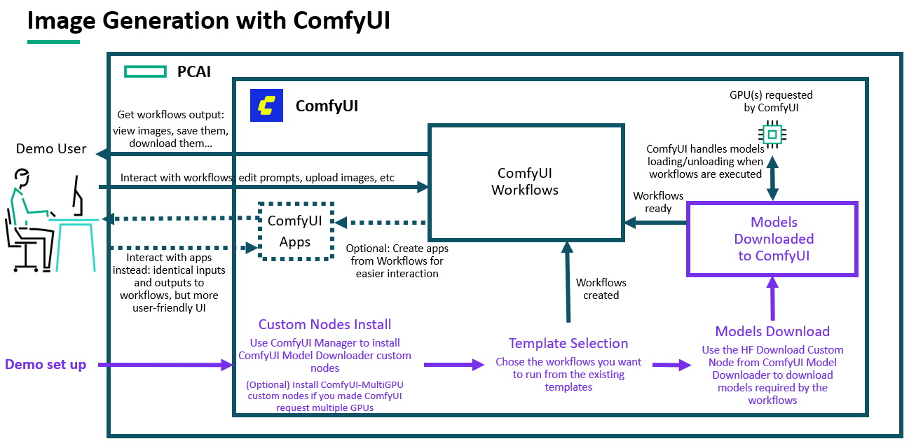

### Workflow

Once the demo has been set up, the workflow is straightforward:
* Open ComfyUI from the Tools & Frameworks page.
* On the left side, click on "Workflows" to open the list of all workflows you have saved during the demo setup, open the ones you are willing to show, then change some of their inputs (usually prompt and image inputs) and run them.
* Optionally, click on "Apps" to access the apps you have created from the workflows during the demo setup, and run them after changing their inputs values.

## Deployment

### Prerequisites

ComfyUI may work without any GPU, but will be severely limited and slow, so we highly recommend to import it with a **single GPU request**. 

Note: This means **one GPU will be fully allocated to ComfyUI for as long as it is running on PCAI**. 

By default ComfyUI only leverages a single GPU: **having it request more than one GPU won't have any effect unless leveraging MultiGPU custom ComfyUI nodes**, to be installed from the ComfyUI manager, after importing it to PCAI.

ComfyUI can be imported like any other application to PCAI: using an helm chart. At the time of writing this guide, there is no official ComfyUI helm chart, so we recommend to import it using the chart from our [frameworks repository](https://github.com/ai-solution-eng/frameworks/tree/main/comfyui)

### Installation and configuration

1. **Import ComfyUI**

Like for any framework you want to import to PCAI: 
* Go to Tools & Frameworks
* Click on "Import Framework", and follow the steps, using our [custom helm chart](https://github.com/ai-solution-eng/frameworks/blob/main/comfyui/comfyui-0.1.0.tgz) from our [frameworks repository](https://github.com/ai-solution-eng/frameworks/tree/main/comfyui)
* Review the values, default ones should be good for a simple demo, but PVC sizes and resources requests and limits may be increased if needed.

Then, wait for the application to be accessible from the PCAI interface.

2. **Open ComfyUI and install custom nodes**

Once imported, open ComfyUI, then click on the blue "Manager" button to open ComfyUI Manager:
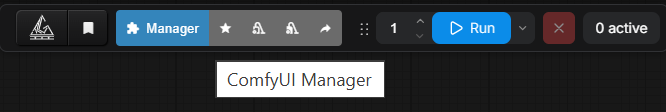

Then on the "Custom Nodes Manager" button, on the center column of the ComfyUI Manager menu:
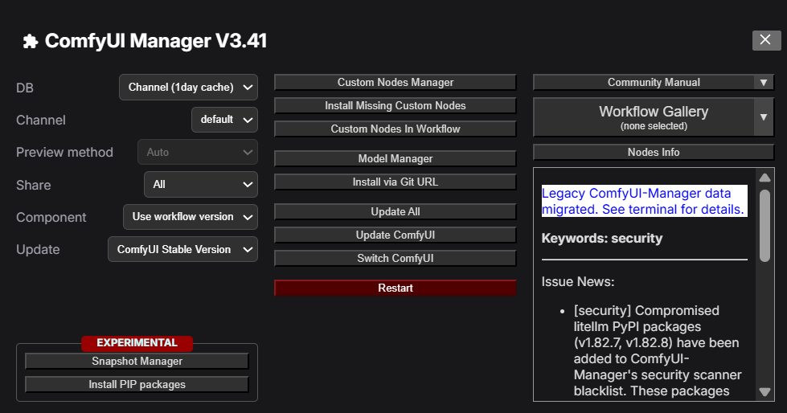

Search for "downloader", and install [ComfyUI Model Downloader](https://github.com/ciri/comfyui-model-downloader):
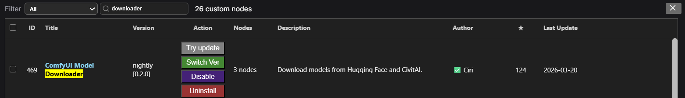

Once installed, click on the bottom left red button for restarting ComfyUI (not the one at the bottom of the center column of the ComfyUI Manager menu), and refresh your browser: 
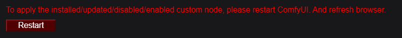

It may take a couple of minutes before the UI is back.

**Optional:** If you plan to use ComfyUI with multiple GPUs, also search for and install [ComfyUI-MultiGPU](https://github.com/pollockjj/ComfyUI-MultiGPU)

If the install has been successful, new nodes should be available in your Nodes list, notably "HF Download":
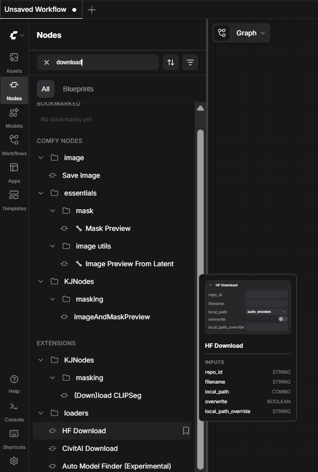

Using this node allows for downloading model weights files directly to the ComfyUI instance (saved on the models-PVC).
This node is needed as trying to download models directly from the UI will download them to your local machine. This is likely a consequence of ComfyUI usually meant to be running locally rather than in a Kubernetes cluster.

**Optional:** If ComfyUI-MultiGPU has been successfully installed, many "MultiGPU" nodes should be available as well:
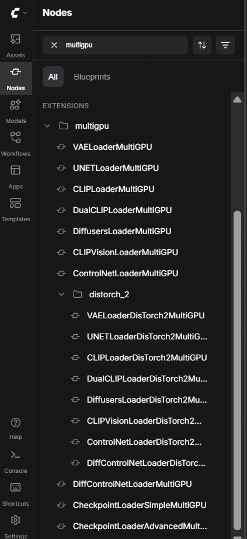

3. **Select workflows from templates**

While it is possible to create a flow from scratch, dragging-and-dropping nodes to the center of ComfyUI interface, and linking the nodes together, this approach requires extensive knowledge and/or trial and error before getting a working flow.
Thankfully, ComfyUI provides dozens of templates, that, once selected, immediately open into ComfyUI as a new workflow, so **building your own workflow by yourself is not needed**:
* On the left side, click on "Templates"
* Templates can be browsed by popularity, use case, generation type, and so on...
* You may want to filter out templates that do not run on ComfyUI (to exclude flows relying on cloud hosted models), by ticking ComfyUI on the "Runs on" filter:
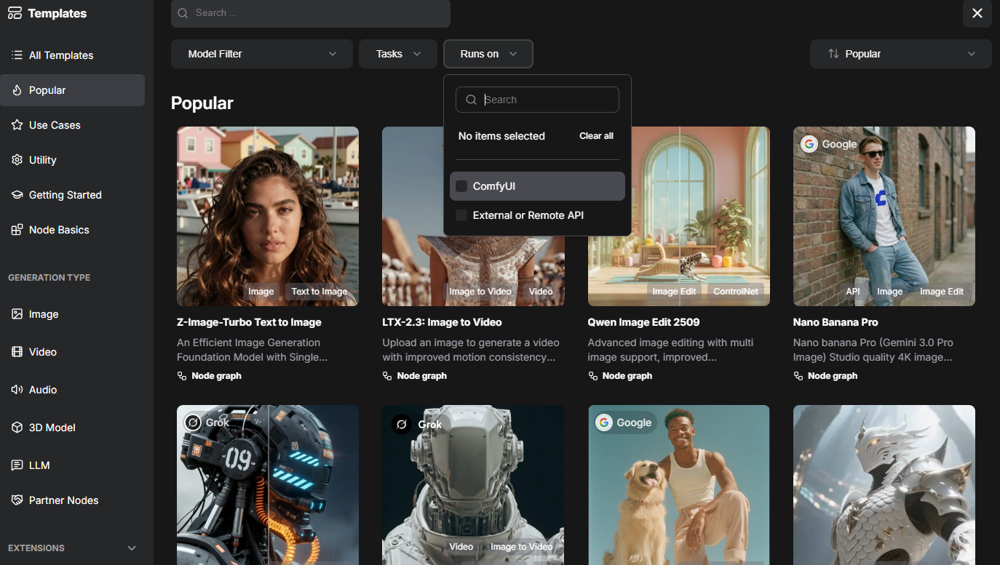

Extensive templates/workflow/models comparison is out of scope of this demo, but sticking with the most popular templates addressing your use case, accepting inputs and producing outputs of the type you would expect might be a good first step.
Some basic examples:
* Don't select a video generation workflow if you are only interested in image generation
* An image generation workflow that only accept text as input won't be a good example for showing image editing

Once you click on a template, it opens as a workflow on your interface:
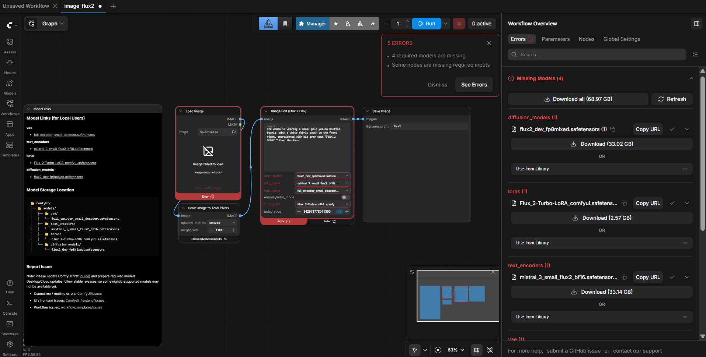

You can then save it as a workflow, either by pressing crtl+S, or by clicking on Graph -> Save as:
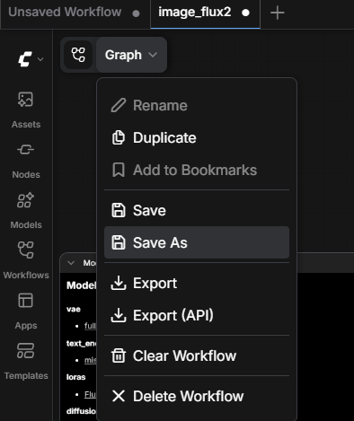

It will then appear on your workflow list, that can be displayed by cliking on "Workflows".

That being said, regardless of the template you selected, the workflow won't be in a runnable state until you download the weights of the different models it requires. This is why many errors may be displayed.

4. **Download models required by your workflows**

As mentioned on step 2, clicking on the "Download" buttons would download the models to your local machine, which won't solve the problem.

To download the models, a workflow composed of a single "HF Download" node will have to be run as many times as there are models missing:
* Create a blank workflow
* Drag-and-drop the "HF Download" node to the graph area
* Fill the first three "HF Download" required fields **repo_id, filename and local_path**:
  * First, look at the errors displayed on the flow you want to run. Each missing model should be displayed that way:
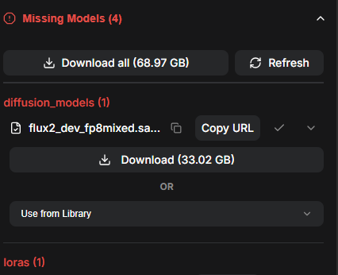
  * The text in red corresponds to the folder where the model is being looked for: set this as the **local_path** value required by the HF Download node
  * Click on "Copy URL", and paste it on your browser address bar to open it. It should open an HuggingFace page, like this one:
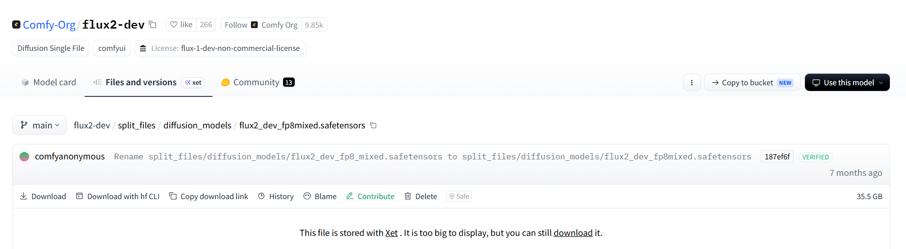
  * Click on the little squares icon immediately at the right of the model name (Comfy-Org/flux2-dev in this example) to copy it, and paste it in the **repo_id** field of the HF Download node
  * Do the same thing with the file name (split_files/diffusion_models/flux2_dev_fp8mixed.safetensors in this example), and paste it to the **filename** field of the HF Download node
  * For this example, the HF Download node will be populated with the following values:
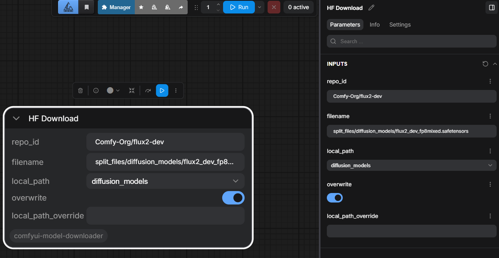

Once all values filled, run this workflow, by clicking either on the blue arrow button above the node, or on the "Run" button.

**Important: Downloading a model that way will start a ComfyUI job that will last for as long as the model gets downloaded. ComfyUI does not allow for parallel job execution, so running other flows will be impossible while a model is downloading. Instead, the other jobs will be put in the queue in the meantime.**

Reiterate this process for each model your selected workflow is missing.

Once downloaded, all your models weights files should be visible on the "Models" tab, under folders indicating their function:
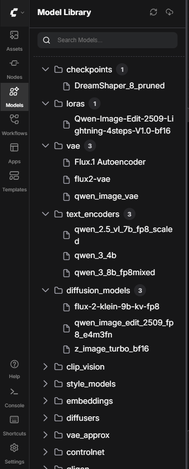

5. **Test your workflow**

If model missing errors are still displayed after downloading the models, they should disappear after refreshing your browser. Your workflow can be run regardless, so test it by clicking on the "Run" button.

Depending on your workflow, you may need to input an image first (e.g. for image editing workflows).

Many workflows will save their output. In this case, output assets will be displayed on the asset saving node and also available in the "Assets" tab:
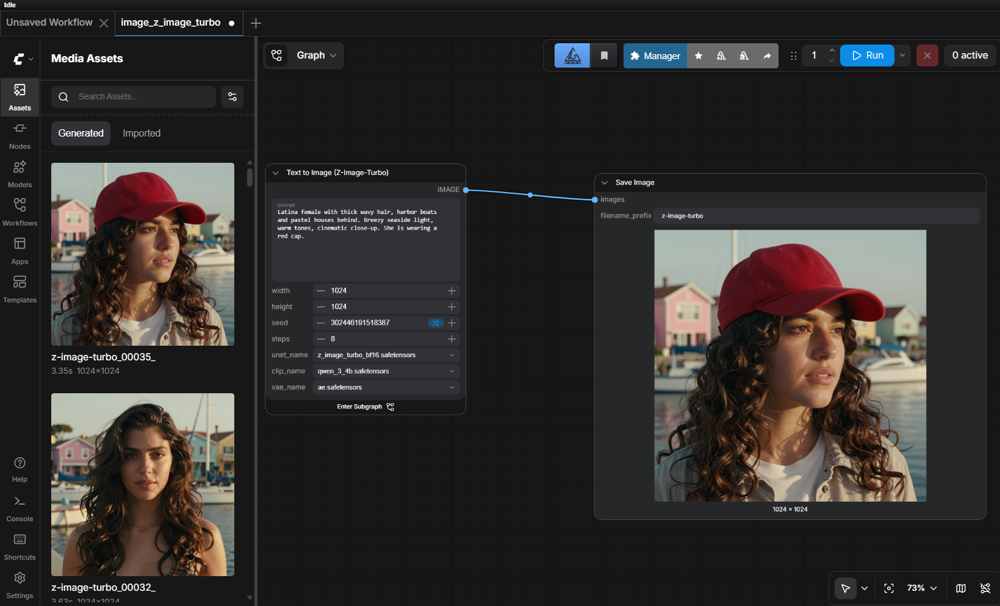

At this stage, the demo is ready.

6. **Optional: Edit you workflow with MultiGPU nodes**

To have ComfyUI leverage multiple GPUs, one solution is to use the multi GPU loader nodes from [ComfyUI-MultiGPU](https://github.com/pollockjj/ComfyUI-MultiGPU). Just switch the original model loading node, with their corresponding multiGPU equivalent, and specify the device you would like that model to be loaded on.

In the following example, the "Load Diffusion Model" node has been replaced with "UNETLoaderMultiGPU", used to load the same model, but on the cuda:1 device. The other nodes have been untouched, they will keep using the cuda:0 device:
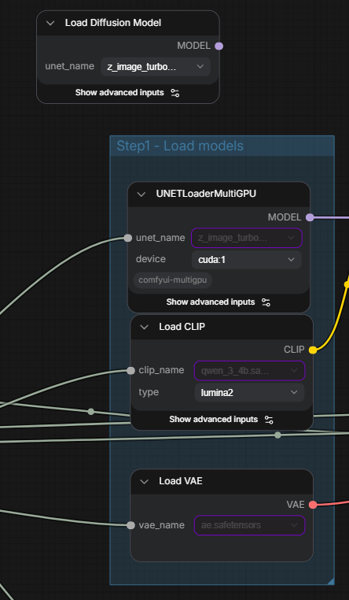

**Note: This is certainly not the only way to leverage multiple GPUs on ComfyUI.** The purpose of this demo being to just get started on using ComfyUI on PCAI, no further investigation has been conducted on other solutions to use multiple GPUs on a single ComfyUI instance.

7. **Optional: Convert your workflows into apps**

Workflows can be converted into ComfyUI apps for easier interaction:
* Click either on the Graph icon next to "Graph" or on "Graph" itself allows you to "Edit app":

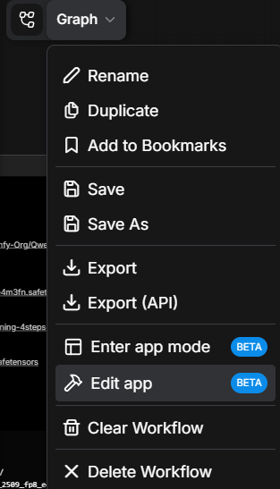
* Editing the app requires you to select which parameter from which nodes are expected to be the input, and which node is the output:
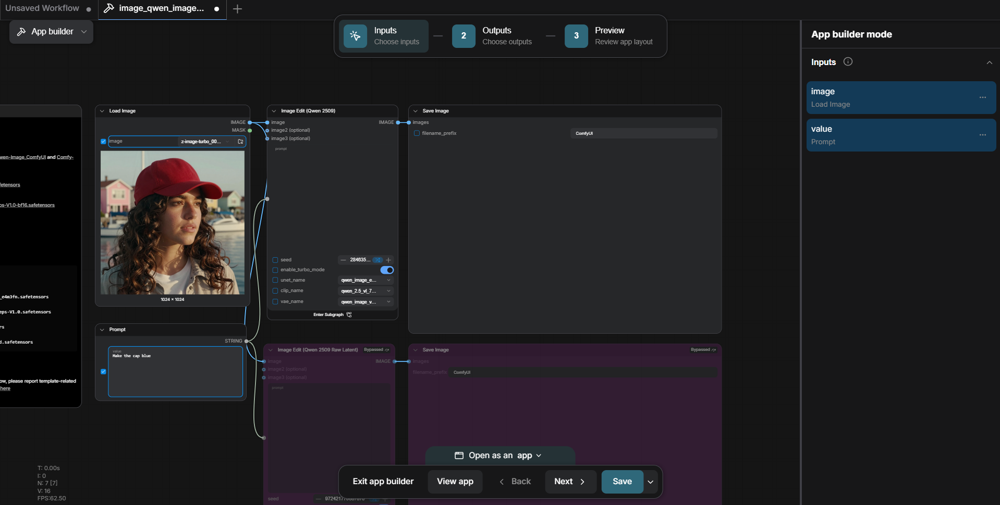
* Once inputs and outputs defined, click on the arrow next to the "Save" button to access the "Save as" option:
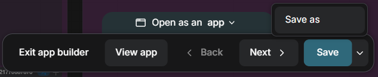
* This will allow you to save the application as an actual application, not just a default workflow view (it will appear in the "Apps" tab):
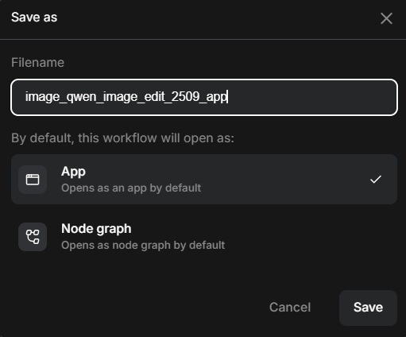
* From the "Apps" tab, you will be able to open your newly saved app, and use it:
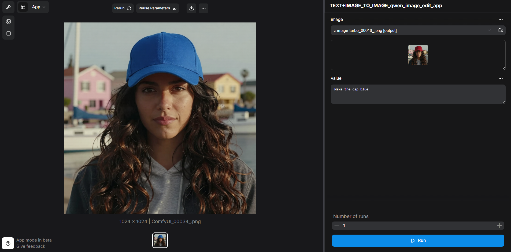

## Limitations

* **Basic ComfyUI demo:** This demo just aims to show image generation/editing on PCAI using ComfyUI. It does not explore more advanced features of ComfyUI.
* **Not a production setup:** Installing ComfyUI with the currently provided helm chart leads by no means a production-ready environment.
* **Sequential job execution:** ComfyUI executes its jobs one at a time, meaning that if multiple users are using ComfyUI simultaneously, their workflow runs may be delayed if someone else's is running.
* **No RBAC set up:** With the currently provided ComfyUI helm chart, every user will have access to everyone's workflows and assets.
* **Potential unexpected issues:** ComfyUI does not provide an official helm chart for Kubernetes deployment, and not even a Docker image: this demo therefore relies on a custom-built helm chart that may lead to eventually encountering unexpected issues.  

## References

* [Official ComfyUI repo](https://github.com/comfy-org/comfyui)
* [ComfyUI-Docker repo](https://github.com/Kaouthia/ComfyUI-Docker), that served in building the image for the helm chart
* [ComfyUI-Manager repo](https://github.com/Comfy-Org/ComfyUI-Manager), allowing to download custom nodes from ComfyUI (included in the Docker image)
* [ComfyUI Model Downloader repo](https://github.com/ciri/comfyui-model-downloader)
* [ComfyUI MultiGPU repo](https://github.com/pollockjj/ComfyUI-MultiGPU)
* [Custom ComfyUI on PCAI helm chart](https://github.com/ai-solution-eng/frameworks/tree/main/comfyui)

