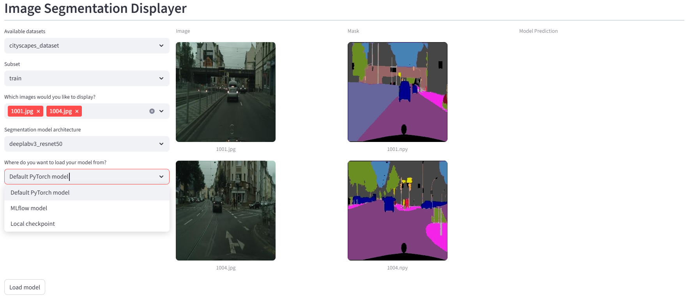

# Image Segmentation

| Owner                       | Name                              | Email                                     |
| ----------------------------|-----------------------------------|-------------------------------------------|
| Use Case Owner              | Tanguy Pomas                      | tanguy.pomas@hpe.com                      |
| PCAI Deployment Owner       | Tanguy Pomas                      | tanguy.pomas@hpe.com                      |

# Description

This customizable PCAI demo consists of:
 * Python scripts and Jupyter notebooks that finetunes pretrained PyTorch Segmentation models
   * Experiment tracking with MLflow is enabled by default (but can be disabled)
   * Model checkpoints are saved locally and are registered as MLFlow models when experiment tracking is enabled
 * A streamlit application to be imported as a framework, that can:
   * Display images and masks from your datasets
   * Load pretrained PyTorch models, local model checkpoints and MLflow registered models
   * Automatically use the loaded model to provide models' predictions on displayed images
 * Three datasets suitable for three different verticals:
   * Tumor segmentation with Brain MRI dataset
   * Defect segmentation on Metal nut dataset
   * Sementic segmentation on Cityscapes dataset (e.g. for autonomous driving)

This demo supports single-channel segmentation, as well as semantic segmentation (with multiple distinct categories to segment).

# High-level demo architecture

* Upload datasets and training script to a notebook
* Run one or more trainings, experiments will be tracked and checkpoints saved
* Import the Streamlit application as standalone framework
* Use it to display images and showcase predictions' improvements after model fine-tuning

# Demo content

* **app_helm_chart** contains the helm chart that can be used to import the image segmentation display streamlit application to PCAI using the "Import Framework" button.
* **app_image** contains the files used to build the image hosting the streamlit application. They are mostly shared here for information purposes, they shouldn't be needed to run the demo. Python scripts can also be used in a VSCode server to start the streamlit app without having to import it as a framework.
* **scripts_and_notebooks** contains the python scripts to upload to a Jupyter notebook instance to start model training/fine-tuning experiments. The notebooks are provided in case one wants a more interactive training process, but aren't needed to run the demo.
* **bring_your_own_dataset.md** details the prerequisites your dataset must follow in case you are interested in reusing the training script and application with your own data.
* **train_commands_examples.md** provides commands calling the train.py script to start model trainings. Its sole purpose is for copy-pasting these commands, saving time by not having to figure out which parameter to call train.py with.
* **Datasets that you can download here:**
  * [Brain MRI](https://storage.googleapis.com/ai-solution-engineering-datasets/brain_mri.tar.gz) (368 Mo)
  * [Metal Nut](https://storage.googleapis.com/ai-solution-engineering-datasets/metal_nut_dataset.tar.gz) (32 Mo)
  * [Cityscapes](https://storage.googleapis.com/ai-solution-engineering-datasets/cityscapes_datasets.tar.gz) (69 Mo)

# How to run the demo

## Step 1 - Use a Jupyter notebook to fine-tune models
* **Start a Jupyter notebook** that you will use to fine tune models. When creating it:
  * Specify the available by default **jupyter-pytorch-cuda-full** image. This image already contains all the dependencies to run the training script, you won't have to install any package afterwards.
  * **Use 1 GPU**. More GPUs will be useless. Not mandatory, but training will be excessively slow without one.
  * Increase the default CPU/RAM. **5 CPUs / 10 Gi RAM is enough**.
* **Prepare files in the notebook**:
  * Download the dataset(s) you wish to train models on, and upload them to your notebook instance.
    * **For a quick start:** Metal nut dataset is by far the smallest dataset, and the quickest to train on. Prefer using it over the other if you want to quickly test the demo.
    * Once uploaded to the notebook instance, extract them with: `tar xzvf metal_nut_dataset.tar.gz` (change name of .tar.gz file accordingly)
  * Create a folder (e.g. "datasets") to hold the datasets you extracted, and move your datasets under that folder. If you plan to use the application, make sure your datasets folder are available in a pvc available to your namespace. **user-pvc is a good candidate**
  * Upload the python scripts available under **scripts-and-notebooks** to your notebook. Their location is not important, unless you plan to use relative paths as datasets/checkpoints options for train.py.
  * Create a "checkpoints" folder to hold local model checkpoints. Similarly as for the datasets folder, you want to make it available in the same pvc/
* **Start model trainings**:
  * Example of train.py calls are made available in **train_commands_examples.md**. This file also contains comments on the most important parameters to play with.
  * Example: `python train.py --data-dir /mnt/user/datasets/metal_nut_dataset --model-name unet --save-path /mnt/user/checkpoints/metalnut_unet.pth --epochs 10 --batch-size 16 --disable-affine-transform`
  * Run `python train.py --help` for detailed description of every parameter.
  * By default, MLflow experiment tracking and model registering is enabled, local model checkpointing is disabled, but enabled when specifying save-path option though, which is the case in the examples.
* **Monitor your training and results**:
  * Check the logs on the terminal you called train.py from.
  * Check the PCAI instance of MLflow for a "Segmentation Demo Experiment" experiment. Training metrics will be added at the end of each epoch. **Model will be registered to MLflow only at the end of the training**. Interrupting the training early will leave you with local checkpoint only.
  * **Important: If not using metal nut dataset, training for 10 epochs can require a few hours.** Reduce number of epochs (potentially to 1) for quick testing, if model accuracy is not important.
* (Optional) Upload and run training notebooks. You can also display images and models' predictions in those.

## Step 2 - Import the Image Segmentation Display application as framework 
* Click on "Import Framework", and provide:
  * A framework name: Image Segmentation App
  * A description: Streamlit application to display image segmentation predictions
  * Select a category: Data Science
  * An icon: Any image will do
* Upload the provided **segmentation-displayer-0.1.0.tgz** helm chart. Select it instead if the application has been previously imported on that instance.
* **Chose your own namespace to deploy the application**. The pvc holding both datasets and local checkpoints must be available to that namespace.
* Edit framework values: **nothing required to change if you followed recommendations** (deploying in your own namespace, creating "datasets" and "checkpoints" folder directly under "user-pvc"). Otherwise:
  * pvc: Name of the PVC that contains the datasets and checkpoints folders. Should be available in deployment namespace.
  * datasetsPath: Path to the datasets folder under pvc
  * checkpointsPath: Path to the checkpoints folder under pvc
  * **resources.appLimits.cpu:** number of CPUs used by the application. Default to 5. **The application will load PyTorch models and run predictions with them**, 5 CPUs for doing so is fine, increasing the number may make the predictions faster, decreasing it will for sure make the whole application slower.
  * The other values should not be changed
* Finish the deployment

## Step 3 - Using the application

* The application interface is quite simple. On the left side, dropdowns allow you to: 
  * Select the dataset and the subset (train/val/test) you want to display images from / run predictions on. 
  * Chose images to display. They will be displayed on the middle and right part of the page.
  * Define the model you want to load and use to run predictions on the displayed images

* Before loading a model the only thing you can do with the application is to display images and segmentation masks from one dataset. Note that you can display multiple images at once, but not from different subsets/datasets.

* When you want to load a model, the first thing to select is the architecture of the model to load: unet, fcn_resnet50 or deeplabv3_resnet50. If you used the training script, your model should necessarily be based on one of these three architectures.

* After selecting the model architecture, you will be given the choice to load a checkpoint, either:
  * The default model weights, available publicly from PyTorch (doesn't require you to have run the training script)
  * An MLflow registered model
  * A local checkpoint

* Once you have selected a checkpoint, the application will load the model and automatically run predictions on all displayed images. Of course, if you select the default model weights, predictions will be bad since the model hasn't been fine-tuned.

* If you decide to load a local checkpoint, you will be given the choice between all checkpoints generated during training and saved under the checkpoints folder. **Make sure the checkpoint you select correspond to the model architecture you specified**

* If you decide to load a model from MLflow, you will be given the choice between all MLflow registered models, and all of their versions. Again, **make sure the checkpoint you select correspond to the model architecture you specified**

* Once the model is loaded, you can add or remove images to display, switch the subset, load another model trained on the same dataset... Just keep in mind the following:
  * Selected checkpoint should match specified model architecture.
  * Models have been fine-tuned on a single dataset, you can't load a model and use it to run predictions on multiple datasets.
  * Default model weights are expected to perform poorly on all datasets. They can be used to show prediction improvement after fine-tuning.

# Using this demo with your own dataset

Please refer to [these instructions](bring_your_own_dataset.md) to use your own dataset. Expect a decent amount of work reshaping the folder structure of your dataset.
