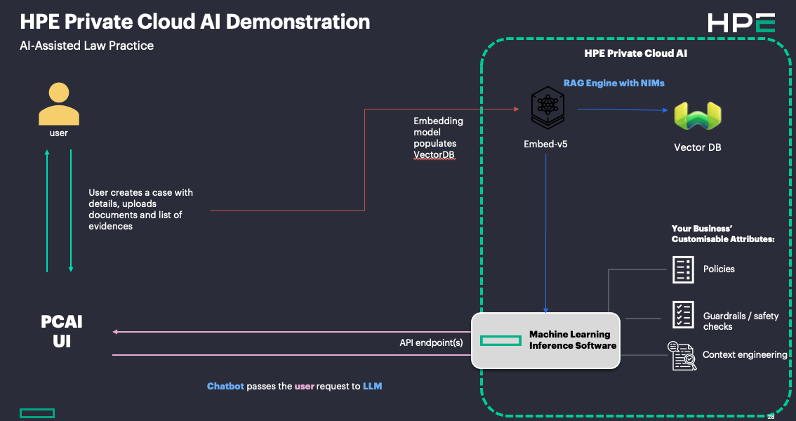
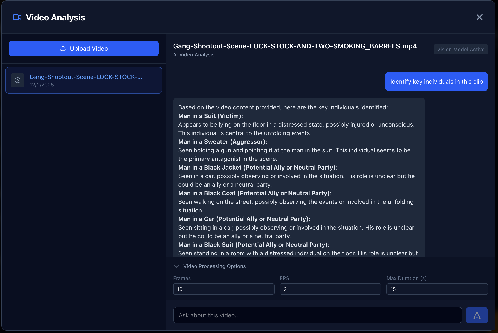

# AI-Assisted Law Practice

| Owner                 | Name              | Email                              |
| ----------------------|-------------------|------------------------------------|
| Use Case Owner        | Erdinc Kaya       | kaya@hpe.com                       |
| PCAI Deployment Owner | Erdinc Kaya       | kaya@hpe.com                       |
| Content Owner         | Russell Macdonald | russell@hpe.com                    |
| Content Owner         | Simon Goldsmith   | simon.goldsmith@hpe.com            |

## Abstract

Law firms, particularly those handling public cases, face stringent confidentiality and privacy requirements. The rapid growth of digital media—including social platforms, device logs, camera footage, and police recordings—has dramatically increased the volume and complexity of case materials and legal documents requiring review. To address this challenge, AI-powered tools can streamline legal document analysis, ensuring that all evidence and records are thoroughly examined and appropriately referenced. By deploying these tools locally with rigorously defined guardrails, firms can maintain compliance with legal and privacy regulations while enhancing efficiency, accuracy, and trust in their casework.

⚡ Accelerates

• Case material ingestion and indexing across diverse digital sources (social media, device logs, camera footage, police recordings).

• Document review cycles by quickly surfacing relevant evidence and cross-references.

• Legal research workflows by reducing repetitive manual scanning and classification.

📑 Provides

• Thorough, consistent analysis of legal documents with automated flagging of sensitive or high-priority content.

• Guardrail-driven compliance checks to ensure confidentiality and privacy standards are upheld.

• Transparent audit trails for every AI-assisted decision, reinforcing accountability.

🔒 Enables

• Secure, on-premises deployment that keeps all case data within the firm’s infrastructure.

• Customizable workflows aligned with jurisdiction-specific legal and privacy regulations.

• Scalable handling of growing digital evidence volumes without compromising security or trust.

### Features:

#### Case Management
- Create and manage legal cases
- Track case details (defendant, type, status, lead attorney)
- Document upload and management
- Evidence logging with categorization
- Document viewer with download and print capabilities

#### AI-Powered Chat
- LLM integration for case analysis
- Multi-model support (OpenAI compatible API)
- Automatic context building from case data
- Readable document content inclusion
- Video Q&A support
- Automated "dramatis personae" generation
- Debug panel for transparency

#### Admin Panel
- Database browser with pagination
- LLM configuration management
- Record detail viewer

Recordings:
- TBC

## Description

### Overview

### Workflow

Get into a case (or create a new one), upload/delete documents.

Open Case Chat to ask questions about the content (including case details and the document).

Open AI Tools box to select assistant tool:

- Dramatis Personae: Automatically scans all the case details and documents to build a relationship map for the individuals related to the case

- Video Chat: Upload a video file, ask questions about the case.

## Deployment

Deploy the provided helm chart using Import Framework wizard. 

### Prerequisites

Visual Language model (tested with Qwen2.5-VL-instruct).

Chart deployment will create 3 pods, db (postgresql), backend (flask/fastapi) and frontend (react/nextjs) with minimal resources.

For auto model detection, chart will create a service account with "cluster-admin" role (to query kserve.io/inferenceServices api endpoints).

### Installation and configuration

Either provide API Base URL and API Token during deployment within the values.yaml content, or use "Admin" page after deployment to set and select these.

## Running the demo

Use the UI.

### Case Chat

### Dramatis Personae

### Video Chat

## Limitations

- Not a fully populated RAG instance

- No audio processing from video, only sample frames are sent to VLM
