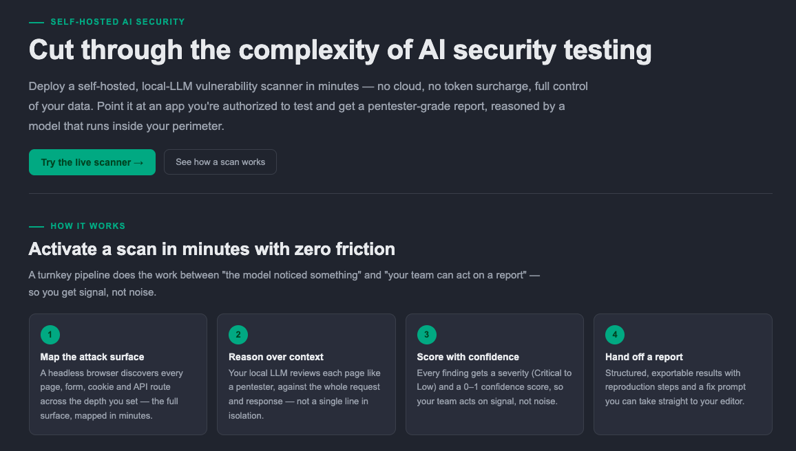
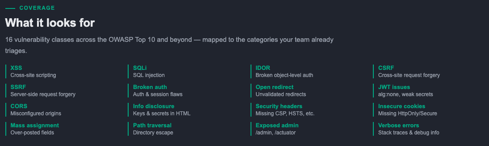
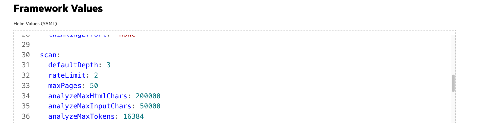
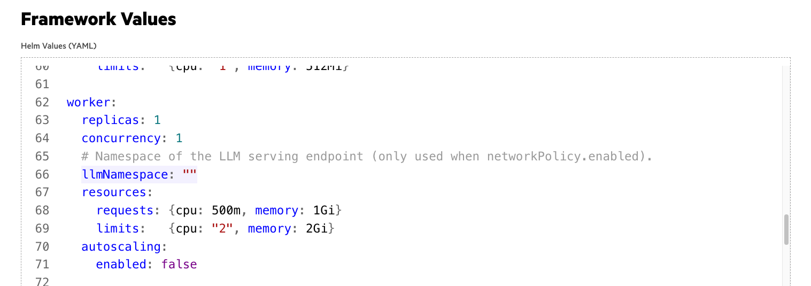

# AI Vulnerability Scanner Demo

| Owner                 | Name    | Email               |
| ----------------------|---------|---------------------|
| Use Case Owner        | Eric Yu | eric.yu@hpe.com     |
| PCAI Deployment Owner | Eric Yu | eric.yu@hpe.com     |


## Abstract

An AI-powered vulnerability scanner for web applications, built for PCAI. A headless browser (Playwright) crawls the bundled OWASP Juice Shop demo app while an **LLM served by HPE MLIS** analyzes every crawled page like a pentester — surfacing ranked findings with severity, confidence, evidence, reproduction steps, and concrete remediation guidance. Results stream live into a web dashboard with a debug console, and can be exported as CSV/JSON.

The scan target is **locked to the bundled demo app** — there is no free-form URL field and no authorization checkbox. The scanner can only touch the demo target, so it can't be pointed at an arbitrary or attacker-controlled website.

The application is a three-component stack — a Next.js dashboard, a FastAPI gateway, and a Playwright/Celery worker — backed by Redis for the Celery broker, scan state, and history. The LLM is an existing MLIS deployment (an OpenAI-compatible endpoint) that the user connects at deployment time; any compatible model can be swapped without rebuilding. The chart ships with **OWASP Juice Shop**, an intentionally vulnerable web app, as an in-cluster demo target, so a scan always has something to find.

This demo features:
* **HPE Machine Learning Inference Software (MLIS)** serving the analysis model:
  - [**openai/gpt-oss-20b**](https://huggingface.co/openai/gpt-oss-20b) as the pentester LLM (OpenAI-compatible `/v1` endpoint). Any other OpenAI-compatible model (Qwen, Nemotron, GPT-OSS variants, …) can be swapped by changing a single value.
* A **custom web application** to run and observe the scans, that includes:
  |* A **scan dashboard**: a read-only scan target (locked to the bundled Juice Shop, derived from `${DOMAIN_NAME}` — no rebuild required per deployment), crawl depth / max pages controls, and a **Start scan** button. Active probing runs automatically on the sandboxed demo target — no user toggle.
  * A **live debug console** (server-sent events) streaming crawl and analysis events as they happen
  * A **findings view** with per-finding severity, confidence, evidence, repro steps and remediation, plus an overall risk score
  * **CSV / JSON export** of any scan, and a **recent scans** history persisted in Redis
  * A built-in **SSRF guard** that blocks private, link-local, and cloud-metadata targets by default
  * A **bundled OWASP Juice Shop** instance (Helm subchart) exposed on the gateway as the demo target
  * A pre-computed Juice Shop baseline scan injected as "history", so the dashboard shows real findings immediately after deployment, before the first live scan

**Recordings**:
* [**Demo Video [6 min]**](https://storage.googleapis.com/ai-solution-engineering-videos/public/AI%20Vulnerability%20Scanner%20Demo.mp4)


## Description

### Overview

The main use of this demo is to show how an LLM can do first-pass security reviews of web applications without a human pentester. The user opens the dashboard, where the target is pre-set to the bundled Juice Shop (exposed on the PCAI gateway, with no free-form URL field), and starts a scan. A Celery worker then crawls the target with a headless browser — up to the configured depth and page limit — and sends the HTML of each page to the MLIS model with a pentester prompt. The model returns structured findings (severity, confidence, evidence, reproduction steps, remediation), which the worker validates, scores, and stores in Redis. The dashboard streams every step to the user through the live debug console, and the final report can be exported as CSV or JSON.

The LLM endpoint, its model name, and its API key are the only environment-specific settings. In the reference deployment the model is `gpt-oss-20b` served by MLIS; the same chart works on any PCAI deployment by pointing `llm.baseUrl` at whatever OpenAI-compatible endpoint is available there.

#### Architecture Diagram


### Workflow

#### Basic Demo Workflow

The actual demo workflow is quite simple, open the app from the **Tools & Frameworks** page of the PCAI console and check the preloaded state first:
* The dashboard already shows a **stored baseline scan of Juice Shop** in **Recent Scans** — open it and walk through the findings: severity, confidence, evidence, repro steps, remediation, and the overall risk score. This works out of the box and is the fastest way to show what the output looks like.
|* For a live scan, the dashboard is **locked to the bundled Juice Shop** — the Target URL is shown read-only (the openable gateway host) and there is no free-form URL field or authorization checkbox. Just click **Start scan**.
|* The scanner performs **active probing** on the sandboxed demo target — the worker crawls, analyses with the LLM, then probes to confirm findings and bump confidence (always-on, no user toggle). You can adjust **Crawl depth** / **Max pages** (defaults: depth 3, 50 pages).
* Click **Start scan**. The **Debug Console** opens automatically and streams live events: pages discovered, pages crawled, pages sent to the model, findings received.
* When the scan completes, review the ranked findings and use **Export CSV / JSON**. The scan also appears in **Recent Scans** and can be re-opened later (history lives in Redis).

The target is locked to the bundled Juice Shop by the server (any URL sent in the scan request is ignored), so the demo always scans the demo target. The **SSRF guard** still rejects private/link-local addresses, which is a security feature of the scanner itself.

### Application Interface

The dashboard during a live scan — configuration panel, scan status, live debug console and scan history:


The dashboard also carries a short landing page explaining the tool to a non-technical audience:






## Deployment

### Prerequisites

* An **existing OpenAI-compatible LLM endpoint** (e.g. an MLIS deployment of `gpt-oss-20b` or any other compatible model). **No additional GPU is required by this demo** — the scanner itself is CPU-only and reuses the model serving already present in the environment.
* **PCAI AIE** with **Tools & Frameworks** enabled, and a namespace to deploy into (the reference deployment uses `ezai-services`).
* Registry access for the application images (`docker.io/eric021122/ai-vulnerability-scanner-{web,api,worker}:0.1.3` — public).
* In restricted environments, egress to the LLM namespace must be allowed for the worker pods.

### Installation and configuration

**1. Make sure the LLM model is deployed and has an API token**:

* Deploy any OpenAI-compatible model with MLIS (the reference deployment uses `gpt-oss-20b`).
* Generate an API token for the deployment from the **Gen AI → Model Endpoints** page of AIE. This is the value for `llm.apiKey` in the framework values.

**2. Import the application**:
* Use the helm chart (`ai-vulnerability-scanner-0.1.14.tgz`) made available in this folder.
* The gateway hosts (app, Juice Shop) and the scan-target allowlist are built from the platform's `${DOMAIN_NAME}` placeholder and **adapt to any deployment automatically**. The only environment-specific values are the LLM settings (see below). Everything else (Juice Shop, Redis, the locked scan target) works out of the box.

#### Configuring the LLM (per environment)

The scanner is LLM-agnostic: it talks to **any** OpenAI-compatible `/v1` endpoint. Three values must match your deployment's model serving:

| Value | Meaning |
|-------|---------|
| `llm.baseUrl` | The model's OpenAI-compatible base URL, e.g. `http://<model>-predictor.<namespace>.svc.cluster.local/v1` (MLIS) or `http://litellm-helm.<namespace>.svc.cluster.local:4000/v1` (litellm proxy). |
| `llm.model` | The model id **exactly as returned by `<baseUrl>/models`** (e.g. `meta/llama3-8b-instruct`, `openai/gpt-oss-20b`). |
| `llm.apiKey` | The API token — **enter it directly in the framework values**. The chart renders the Kubernetes secret itself, so no secret-creation rights are needed. For a PCAI MLIS predictor, use the namespace access-token (secret `access-token`, key `AUTH_TOKEN`). |

How to get the right `model` id and confirm the endpoint works (run from a pod in the cluster, or anywhere that can reach it):

```bash
# list the models the endpoint actually serves
curl -s -H "Authorization: Bearer <apiKey>" <baseUrl>/models
# note the exact id (e.g. meta/llama3-8b-instruct) and use it for llm.model
```

**Important — model context window.** The LLM call must satisfy `prompt_tokens + max_tokens <= <model window>`. The chart ships with defaults **tuned to an 8192-token window** (`llama-3.1-8b-instruct`): `scan.analyzeMaxHtmlChars=12000` (measured: Juice Shop pages are ~100k–138k rendered chars, so the cap is essential; 12000 chars -> ~4800–5250 prompt tokens) and `scan.analyzeMaxTokens=2500` output budget — total stays under 8192. If you use a large-context model (>=32k), you may raise `analyzeMaxHtmlChars` toward `200000` and `analyzeMaxTokens` toward `16384` for deeper analysis; leave the defaults for small models to avoid HTTP 400 "maximum context length" errors.

**You will always know if the LLM is misconfigured.** On load, the dashboard's **LLM health probe** calls the endpoint and shows a red **"LLM not ready"** banner with the specific reason (`unreachable` / `auth_failed` / `model_not_found` / …). The worker also refuses to start a scan with a clear console message. So a wrong endpoint, bad key, or unknown model is visible immediately — there is no silent 0-findings result.

* (Advanced alternative) If you *do* have rights to create Kubernetes secrets, you may instead store the token in your own secret (e.g. `ai-vulnerability-scanner-llm`) and point `llm.existingSecret` at it, leaving `llm.apiKey` empty. That secret must be an `Opaque` secret containing the `OPENAI_API_KEY` (and `JWT_SECRET`) keys, since the app reads its credentials via `envFrom` on that secret. Not required for the demo.
* No other value change is required; Juice Shop is enabled by default and exposed on its own gateway host so it can be opened in a browser.
* Pre-built images are at `docker.io/eric021122/ai-vulnerability-scanner-{web,api,worker}:0.1.6` (public).
* Active probing runs automatically on the sandboxed demo target (no user toggle).

The PCAI framework values screen (Tools & Frameworks) — the values above are what shows up there:





**3. Use the application to run the demo**:
* As explained in the Basic Demo Workflow section above and showcased in the demo recording.

**Note**:
* If you install the chart with plain `helm` outside PCAI, pass explicit hosts instead of relying on the placeholders: `--set ezua.virtualService.endpoint=<host> --set juice-shop.host=<host>`.

## Repository Layout

* `image_source_code/apps/api` — FastAPI gateway: scan orchestration, SSE event streaming, results API
* `image_source_code/apps/web` — Next.js dashboard (configuration, live debug console, findings, export)
* `image_source_code/workers/scanner` — Playwright crawler + LLM analyzer (runs as the Celery worker)
* `image_source_code/packages/shared` — shared data models used by the api, worker and web backends
* `image_source_code/docker/` — Dockerfiles for the api, worker (Playwright/Chromium) and web images
* `app_chart` — Helm chart (bundled Juice Shop subchart, in-chart Redis)
* `image_source_code/example/` — pre-computed baseline scan of Juice Shop, injected as startup history
* `images/` — screenshots referenced by this README

The pre-built images are published at `docker.io/eric021122/ai-vulnerability-scanner-{web,api,worker}`. To rebuild from source, the **api** and **worker** builds run from the **repository root** (their Dockerfiles `COPY` paths relative to it):

```bash
docker build -f image_source_code/docker/api.Dockerfile    -t <registry>/ai-vulnerability-scanner-api:<tag> .
docker build -f image_source_code/docker/worker.Dockerfile -t <registry>/ai-vulnerability-scanner-worker:<tag> .
```

The **web** image is built with the Next.js app directory as its build context:

```bash
docker build -f image_source_code/docker/web.Dockerfile -t <registry>/ai-vulnerability-scanner-web:<tag> image_source_code/apps/web
```

## Limitations

* The provided application is meant for **demo and authorized testing only** — do not point it at targets you are not authorized to scan, and the findings are a first-pass aid, not a substitute for a professional penetration test.
* **Single model**: one OpenAI-compatible model drives all analysis; quality and coverage depend on that model.
* **LLM serving**: a shared MLIS endpoint is stateful — under heavy burst load transient 5xx errors can occur. The application retries server errors and serializes analysis to minimize the impact.
* **No persistent storage**: scan history lives in Redis and is lost when Redis is reset.
* **Scan scope**: crawling is bounded by depth / page limits and the SSRF guard; large or deeply nested applications are only partially covered per scan.
