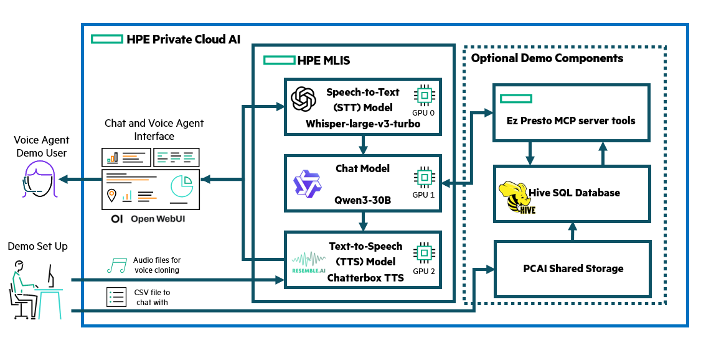
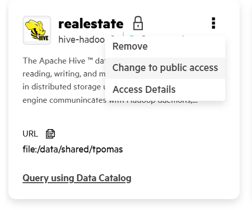
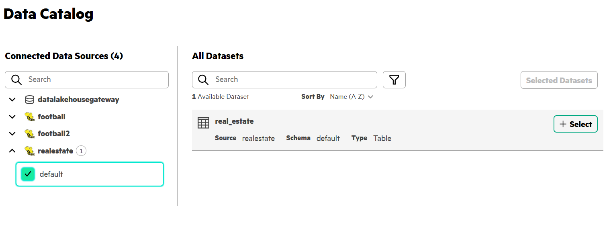
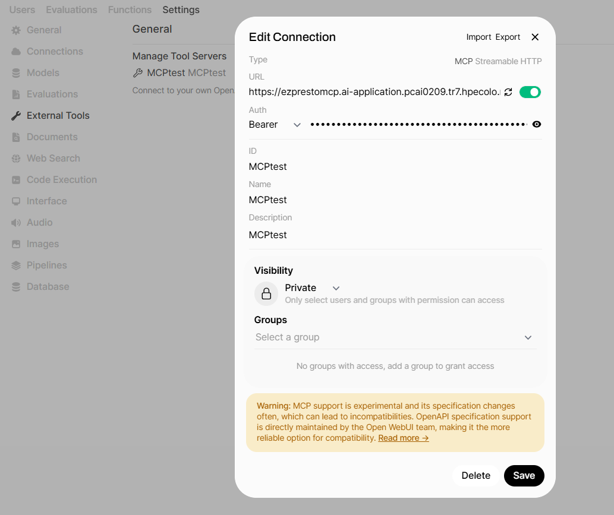
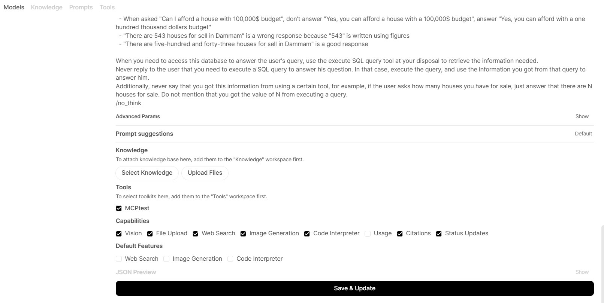

# Multilingual Voice Agent Demo

| Owner                 | Name              | Email                              |
| ----------------------|-------------------|------------------------------------|
| Use Case Owner        | Tanguy Pomas      | tanguy.pomas@hpe.com               |
| PCAI Deployment Owner | Tanguy Pomas      | tanguy.pomas@hpe.com               |

## Abstract

This demo mainly aims to prove that PCAI can host end-to-end voice agent solutions that not only can speak English, but any other language, as long these languages are supported by both the chat model, a Speech-To-Text (STT) model and a Text-To-Speech (TTS) model.
Hence, the focus of this demo is not centered on the end application, but rather on the capabilities of the deployed models, defaulting to Open WebUI as application interface.

To enrich this demo, and go beyond simply adding STT and TTS to a standard chatbot, we provide optional steps for connecting the chat model to a SQL Database. Alternatively, enriching the chat knowledge with standard text documents is also available out-of-the-box using Open WebUI built-in RAG features.

This demo features:
* **HPE Machine Learning Inference Software (MLIS)** to deploy the following models:
  - [**openai/whisper-large-v3-turbo**](https://huggingface.co/openai/whisper-large-v3-turbo) as STT model
  - [**Qwen/Qwen3-30B-A3B-Instruct-2507-FP8**](https://huggingface.co/Qwen/Qwen3-30B-A3B-Instruct-2507-FP8) as chat model (text-to-text)
  - [**Chatterbox**](https://github.com/resemble-ai/chatterbox) as TTS model
* [**Open WebUI**](https://docs.openwebui.com/) as chat / voice application interface
* **Multilingual support** from both Whisper STT and Chatterbox TTS models
* Additional **voice creation** for Chatterbox TTS model
* Language selection for Whisper transcriptions, as well as voice selection for Chatterbox generated speech within Open WebUI interface
* Options to enrich the chat answers with basic **RAG and/or SQL data**
Optional features:
* **Chat with SQL data**, using an edited version of a [Saudi Real Estate Kaggle Dataset](https://www.kaggle.com/datasets/lama122/saudi-arabia-real-estate-aqar)
* **MCP server** to provide tools for the chat model to access the SQL data 

Supported languages:
* Arabic (ar)
* Danish (da)
* German (de)
* Greek (el)
* English (en)
* Spanish (es)
* Finnish (fi)
* French (fr)
* Hebrew (he)
* Hindi (hi)
* Italian (it)
* Japanese (ja)
* Korean (ko)
* Malay (ms)
* Dutch (nl)
* Norwegian (no)
* Polish (pl)
* Portuguese (pt)
* Russian (ru)
* Swedish (sv)
* Swahili (sw)
* Turkish (tr)
* Chinese (zh)

That list corresponds to languages supported by Chatterbox, Whisper can transcribe additional languages and the Qwen3 chat model can be swapped for another one if its performance for the chosen language is underwhelming.

Recordings:
* None for the moment

## Description

### Overview

The demo relies on Whisper to transcribe the demo user queries into text, a standard chat model (Qwen3-30B-A3B-Instruct-2507-FP8) for interpreting the queries and respond to them, and Chatterbox TTS to generate an oral response from the text output. Those three models need to be deployed to MLIS, and the demo user is expected to connect them to Open WebUI to interact with them.

Additionally, if the demo needs to be run in a non-english language, an audio speech sample file in that language must be passed to Chatterbox to make this voice available for the demo. Details are provided in the "Installation and configuration section" of this readme.

Optional demo part involves uploading a CSV file to PCAI shared storage, creating a Hive Data Source from it, connecting Ez Presto MCP server to Open WebUI, and allowing the chat model to use tools from that MCP server to enable the chat model to leverage data from that CSV file. 

#### Architecture Diagram

### Workflow

#### Basic Demo Workflow

The actual demo workflow is quite simple, go to Open WebUI, set your user settings to:
* Have Whisper transcribes your questions in the language you plan to speak
* Chose the Chatterbox voice you want to listen to when the response is generated
* **This assumes that a voice in the language you want to get an answer in has been created by Chatterbox during demo setup**

After that, if you are not opting for the optional "Chat with SQL Data" component of this demo, you are free to use Open WebUI as usual, with the addition of qualitative and multilingual STT and TTS.

#### Demo Workflow with optional SQL Data

If you are opting for the optional "Chat with SQL Data" component of this demo, a few things change:
* Make sure that the JWT Token used for connecting to the MCP server has not expired, refresh it otherwise (requires Open WebUI admin rights)
* You are expected to ask questions related to your data

It is otherwise identical to chatting without access to SQL data.

## Deployment

### Prerequisites

* **Three GPUs** to deploy the three models. For reference, all models chosen for this demo can fit on **L40S GPUs**.
* (Optional) For chatting with SQL data: **EzPrestoMCP** installed (not publicly available as of now, may be available by default in future AIE releases, contact us for advice otherwise)

### Installation and configuration

**1. Import Open WebUI**:
* Using the latest helm chart at your dispoal in our [Frameworks](https://github.com/ai-solution-eng/frameworks/tree/main/open-webui) repo. No change in the values is needed.

**2. Deploy the three models using MLIS**:
  
  * **Qwen/Qwen3-30B-A3B-Instruct-2507-FP8** MLIS configuration:
    * Registry: None
	* Image: vllm/vllm-openai:latest
	* Resources:
	  * CPU: 4 to 6 (flexible, lower values may work)
	  * Memory: 40Gi to 60Gi (flexible, lower values may work)
	  * GPU: 1 to 1 (mandatory)
	* Arguments: --model Qwen/Qwen3-30B-A3B-Instruct-2507-FP8 --enable-auto-tool-choice --tool-call-parser hermes --port 8080 --max-model-len 32768	
	* Environment variables (optional):
	  * AIOLI_DISABLE_LOGGER to 1
	  * AIOLI_PROGRESS_DEADLINE to 10000s
     
  * **openai/whisper-large-v3-turbo** MLIS configuration:
    * Registry: None
	* Image: tpomas/vllm-audio:0.11.0 **See Note 1 for details**
	* Resources:
	  * CPU: 1 to 1
	  * Memory: 10Gi to 10Gi
	  * GPU: 1 to 1 (mandatory)
	* Arguments: --model openai/whisper-large-v3-turbo --port 8080
	* Environment variables (optional):
	  * AIOLI_PROGRESS_DEADLINE to 10000s
     
  * **Chatterbox TTS model** MLIS configuration:
    * Registry: None
	* Image: tpomas/chatterbox-uv-gpu:0.0.1 **See Note 2 for details**
	* Resources:
	  * CPU: 8 to 8 (flexible, lower values may work)
	  * Memory: 40Gi to 80Gi (flexible, lower values may work)
	  * GPU: 1 to 1 (mandatory)
	* No additional argument needed
	* Environment variables:
	  * AIOLI_SERVICE_PORT to 4123 (mandatory)
	  * AIOLI_PROGRESS_DEADLINE to 10000s (optional)

     
**3. Add voices to Chatterbox (mandatory to generate non-English speech)**
  * A few minutes after Chatterbox has been deployed, you should be able to add additional voices for it, using short audio samples. Details for this procedure can be found in the [Chatterbox TTS API repo](https://github.com/travisvn/chatterbox-tts-api/blob/main/docs/MULTILINGUAL.md#2-upload-voice-with-language).
  * For convenience, we are providing the following audio samples, under the [deploy/data](../deploy/data) folder **(See Note 3 for details)**:
    * ARA_NORM_0002.wav, an Arabic audio sample coming from [this Kaggle dataset](https://www.kaggle.com/datasets/haithemhermessi/arabic-speech-corpus)
    * lupincontresholme_0009.wav, a French audio sample coming from [this Kaggle dataset](https://www.kaggle.com/datasets/bryanpark/french-single-speaker-speech-dataset)
    * meian_0000.wav, a Japanese audio sample coming from [this Kaggle dataset](https://www.kaggle.com/datasets/bryanpark/japanese-single-speaker-speech-dataset)
  * We also provide a simple notebook called [**load_voices.ipynb**](../deploy/notebook/load_voices.ipynb), that contains the three commands used to add voices cloned from the three provided samples. In order to use it: 
    * Start a notebook server on PCAI
    * Upload load_voices.ipynb and the three audio samples into the same folder
    * Copy and paste your Chatterbox MLIS endpoints and API Token into each of the three notebook cells
    * Run each cell, adding a voice to Chatterbox that way is almost instantaneous
    * Voices called "arabic_speaker", "french_speaker" and "japanese_speaker" will be added to Chatterbox, and you will be able to select them when running the demo

**4. Connect models to Open WebUI**:
  * Adding connection to Qwen3-30B-A3B-Instruct-2507-FP8:
    * As an Admin user on Open WebUI, go to Admin Panel -> Settings -> Connections
	* Add an OpenAI API connection to your Qwen MLIS deployment using its MLIS endpoints and API Token
    
  * Adding connection to Whisper and Chatterbox:
    * Still as an Admin user, go to Admin Panel -> Settings -> Audio
	* For both Speech-to-Text and Text-to-Speech sections, select "OpenAI" as Engine, then fill in:
	  * For the STT section: Your Whisper MLIS deployment endpoint, its API token, and set the STT Model to openai/whisper-large-v3-turbo
	  * For the TTS section: Your Chatterbox MLIS deployment endpoints and its API token. You can leave tts-1 or tts-1-hd as TTS model, and leave alloy as TTS Voice
    
	* Take note of the "Response Splitting" value: either "Punctuation" and "Paragraph" values are OK 

**5. (Recommended) Create a custom chat model using prompt engineering**:
  * You may want to customize the prompt used by the chat model to avoid outputting numbers in digits (see related Chatterbox limitation)
  * Go to Workspace -> Models -> + New Model
  * Give a custom name to your new model (e.g. Voice Qwen) and select Qwen/Qwen3-30B-A3B-Instruct-2507-FP8 as your Base Model
  * In "System Prompt", give detailed instructions that the chat model should follow to avoid outputting digits in its answer.
    * You can copy-paste the relevant passage of the prompt provided for the Saudi Real Estate example from [**deploy/data/sa-houses-prompt.txt**](../deploy/data/sa-houses-prompt.txt)
	* It is worth customizing that prompt, for example providing additional examples of good output vs bad output in the language you plan to run the demo with.
  
  * Click on the "Save&Create" button

**6. (Optional) Loading a CSV file as a SQL Database, and provide the chat model the ability to query it**
  * Follow this step only if you are interested in chatting with a SQL DB
  * **This steps requires EzPrestoMCP** to be imported to your PCAI instance
  * You can use the custom Saudi Real Estate dataset CSV file, **Saudi_Arabia_houses.csv**, made available in the [**deploy/data**](../deploy/data) folder
  * Make the CSV available in the right place:
    * In a notebook, go the shared folder, and, under that shared folder, create a new folder, a subfolder inside it, and upload your CSV file inside that subfolder.
    * Run chmod -R 777 on your folder. See example:
    
  * Add the CSV as a Data Source:
    * On AIE, go to Data Engineering -> Data Sources -> Structured Data -> Add New Data Source
    * Select Hive, and fill the following information:
      * Name: Any name you want (e.g. realestate)
      * Hive Metastore: Discovery
      * Data Dir: file:/data/shared/YOUR FOLDER NAME
      * File Type: CSV
    
    * Make the newly created Data Source public by clicking on the three dots, then "Change to public access:"
    
  * Check that the CSV data has been successfully imported:
    * Click on "Data Catalog" -> Select your Data Source, default, then your table name should appear under the "All Datasets" section
    
    * Click on you table name, and you should have access to your dataset preview
    
    * Alternatively, you could go to Data Engineering -> Query Editor and add your dataset there in a similar fashion to run SQL queries on your data
  * Connect Open WebUI to the EzPrestoMCP server:
    * As an Open WebUI admin user, go to Admin Panel -> Settings -> External Tools -> Add Connection
    * Select Type as "MCP Streamable HTTP"
    * Copy-paste your MCP server URL in the URL field
    * Get a JWT token to paste in the Auth API Key field. You can get a JWT Token from a notebook instance with the command **cat /etc/secrets/ezua/.auth_token**. Note that, by default, **this token is valid only for 30 minutes, so you will need to refresh it**, unless its lifetime has been increased.
    * Fill ID, Name and Description fields however you like
  
  * Allow your chat model to use tools from that MCP server:
    * If you created a new model to customize its prompt, you can go back to edit this model (Workspace -> Models -> click on the logo next to your model name) and tick your newly added tools, under the Tools section, towards the bottom of that page:
    
      * Adding a tool this way will ensure the custom model will always have access to that tool, and you won't have to confirm connection to that toolset when using this model
    * If you have not created a new model with a custom prompt to bypass Chatterbox limitations to pronounce numbers written in digits, **you may still want a create a custom prompt to help the chat model generate better SQL queries**, to make a better use of tools available to it. In particular, describing at high level the database it has access to, and providing one or two examples of SQL queries will make it much more efficient at getting information from the provided CSV.
      * Check the example provided in [**deploy/data/sa-houses-prompt.txt**](../deploy/data/sa-houses-prompt.txt) for guidance.
    * If you are not using a custom model, you will have to click on the "Integrations" button, at the right of the "+" sign below the place where you usually type your query, then Tools -> tick your tool. A wrench icon appears once the chat model is given access to the tool: 
    
      * You will have to do this every time you start a new chat

**7. Run the demo**  

	  
**Notes**:
  1. [STT transcription API not being available in the official vLLM images](https://docs.vllm.ai/en/latest/serving/openai_compatible_server/#transcriptions-api), a custom image is needed. tpomas/vllm-audio:0.11.0 has been created from vllm/vllm-openai:v0.11.0 with the addition of running pip install vllm[audio]. It is provided for convenience, you can build and use your own image instead.
  2. Chatterbox is neither vLLM-compatible, nor provide an Open AI API compatibility by default. tpomas/chatterbox-uv-gpu:0.0.1 has been built using "Dockerfile.uv.gpu" under the "docker" folder from the [Chatterbox TTS API GitHub repo](https://github.com/travisvn/chatterbox-tts-api), that aims to make Chatterbox more easily deployable using Open AI API compatible endpoints.
  3. The latter two samples come from datasets that are part of the same dataset collection, called CSS10. [CSS10 GitHub repository](https://github.com/Kyubyong/css10) can be a good source to quickly find other quality audio samples for other languages (German, Spanish, Finnish, Hungarian, ...). Quality of provided voice sample is crucial to generate qualitative speech.

## Running the demo

1. **Go to Open WebUI and select your model with custom prompt** (or Qwen/Qwen3-30B-A3B-Instruct-2507-FP8 if you didn't customize the prompt)
2. **Select the language for Whisper, and the voice for Chatterbox**:
    * Go to your user settings -> Audio
    * STT Settings -> Language dictates the Whisper language. Expected value is the language two-letter code, defaults to "en" for "English". Provided example is "ar" for "Arabic". See "Supported Languages" at the top of this page if you have a doubt.
    * TTS Settings -> Set Voice refers to the Chatterbox voice to use. The list of available voices will NOT be displayed, but you can write down the name of the voice you want to use. If no voice is found with that name, Chatterbox will default to the Alloy English voice.
3. **Note these relevant options**:
    * Enabling "Instant Auto-Send After Voice Transcription" will automatically send your query to the chat model once it's transcribed by Whisper when using the "Dictate" button. It has no effect when using the "Voice mode" button.
    * Enabling "Auto-playback response" will automatically send the chat response to Chatterbox and play the audio once it is ready. It has no effect when using the "Voice mode" button.

4. **Ask your question to the chat model**:
    * Click on "New Chat", and then the second button on the right, "Dictate"

    * Allow Open WebUI to access your mic if prompted
    * Ask your question verbally
    * Click on the right tick button when you are done. Your speech will be send to whisper for transcription.
5. **Check the transcription**:
    * If "Instant Auto-Send After Voice Transcription" has been left disabled, transcription will appear where you usually type your queries. You can review the transcription and decide to erase it, edit it, or send it. It is no different than if you had typed this transcription yourself.
    * If "Instant Auto-Send After Voice Transcription" has been enabled, transcription will immediately be send to the chat model, as if you typed your question and pressed enter.
6. **Listen to the answer**:
    * Wait for the chat answer to appear.
    * If "Auto-playback response" has been left disabled, you will have to press the little "Read aloud" button below the chat response to generate the audio using the specified Chatterbox voice
    
    * If "Auto-playback response" has been enabled, you won't have to do anything else, but audio will only start being generated once the entire chat response is generated.
7. **(Optional) Check the SQL query and result**:
    * Clicking on the "1 Source" button and then on the MCP server + Tool name will give you access to the list of parameters used by the model with that tool (the SQL query) and its output
   

**Note:**
* **DO NOT USE VOICE MODE**: this demo will be updated to support voice mode, and make it the default way to run it over using "Dictate". Supporting it will make getting the audio response faster, especially for long answers (see limitations for more details).

## Limitations

* Chatterbox voices **cannot pronounce numbers written with digits** properly (English voices might be able to, but not in other languages). If you intend to have chatterbox voices pronounce numbers, you will have to get the chat model to output numbers in words instead. This can be done with prompt engineering.
* **This Chatterbox deployment cannot handle concurrent requests**. As a consequence:
  * It is likely to fail if multiple persons are running this demo at the same time: some persons may not get any audio output, and the Chatterbox deployment may even crash and restart (voices will have to be re-added in that case)
  * It cannot handle Open WebUI Voice Mode: Voice Mode will spilt the chat response (by punctuation, or paragraph, based on the "Response Splitting" value in admin audio setting) **while it is being generated**, and immediately send each split as an independent request to Chatterbox. Chatterbox won't have time to process the first split before receiving the second one, and will fail to process the subsequent requests as well.
  * "Dictate" mode on the other hand will wait for the entire chat response to be generated before splitting it and sending each split one by one to Chatterbox: waiting to receive the audio for the first split before sending the second one, and so on, and so forth... Note that if there is a single split (one sentence, paragraph, or "Response Splitting" set to None), Voice Mode will work, but won't allow for faster audio response compared to "Dictate"

## Advice

* If Chatterbox audio output is of poor quality, **test different voices using different audio samples**, quality of the audio sample is crucial to the voice created by Chatterbox.
* As a reminder, **Prompt Engineering** is needed here for:
  * Avoiding the chat model to output numbers written in digits, as Chatterbox voices cannot pronounce them properly. 
  * Help the chat model generate meaningful SQL queries to extract information from the provided dataset. **There is a world of difference between the model performance with and without customized prompt**.
* While we used Qwen/Qwen3-30B-A3B-Instruct-2507-FP8 as chat model, **any Open AI API compatible chat model can be used**. Ability to make tool calls is only needed for the optional component of this demo.
* Once Whisper and Chatterbox are deployed and connected to Open WebUI, you can of course use any Open WebUI feature to enrich your demo. That includes **using Open WebUI built-in RAG capabilities**. This is particularly relevant **if you want to chat with data from txt or PDF files**, and much easier to set up, compared to chatting with SQL data.

