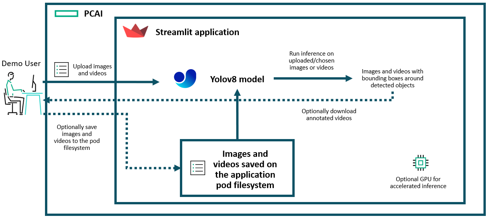
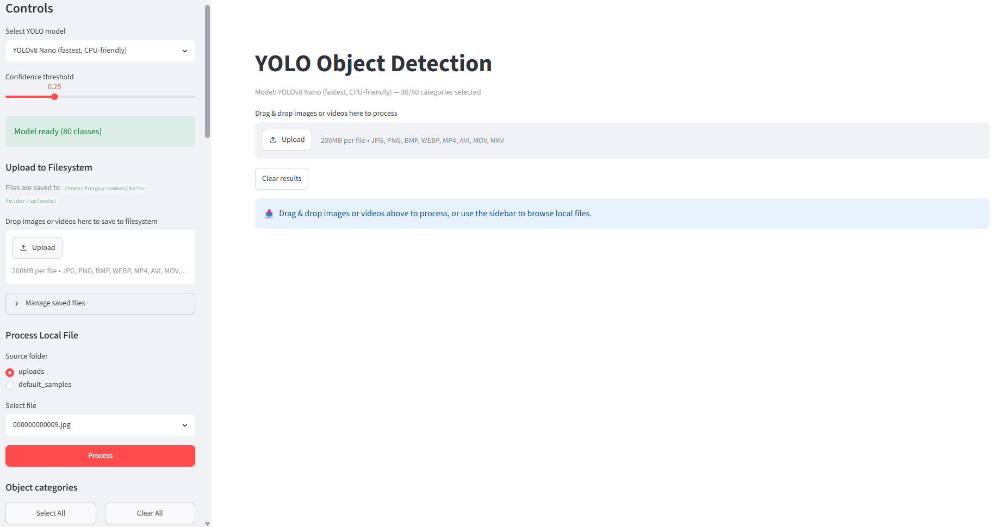
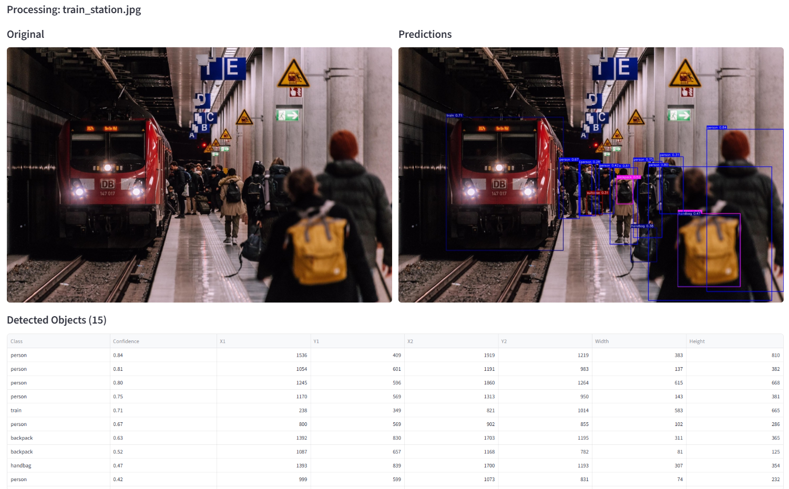
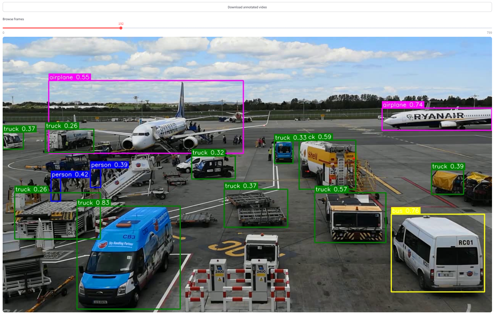

# Simple Object Detection with YOLO

| Owner                       | Name                              | Email                                     |
| ----------------------------|-----------------------------------|-------------------------------------------|
| Use Case Owner              | Tanguy Pomas                      | tanguy.pomas@hpe.com                     |
| PCAI Deployment Owner       | Tanguy Pomas                      | tanguy.pomas@hpe.com                      |

## Abstract

This demo aims to show basic object detection inference on PCAI using a simple custom streamlit application that loads and uses a [YOLOv8](https://docs.ultralytics.com/models/yolov8#key-features-of-yolov8) model.

**Disclaimer: This demo does not include a fine-tuning component, it only uses default YOLOv8 models to detect classes of objects found in the** [**COCO dataset**](https://cocodataset.org/#home)
You can check the [image segmentation demo](https://github.com/ai-solution-eng/ai-solution-demos/tree/main/image-segmentation), for what could be a similarly structured, computer-vision centric demo, that includes a training/fine-tuning component.

This demo uses:
- **YOLOv8**: Pre-trained model for object detection, running on PyTorch.
- **Custom streamlit applicatoin**: Provides the UI for uploading media, configuring detection parameters, and viewing results.

**Recording:**

- [**Demo recording**](https://storage.googleapis.com/ai-solution-engineering-videos/public/object-detection-demo.mp4)

## Description

### Overview

This demo consists of importing a custom Streamlit-based object detection application into PCAI and using it to run YOLO inference on images and videos. Users can upload their own images and videos, select which object categories (out of the 80 represented in the COCO dataset) to detect, adjust the confidence threshold, and view annotated results directly in the browser.

The application can request a GPU for accelerated inference, but also works fine without a GPU, albeit inference will be slower when running on CPU only.

### Architecture Diagram

### Workflow

Once the demo has been set up, the workflow is straightforward:

* Open the application, from the PCAI Tools & Frameworks page.
* Download the YOLOv8 model version you wish to use, the Nano version will be downloaded automatically, but larger versions can provide better results.
* Double check the detection parameters: Confidence threshold is set to 0.25 and all the 80 object classes will be looked for by default.
* Either:
  * Upload a video or an image in the center of the application to automatically have YOLO detect objects in it.
  * Use one of the sample image or video made available in the app to test the model.
* View the result on the app. In case of videos, you can download the annotated video after the YOLO inference is complete.

## Deployment

### Prerequisites

The YOLO model runs on PyTorch and can use a GPU if available. **Requesting a GPU is optional but recommended for acceptable inference speed, especially on videos**.

The application can be imported like any other PCAI application: using a Helm chart. The chart is available in this folder, already packaged as `basic-object-detection-demo-app-0.1.0.tgz`. Its content is available under the `app_chart` folder.

Notes:
* If requested, **one GPU will be fully allocated to the application for as long as it is running on PCAI**.
* For that reason, the default helm configuration has GPU disabled by default, but GPU count set to 1 if enabled (see `values.yaml` — `resources.gpu.enabled` and `resources.gpu.count`).
* Requesting more than one GPU will not further improve the performance of the YOLO models.

### Installation and configuration

1. **Import the application**

   Like for any framework you want to import to PCAI:

   - Go to **Tools & Frameworks**
   - Click on **Import Framework**, and follow the steps, using the Helm chart referenced in the prerequisites section.
   - Review the values. The default ones should be good enough for a demo using YOLOv8 Nano. Notable values include:
     - `resources.limits.cpu` / `resources.limits.memory`: Can be worth increasing for faster inference, especially if not using a GPU.
     - `resources.gpu.enabled`: Set if to `true` to request a GPU - This will fully allocate a GPU to the application while it is on the platform. `resources.gpu.count` should be left to one.

   Then, wait for the application to be accessible from the PCAI interface.

2. **Open the application**

   Once imported, open the application from the PCAI interface. You should see the application UI with the following sections:

   - **Main area**: Drag-and-drop images or videos here for quick processing.
   - **Sidebar — Controls**: Choose the YOLO model variant and set the confidence threshold.
   - **Sidebar — Upload to Filesystem**: Upload media files to the pod's local storage for later use.
   - **Sidebar — Manage saved files**: View and delete files saved to the pod's filesystem.
   - **Sidebar — Process Local File**: Select between `uploads/` and `default_samples/` folders, pick a file, and run inference.
   - **Sidebar — Object categories**: Toggle which object classes to detect (Select All / Clear All, or individual categories).

3. **Use the application**

There are multiple ways to use the application, either:
* **Option 1: Upload an image or a video in the main area for immediate processing**
  * Multiple images can be uploaded at once, but only one video at a time.
  * After uploading an image (or multiple ones), original images will be displayed next to annotated images, and a table listing detected objects with their confidence scores and bounding box coordinates will be displayed below them.

  * If uploading a video, the resulting video with bounding boxes annotations will NOT be playable, only frame by frame visualization is possible from the app. The annotated video will be made available for download though.

* **Option 2: Use the default samples**
  * Tick default_samples as source folder, under the "Process Local Files" section of the sidebar
  * Choice between four images and three videos bundled by default with the application will be offered in the dropdown list, just below.
  * Select the one you want to run inference on, and click the "Process" button, to actually start the inference.
  * Results formatting will be the same as option 1. The only difference is that only one file can be processed at a time that way.

* **Option 3: Use the uploads folder after uploading your files**
  * Click on the "Upload" button or drag-and-drop your images and videos to the sidebar field under the "Upload to Filesystem" section to upload your files to the application pod's filesystem
  * These files will be available to select in the dropdown list when you tick "uploads" as source folder.
  * With "uploads" option ticked, the demo is the same as option 2.
  * **Note: Uploaded files are not saved upon pod restart.**

## Limitations

- **Basic object detection demo:** This demo just aims to show object detection on PCAI using a YOLO model. It does not explore advanced features such as model training, custom dataset integration, or deployment of custom YOLO variants.
- **Not a production setup:** Installing the application with the currently provided Helm chart is by no means a production-ready environment. It is intended for demonstration purposes only.
- **No persistent storage:** Uploaded files are stored on the pod's ephemeral filesystem and are lost when the pod restarts.

## References

- [Ultralytics YOLO](https://www.ultralytics.com/yolo)
- [Ultralytics Documentation](https://docs.ultralytics.com/)
- [COCO dataset](https://cocodataset.org/#home)
- Images bundled within the application have been taken from [Pixabay](https://pixabay.com)
