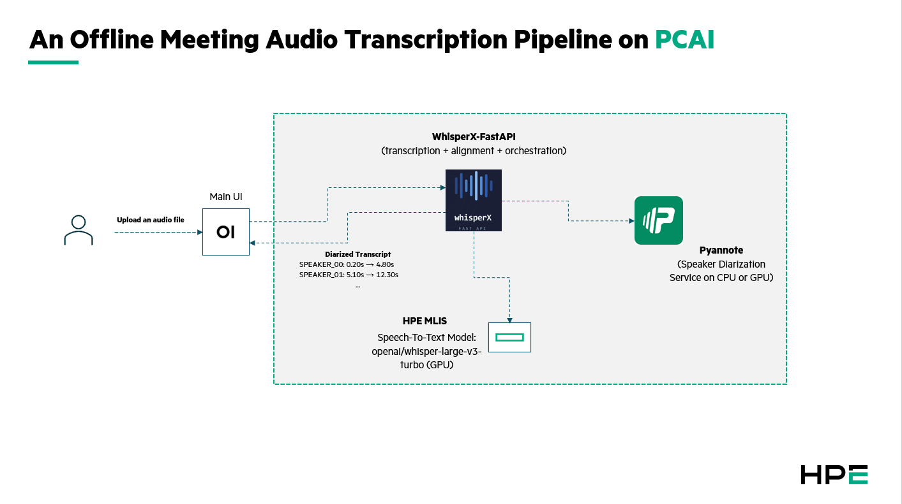

# Offline Meeting Audio Transcription

| Owner                 | Name              | Email                              |
| ----------------------|-------------------|------------------------------------|
| Use Case Owner        | Daniel Cao        | daniel.cao@hpe.com                 |
| PCAI Deployment Owner | Daniel Cao        | daniel.cao@hpe.com                 |

## Abstract

Organizations generate vast amounts of audio from meetings, court hearings, compliance calls, and interviews — yet most of this content remains unstructured and inaccessible. Manual transcription is slow, expensive, and struggles with multi-speaker attribution. This demo shows how open-source AI models can be assembled into a complete offline transcription pipeline on HPE Private Cloud AI, converting raw audio recordings into speaker-attributed transcripts and structured meeting minutes — entirely on-premises.

The pipeline combines two AI capabilities: speech-to-text (OpenAI Whisper large-v3-turbo), and speaker diarization (pyannote.audio community-1). These are deployed as independent, reusable services on PCAI and connected through a single chat-based interface via OpenWebUI.

- Accelerates meeting documentation from hours of manual work to minutes of automated processing
- Provides speaker-attributed transcripts 
- Keeps all audio data on-premises — no external API calls, suitable for legal, compliance, and government use cases

Features:
- Upload audio files (.wav, .mp3, .m4a, .ogg, .flac) via a simple chat interface and receive diarized transcripts
- Automatic speaker detection supporting 2–10+ speakers with configurable min/max speaker hints
- 99-language support via Whisper large-v3-turbo with ~6x speed improvement over large-v3
- Microservice architecture: speech model, diarization, and orchestration are independently scalable and swappable
- Whisper model served through HPE MLIS for shared, multi-tenant GPU utilization
- Diarization runs on CPU, minimizing GPU requirements

Recordings:
- [Short version, customer focused [06:51]](pending)

## Description

### Overview

This demo deploys four components on PCAI that together form an end-to-end offline audio transcription pipeline:

| Component | Role | GPU | Source |
|-----------|------|-----|--------|
| **Open WebUI** | Chat-based user interface for file upload, transcript display, and LLM interaction | No | [ai-solution-eng/frameworks/open-webui](https://github.com/ai-solution-eng/frameworks/tree/main/open-webui) |
| **WhisperX-FastAPI** | Orchestrator — coordinates transcription, diarization, and word-level alignment | No (MLIS mode) | [pavelzbornik/whisperX-FastAPI](https://github.com/pavelzbornik/whisperX-FastAPI), ported to PCAI |
| **Pyannote Diarization** | Standalone speaker diarization service (who spoke when) | No (CPU) | Custom image `caovd/pyannote-diarization:0.1.1`, ported to PCAI |
| **Whisper large-v3-turbo** | Speech-to-text model served via HPE MLIS | Yes (1x GPU) | Deployed through MLIS model catalog |

**Architecture diagram:**


```

### Workflow

**Step 1 — Audio Upload:** The user opens Open WebUI, starts a chat, and attaches a meeting audio recording (.wav, .mp3, etc.). A community WhisperX Pipe plugin installed in Open WebUI detects the audio file and routes it to WhisperX-FastAPI.

**Step 2 — Transcription:** WhisperX-FastAPI receives the audio and sends it to the Whisper large-v3-turbo model hosted on HPE MLIS. The model returns a raw text transcription of the audio.

**Step 3 — Speaker Diarization:** Simultaneously, WhisperX-FastAPI sends the same audio to the Pyannote Diarization service. Pyannote analyzes vocal patterns and returns time-stamped speaker segments (e.g., `SPEAKER_00: 0.20s → 4.80s`).

**Step 4 — Alignment & Combination:** WhisperX-FastAPI performs word-level forced alignment locally (using wav2vec2) to produce precise per-word timestamps. It then combines the transcription with the diarization output, assigning a speaker label to every word.

**Step 5 — Transcript Display:** The diarized transcript — with speaker labels, timestamps, and full text — is returned to Open WebUI and displayed in the chat.


**Data flow summary:** Audio file → Open WebUI → WhisperX-FastAPI → (Whisper MLIS + Pyannote service) → diarized transcript → Open WebUI. All data remains within the PCAI cluster.

## Deployment

### Prerequisites

**Hardware:**
- 1x NVIDIA GPUs (L40S 48GB, H100 80GB or A100 80GB): 1 for Whisper large-v3-turbo
- CPU capacity for Open WebUI, WhisperX-FastAPI (MLIS mode), and Pyannote Diarization

**Software:**
- HPE AIE Software v1.8.0 or later
- HPE MLIS available and operational
- `kubectl` and `helm` v3.x configured with cluster access

**External accounts:**
- HuggingFace account (free) with access token: [hf.co/settings/tokens](https://huggingface.co/settings/tokens)
- Accept model licenses on HuggingFace before deploying:
  - [pyannote/speaker-diarization-community-1](https://huggingface.co/pyannote/speaker-diarization-community-1) — click "Agree and access repository"
  - [pyannote/segmentation-3.0](https://huggingface.co/pyannote/segmentation-3.0) — click "Agree and access repository"

**Frameworks to install (in order):**
1. Whisper large-v3-turbo (via MLIS)
2. Open WebUI (from `ai-solution-eng/frameworks/open-webui`)
3. Pyannote Diarization (custom chart: `pyannote-diarization-0.1.0.tgz`)
4. WhisperX-FastAPI (custom chart: `whisperx-fastapi-0.1.0.tgz`)

### Installation and configuration

#### 1. Deploy Whisper via MLIS

1. Deploy **openai/whisper-large-v3-turbo** via MLIS — allocate 1x GPU
2. Note the endpoint URL and API key

#### 2. Deploy Open WebUI

1. Navigate to **Tools & Frameworks → Import Framework**
2. Upload the Open WebUI Helm chart from `ai-solution-eng/frameworks/open-webui`
3. In values, configure:
   - `OPENAI_API_BASE_URLS` → LLM MLIS endpoint URL
   - `OPENAI_API_KEYS` → LLM API key
   - `ezua.virtualService.endpoint` → your cluster domain
4. Deploy and create an admin account on first login

#### 3. Deploy Pyannote Diarization

1. Import `pyannote-diarization-0.1.0.tgz` via **Tools & Frameworks → Import Framework**
2. In values, set:
   - `hfToken` → your HuggingFace access token
   - `ezua.virtualService.endpoint` → `pyannote.<DOMAIN_NAME>`
3. Deploy. Wait for logs to show `Pipeline ready. Application startup complete.`
4. Ignore `torchcodec` warnings in logs — they are non-fatal

#### 4. Deploy WhisperX-FastAPI

1. Import `whisperx-fastapi-0.1.0.tgz` via **Tools & Frameworks → Import Framework**
2. In values, set:
   - `mlis.enabled` → `true`
   - `mlis.whisper.apiUrl` → Whisper MLIS endpoint URL
   - `mlis.whisper.apiKey` → Whisper MLIS API key
   - `mlis.diarization.apiUrl` → Pyannote service internal URL (e.g., `http://pyannote-pyannote-diarization.pyannote-diarization.svc.cluster.local:8000`)
   - `hfToken` → your HuggingFace access token
   - `resources.limits.nvidia.com/gpu` → `0` (no GPU needed in MLIS mode)
   - `ezua.virtualService.endpoint` → `whisperx.<DOMAIN_NAME>`
3. Deploy. Verify at `https://whisperx.<DOMAIN_NAME>/docs`

#### 5. Install WhisperX Pipe in Open WebUI

1. Open Open WebUI → **Admin Panel → Functions → + Create new function**
2. Paste the WhisperX Pipe code from [openwebui.com/f/podden/whisper_x_transciption](https://openwebui.com/f/podden/whisper_x_transciption)
3. Configure Valves:
   - `API_BASE_URL` → WhisperX-FastAPI internal service URL
   - `MODEL_SIZE` → `large-v3-turbo`
   - `LANGUAGE` → `en`
4. Enable the function

## Running the demo

### Demo 1: Audio Transcription with Speaker Diarization

This demo shows the core pipeline — uploading an audio file and receiving a speaker-attributed transcript.

1. Open Open WebUI and start a new chat
2. In the model selector, choose the **whisperx_pipe** function
3. Click the attachment button (📎) and upload a meeting audio file (.wav or .mp3, 1–5 minutes, 2–3 speakers)
4. Type `"Transcribe this meeting"` and send
5. When prompted about multiple speakers, click **Confirm**
6. Wait for processing (typically 20–60 seconds depending on audio length)
7. The diarized transcript appears in the chat with speaker labels (`SPEAKER_00`, `SPEAKER_01`) and timestamps

**Expected output:**
```
SPEAKER_00 [00:03 - 00:04]: Let me ask you about AI.
SPEAKER_00 [00:04 - 00:11]: It seems like this year for the entirety of
the human civilization is an interesting year for the development of
artificial intelligence.
SPEAKER_01 [00:39 - 00:49]: I think you're right, first of all, that in
the last year, there have been a bunch of advances on scaling up these
large transformer models.
```

## Limitations

**Speaker diarization accuracy:** Open-source diarization (pyannote community-1) achieves 11–20% Diarization Error Rate on clean audio with 2–3 speakers. Accuracy degrades with distant microphones, overlapping speech, similar-sounding voices, or 5+ speakers. For a controlled demo, use clean recordings with clear turn-taking.

**Speaker labels are generic:** The system produces labels like `SPEAKER_00`, `SPEAKER_01` — not real names. Mapping labels to actual speaker names requires voice enrollment, which is not implemented.

**Offline only:** This demo processes completed audio recordings. Real-time / live transcription is not supported — it requires a streaming ASR architecture which is a different technical approach.

**Audio quality dependency:** Transcription quality depends heavily on the input audio. Background noise, echo, low bitrate, or heavy compression will reduce accuracy. Best results come from close-mic or headset recordings.

**Single language per recording:** Whisper large-v3-turbo supports 99 languages but assumes a single language per audio file. Mixed-language recordings (code-switching) may produce inconsistent results.

**Open WebUI audio upload:** The WhisperX Pipe handles audio file detection via file extension. If Open WebUI rejects an audio file upload, rename the file to `.wav` or `.mp3`. The built-in mic button in Open WebUI is for dictation (voice-to-text input), not for recording meetings.


