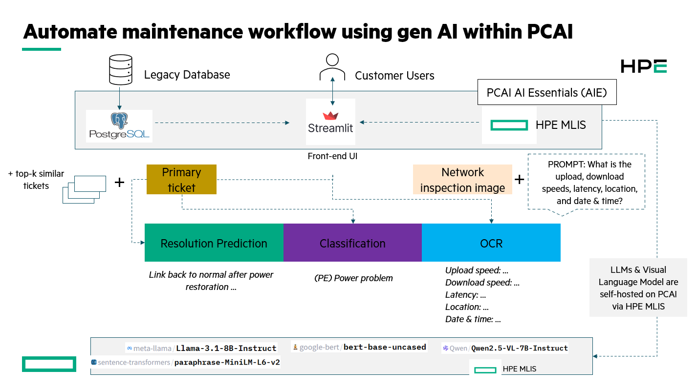

# Predictive Maintenance Demo

A gen-AI powered predictive maintenance application built with Streamlit, featuring three core capabilities:

1. **Resolution Prediction**: Leverages LLaMA models to predict maintenance resolutions based on historical ticket data and embeddings
2. **Ticket Classification**: Uses BERT-based models to automatically classify maintenance tickets into appropriate categories
3. **Network Inspection OCR**: Employs Qwen VL models to extract and analyze text from network equipment photos for diagnostic purposes



[Quick demo](https://hpe-my.sharepoint.com/:v:/r/personal/daniel_cao_hpe_com/Documents/18_AISSE/31_PCAI/08%20-%20Demo/01_recorded_trials/pcai-predictive-maintenance-demo.mp4?csf=1&web=1&nav=eyJyZWZlcnJhbEluZm8iOnsicmVmZXJyYWxBcHAiOiJPbmVEcml2ZUZvckJ1c2luZXNzIiwicmVmZXJyYWxBcHBQbGF0Zm9ybSI6IldlYiIsInJlZmVycmFsTW9kZSI6InZpZXciLCJyZWZlcnJhbFZpZXciOiJNeUZpbGVzTGlua0NvcHkifX0&e=eelMR9)

## Project Structure

```
.
├── artifacts/
│   ├── embeddings.npy              # Pre-computed sentence embeddings for resolution prediction
│   └── label_encoder.pkl           # Sklearn label encoder for ticket classification (9 classes)
├── assets/
│   ├── HPE-logo-2025.png          # HPE logo for UI branding
│   ├── logo.png                   # App logo for PCAI deployment
│   └── predictive-maintenance-0.1.8.tgz  # Packaged Helm chart for deployment
├── data/
│   ├── test-image.jpg             # Sample network equipment image for OCR testing
│   └── test-tickets.csv           # Sample ticket dataset for testing and development
├── model/
│   └── finetuned_bert/            # Fine-tuned BERT model for ticket classification
│       ├── config.json            # Model configuration with 9 label classes
│       ├── model.safetensors      # Model weights in SafeTensors format
│       └── ...                    # Additional model files (tokenizer, training artifacts)
├── helm-chart/                    # Kubernetes deployment configuration
│   ├── Chart.yaml                 # Helm chart metadata
│   ├── values.yaml                # Default configuration values
│   └── templates/                 # Kubernetes resource templates
├── postgresql/                    # Database setup notebooks
│   ├── 1_create_database.ipynb    # PostgreSQL database creation
│   ├── 2_insert_csv_psql.ipynb    # CSV data import to PostgreSQL
│   └── 3_get_psql_as_df.ipynb     # Database query examples
├── classification.py              # BERT-based ticket classification (9 classes)
├── config_handler.py              # Configuration file loader
├── config.yaml                    # Main application configuration
├── main.py                        # Streamlit web application entry point
├── ocr.py                         # Qwen VL-based OCR for network inspection
├── resolution_mttr.py             # LLaMA-based resolution and MTTR prediction
├── requirements.txt               # Python dependencies
└── Dockerfile                     # Container build configuration
```

### Key Files by Use Case

#### 1. Ticket Classification (BERT)
- **`classification.py`**: Core classification logic with 9 predefined classes:
  - **CL (Commercial Issue)**: Business or billing related problems
  - **FC (Fast Connector)**: Fiber optic connector issues
  - **FO (Fiber Optic Problem)**: General fiber cable and optical issues
  - **HD (Hardware Problem)**: Physical equipment failures
  - **HP (In-House Problem)**: Internal infrastructure issues
  - **PE (Power Problem)**: Electrical and power supply issues
  - **PM (Public Complaint)**: Customer complaints and public grievances
  - **SW (Software Problem)**: Software, firmware, and configuration issues
  - **UNKNOWN FAULT**: Unclassified or unclear issues
- **`artifacts/label_encoder.pkl`**: Maps model outputs to human-readable class names
- **`model/finetuned_bert/`**: Fine-tuned BERT model trained on telecom maintenance tickets

#### 2. Resolution & MTTR Prediction (LLaMA)
- **`resolution_mttr.py`**: Uses sentence embeddings and LLaMA models for intelligent resolution suggestions
- **`artifacts/embeddings.npy`**: Pre-computed embeddings for similarity-based retrieval
- **External LLaMA API**: Configured through `config.yaml` for text generation

#### 3. Network Inspection OCR (Qwen VL)
- **`ocr.py`**: Vision-language model integration for extracting metrics from equipment images
- **`data/test-image.jpg`**: Sample network monitoring dashboard screenshot
- **External Qwen VL API**: Configured through `config.yaml` for multimodal inference

#### 4. Web Application
- **`main.py`**: Streamlit interface with tabbed navigation for all three use cases
- **`config_handler.py`**: Dynamic configuration management for API endpoints
- **`config.yaml`**: Central configuration file for all model endpoints and settings

## Helm Chart Deployment

This application is packaged as a Kubernetes Helm chart designed for deployment on HPE PCAI infrastructure with Istio service mesh integration.

### EZUA Integration

The Helm chart includes EZUA (HPE's application orchestration platform) integration through:

- **VirtualService Configuration**: Automatically configures Istio VirtualService for external access
- **Gateway Integration**: Routes traffic through `istio-system/ezaf-gateway`
- **Dynamic Endpoints**: Supports `${DOMAIN_NAME}` variable substitution for flexible domain configuration

### Key Features

- **ConfigMap Mounting**: Application configuration mounted as ConfigMap for runtime flexibility
- **Istio Service Mesh**: Native integration with Istio for traffic management and security
- **Resource Management**: Configured with appropriate CPU/memory limits for ML workloads
- **Health Checks**: Built-in liveness and readiness probes for Kubernetes orchestration
- **HPE PCAI Optimized**: Tailored for HPE Private Cloud AI infrastructure requirements

### Deployment

Two assets required for the app deployment on PCAI via "Import Framework" are:

1. The packaged helm chart: ./assets/predictive-maintenance-0.1.8.tgz
2. The app logo: ./assets/logo.png

### Testing: 

- For ticket resolution prediction & classification, refer to the notebooks in ./postgresql to set up a table data in PostgreSQL. You can deploy PostgreSQL on the same PCAI cluster using [this framework](https://github.com/ai-solution-eng/frameworks/tree/main/postgresql). 

- For demoing the OCR use case, use the test image under ./data/test-image.jpg. Hint: You might need to add this sentence to the existing template suggested prompts in case the decimals are not properly identified.

```yaml
Make sure a comma in between digits is treated as "." or decimal.
```

# Access via configured domain
# Application will be available at: predictive-maintenance.${DOMAIN_NAME}

The application supports dynamic endpoint configuration through the UI, allowing runtime updates to ML inference server URLs and authentication tokens without requiring redeployment.

## HPE PCAI Integration

### Bring Your Own Application (BYOA)

For detailed instructions on deploying custom applications to HPE PCAI using the import framework, refer to:
- [BYOA Tutorials](https://github.com/HPEEzmeral/byoa-tutorials) - Step-by-step guides for bringing your own applications to PCAI

### Model Deployment

To deploy and manage ML models on HPE PCAI infrastructure:
- [HPE MLIS Documentation](https://docs.ai-solutions.ext.hpe.com/products/mlis/latest/) - Complete guide for ML inference services on PCAI

### Acknowledgement:
- HPE GSE Team - Original use case development.
- [Roh Geun Tak](https://github.com/rohgeuntak76) - Migrating the helm chart over to PCAI.
- [Daniel Cao](https://github.com/caovd) - Solution architect for designing, testing, adapting and demoing these use cases on PCAI. 

### Contribution: 
- No contribution/further development is expected except for POC/demo purposes.

