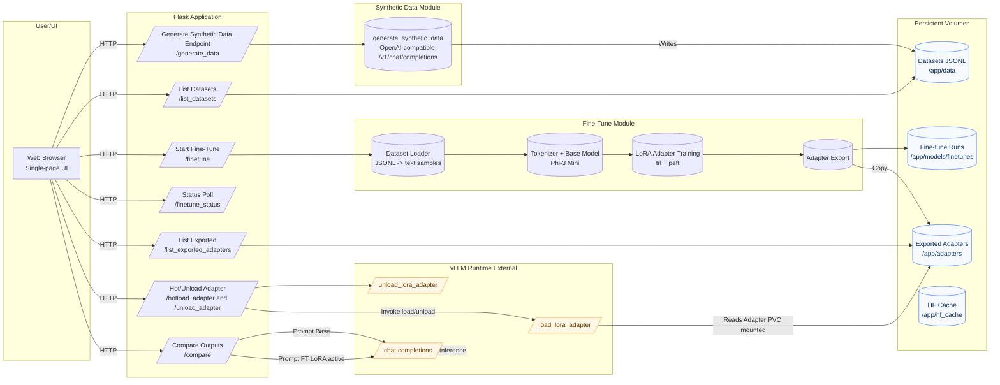

# Synthetic Data Generation & LoRA Fine‑Tuning App

Generate small synthetic instruction datasets from any OpenAI‑compatible endpoint, fine‑tune a base model (Phi‑3 mini by default) with LoRA, export the adapter, hot‑load it into a running vLLM server, and interactively compare base vs fine‑tuned outputs — all from a single lightweight Flask UI.

## Architecture Diagram



### Description

1. The browser UI interacts only with the Flask REST endpoints.
2. Synthetic data generation calls an external OpenAI-compatible model endpoint and persists JSONL rows.
3. Fine-tuning runs in a background thread: loads datasets, tokenizes, applies LoRA via `peft` + `trl`.
4. Trained adapter artifacts are exported to a shared directory intended to be volume-mounted into a vLLM deployment.
5. User triggers hot-load/unload to dynamically attach/detach adapters in vLLM.
6. Comparison sends identical formatted prompts to base and fine-tuned (adapter-loaded) model endpoints.


## ️🎯 Key Capabilities

- Synthetic data generation against any OpenAI Chat Completions–compatible API (vLLM, Azure OpenAI, etc.)
- JSONL dataset creation (instruction/output pairs) with retry logic & per‑request timeouts
- Async LoRA fine‑tuning using `trl` + `peft` on `microsoft/Phi-3-mini-4k-instruct` (default)
- Adaptive device strategy: CUDA (with optional 4‑bit), Apple MPS, or CPU fallback
- Automatic adapter export to a shared directory / PVC
- Hot‑load / unload LoRA adapters into a remote vLLM instance via its management endpoints
- Side‑by‑side generation comparison (base vs fine‑tuned) with identical prompt formatting
- Minimal, modern responsive UI (pure HTML/JS/CSS — no build step)
- Production Docker image + Helm chart (GPU request + optional Istio VirtualService)

## 🗂 Project Structure

```text
synth-data-gen-fine-tune/
├── app/
│   ├── __init__.py
│   ├── app.py                # Flask routes + UI + REST API
│   ├── synthetic_data.py     # Synthetic data generation helper
│   ├── fine_tune.py          # LoRA fine-tuning orchestration (threaded)
│   ├── templates/
│   │   └── index.html        # Single-page UI
│   └── static/
│       └── style.css         # Dark/light responsive styling
├── docs/
│   └── architecture.md       # Extended architecture notes / diagram source
├── helm/                     # Helm chart for K8s deployment
│   ├── Chart.yaml
│   ├── values.yaml
│   └── templates/
│       ├── synth-ft-deployment.yaml
│       ├── synth-ft-service.yaml
│       └── virtualservice.yaml
├── pcai/                     # PCAI import framework assets (image, bundled helm chart)
│   ├── synth-data-gen.png
│   └── synth-ft.tar.gz
├── Dockerfile                # Container build
├── requirements.txt          # Python deps
└── README.md
```


## 📦 Core Dependencies

| Library | Purpose |
|---------|---------|
| Flask | Web UI + API |
| transformers | Base model + tokenizer loading |
| peft | LoRA adapter wrapping & saving |
| trl | SFT training utilities |
| datasets | Lightweight in‑memory dataset for SFT |
| bitsandbytes (optional) | 4‑bit quant on CUDA GPUs |
| accelerate | Device placement / dispatch |


## 🧱 Architecture Overview

1. User supplies a model endpoint + auth token → generates N synthetic instruction/response rows.
2. Rows are persisted as JSONL in `app/data/`.
3. User selects one or more datasets and starts LoRA fine‑tuning (background thread per job).
4. Trainer outputs a run directory under `models/finetunes/<timestamp>_microsoft_Phi-3-mini-4k-instruct/`.
5. LoRA adapter (adapter_model + config) is copied to an export directory (PVC mount) — default `/app/adapters` inside the container.
6. User hot‑loads adapter into vLLM with `/v1/load_lora_adapter` and compares generations.

## 🧪 Dataset Format

Each generated dataset is a JSONL file. Every line:

```json
{"instruction": "<original prompt template>", "output": "<model generated text>"}
```

During training, each pair is converted to a single text sample:

```text
### Instruction:
<instruction>

### Response:
<output>
```

This formatting is reused for comparison prompts so the fine‑tuned adapter sees a consistent pattern.

## 🚀 For Deployment on PCAI see the Confluence page (here)[https://hpe-aiatscale.atlassian.net/wiki/x/QwBwjQ]

## 🔧 Environment Variables

| Variable | Default | Purpose |
|----------|---------|---------|
| DATA_DIR | /app/data | Where JSONL datasets are written |
| FINETUNE_ROOT | /app/models/finetunes | Parent dir for fine‑tune runs |
| ADAPTER_EXPORT_DIR | /app/adapters | Final exported LoRA adapter copies |
| HF_HOME / TRANSFORMERS_CACHE | /app/hf_cache | Hugging Face cache location |
| DEFAULT_ADAPTER_NAME | (unset) | If set, used as stable adapter export folder name |

## 🧠 Fine‑Tuning Details

| Aspect | Value / Strategy |
|--------|------------------|
| Base model | `microsoft/Phi-3-mini-4k-instruct` (change via API param) |
| Adapter | LoRA (cuda: r=16, alpha=32, dropout=0.1; cpu/mps: r=8, alpha=16, dropout=0.05) target Q/K/V/O + MLP proj layers |
| Sequence length | Configurable (`max_seq_len`, default 512) |
| Precision | CUDA: bfloat16; MPS: fp16; CPU: fp32 |
| 4‑bit | Enabled automatically only if CUDA + bitsandbytes available |
| Gradient Accum | Default 1 for CUDA, 2 for CPU/MPS (reduces memory) |
| Logging | Minimal (no external trackers) |
| Checkpoints | Single final adapter (no intermediate saves) |

## 🔌 REST API Summary

| Method | Path | Purpose |
|--------|------|---------|
| GET | `/healthz` | Liveness probe |
| POST | `/generate_data` | Create synthetic dataset (JSONL) |
| GET | `/list_datasets` | List available dataset files |
| POST | `/finetune` | Start LoRA fine‑tune job |
| GET | `/finetune_status?job_id=...` | Poll job status / progress |
| GET | `/list_exported_adapters` | List exported adapter folders |
| POST | `/hotload_adapter` | Proxy call to vLLM load adapter endpoint |
| POST | `/unload_adapter` | Proxy call to vLLM unload adapter endpoint |
| POST | `/compare` | Generate base vs finetuned outputs via vLLM |
| POST | `/event_log` | UI event logging (debug/telemetry) |

## 🛡 Security & Operational Notes

- Tokens are never persisted server‑side; they transit only in request bodies.
- Logs redact fields containing: `authorization`, `token`, `bearer_token`, `base_token`, `ft_token`.
- Use HTTPS reverse proxy in production (Flask app itself does not terminate TLS).
- Set resource requests/limits & network policies in Kubernetes for isolation.
- Validate synthetic data origin to avoid inadvertently leaking sensitive context.

