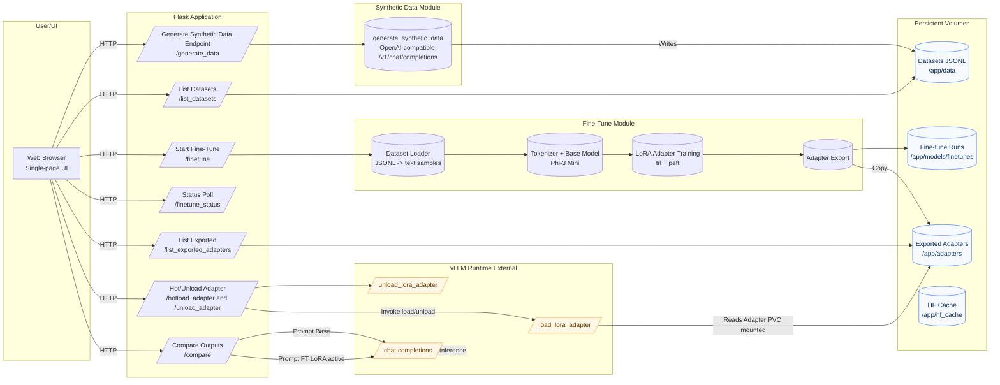

# High-Level Architecture

## Description

1. The browser UI interacts only with the Flask REST endpoints.
2. Synthetic data generation calls an external OpenAI-compatible model endpoint and persists JSONL rows.
3. Fine-tuning runs in a background thread: loads datasets, tokenizes, applies LoRA via `peft` + `trl`.
4. Trained adapter artifacts are exported to a shared directory intended to be volume-mounted into a vLLM deployment.
5. User triggers hot-load/unload to dynamically attach/detach adapters in vLLM.
6. Comparison sends identical formatted prompts to base and fine-tuned (adapter-loaded) model endpoints.
