# Automated Traffic Report

Making continuous reports on traffic from CCTV cameras is a laborous and repetitive task that requires automation at scale. This app aims to build a gen AI-powered smart traffic report system using Computer Vision & Visual Language Model (VLM) for real-time traffic analysis.

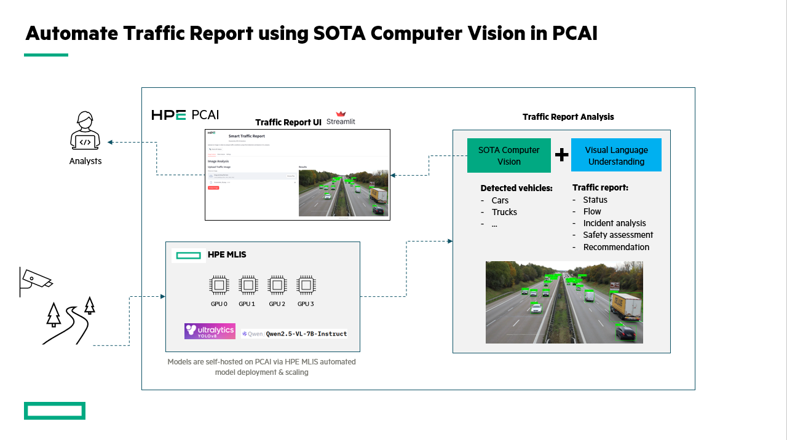

[Demo](https://storage.googleapis.com/ai-solution-engineering-videos/public/traffic-report-demo.mp4)

This application leverages the complementary strengths of two specialized AI models to provide comprehensive traffic scene understanding:

**YOLOv8 (Object Detection)** excels at:
- **Real-time detection** with minimal latency for immediate response
- **Precise localization** of vehicles, pedestrians, and traffic objects with accurate bounding boxes
- **High throughput** processing suitable for continuous monitoring
- **Consistent performance** across varying lighting and weather conditions
- **Quantitative analysis** providing exact counts and positions of detected objects

**Qwen2.5-VL (Vision-Language Model)** provides:
- **Contextual understanding** of complex traffic scenarios beyond simple object detection
- **Semantic analysis** interpreting traffic flow patterns, congestion levels, and safety conditions
- **Natural language insights** generating human-readable reports and recommendations
- **Scene comprehension** understanding relationships between objects and environmental factors
- **Qualitative assessment** providing traffic safety evaluations and incident analysis

Together, these models create a robust traffic management system where YOLOv8 provides the foundational object detection layer for precise, real-time identification, while Qwen2.5-VL adds the intelligence layer for contextual analysis and actionable insights. This dual-model approach ensures both accuracy in detection and depth in understanding, making it suitable for comprehensive traffic monitoring and management applications.

## Features

- **Object Detection**: YOLOv8 detects vehicles, pedestrians, and traffic violations
- **Scene Analysis**: Qwen2.5-VL provides detailed traffic flow analysis and safety insights
- **User Interface**: Modern Streamlit web interface for easy image/video upload and analysis
- **Real-time Processing**: Supports both static images and video analysis
- **Tabbed Interface**: Clean organization with separate tabs for Image Analysis, Video Analysis, and Settings
- **Session State Management**: Maintains analysis results throughout the session
- **Responsive Design**: Wide layout with column-based organization for better user experience

## Architecture

- `detection_service.py`: YOLOv8 integration for object detection
- `analysis_service.py`: Qwen2.5-VL integration for scene analysis
- `app.py`: Streamlit web interface
- `config.py`: Configuration and API settings

## API Requirements

- YOLOv8 endpoint with object detection capabilities
- Qwen2.5-VL endpoint with vision-language understanding

## Kubernetes Deployment

This application includes a complete Helm chart for Kubernetes deployment, compatible with EZUA BYOApp platform.

### Helm Chart Features

- **EZUA BYOApp Compatible**: Includes Istio VirtualService for proper application endpoint exposure
- **Complete Kubernetes Resources**: Deployment, Service, Ingress, ConfigMaps, Secrets
- **Auto-scaling**: HorizontalPodAutoscaler support for dynamic scaling
- **Security**: ServiceAccount and proper secret management for API keys
- **Configurable**: Comprehensive values.yaml for customization

### Directory Structure

```
helm-chart/
├── Chart.yaml                 # Chart metadata
├── values.yaml               # Configuration values
├── charts/                   # Dependencies
├── templates/
│   ├── deployment.yaml       # Application deployment
│   ├── service.yaml         # Kubernetes service
│   ├── ingress.yaml         # External access (optional)
│   ├── secret.yaml          # API credentials
│   ├── serviceaccount.yaml  # Service account
│   ├── hpa.yaml             # Auto-scaling
│   ├── tests/               # Test templates
│   └── ezua/
│       └── virtualService.yaml  # EZUA Istio integration
├── traffic-report-0.1.0.tgz     # Packaged chart
└── traffic-report.png          # Application logo
```

### Docker Image

The application is containerized and available on Docker Hub:
- **Repository**: `caovd/traffic-report-streamlit:latest`
- **URL**: https://hub.docker.com/r/caovd/traffic-report-streamlit

### Deploy YOLO and VLM models on PCAI

Edit your packaged model - YOLO model 

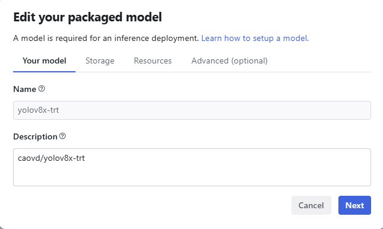

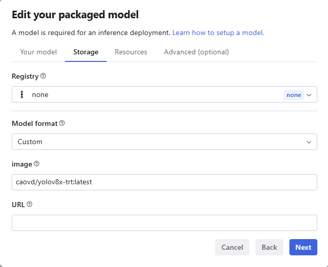


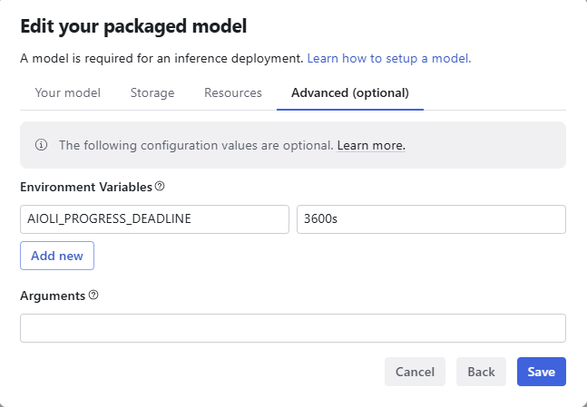

Edit your packaged model - VLM 

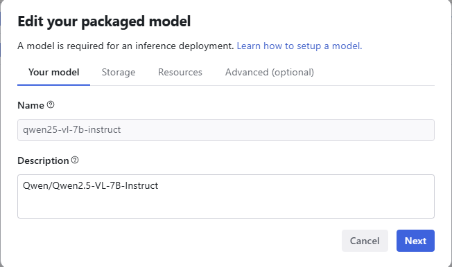


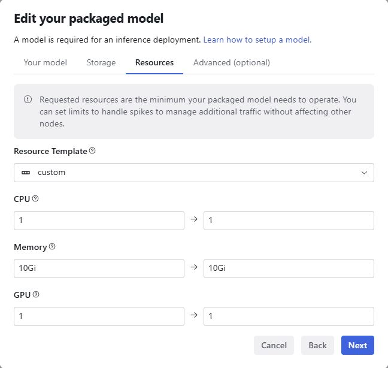

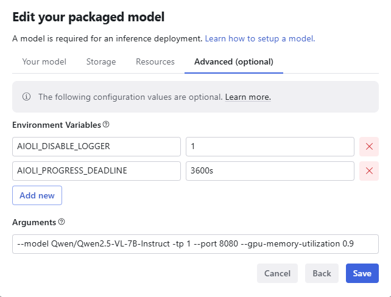

### Deployment on PCAI via "Import Framework"

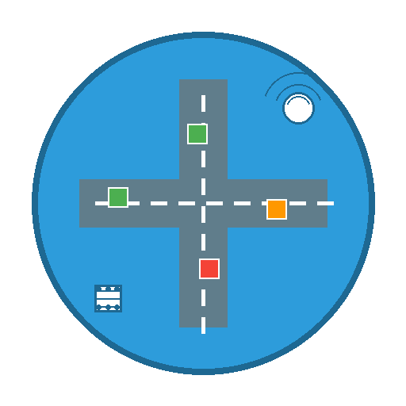

[Chart package](traffic-report-0.1.3.tgz) 

On the AIE portal, click on "Import Framework" and follow these steps below:

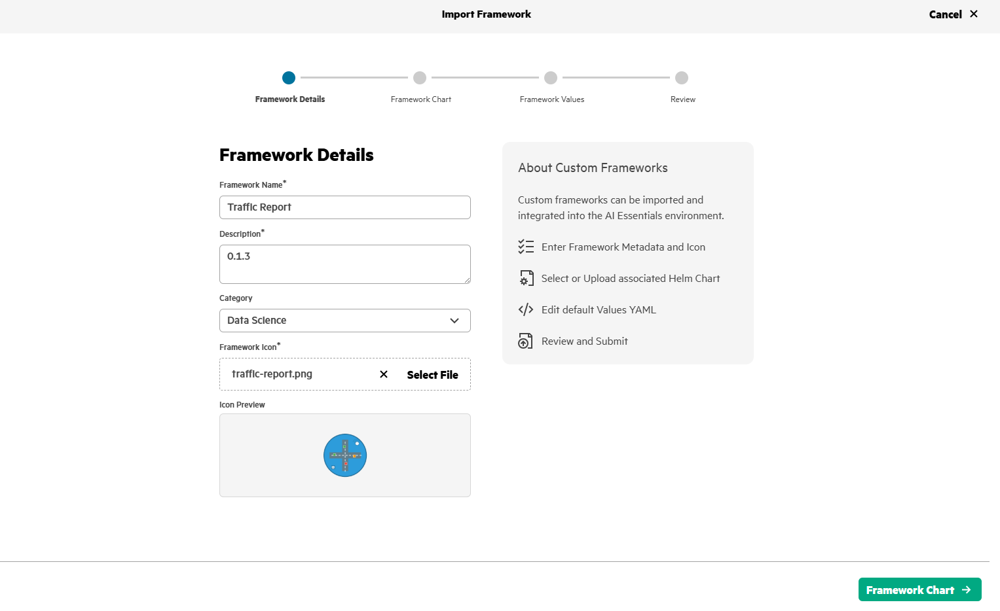

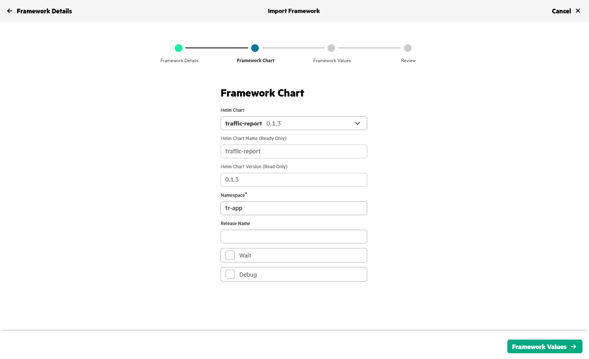

Configure API endpoints in values.yaml or leave these as default and later update them on the Streamlit UI once the app has been deployed and running:

```yaml
app:
  yolo:
    endpoint: "https://your-yolo-endpoint.com/predict"
    apiKey: "your-yolo-api-key"
  qwen:
    endpoint: "https://your-qwen-endpoint.com/v1/chat/completions"
    apiKey: "your-qwen-api-key"
```

For EZUA BYOApp deployment, the chart includes:

- Istio VirtualService at traffic-report.${DOMAIN_NAME}
- Gateway integration via istio-system/ezaf-gateway
- Proper endpoint configuration for platform integration

Once the app has been deployed. On the Streamlit UI, follow these steps:


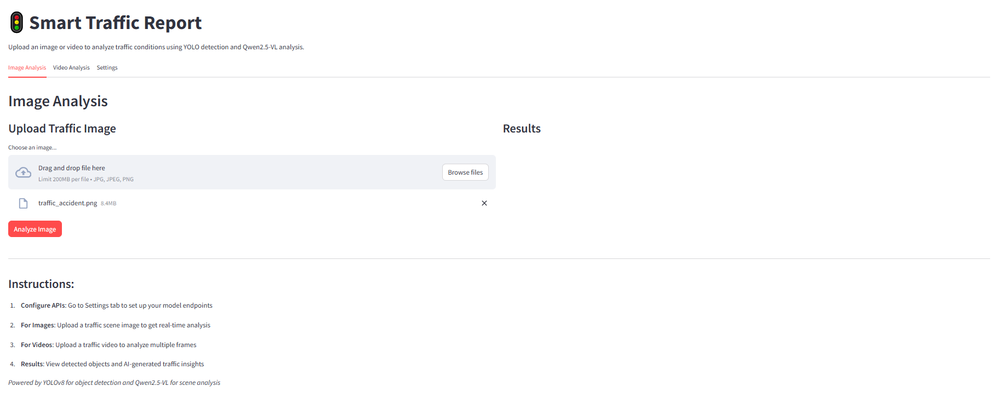

## Usage

1. **Configure APIs**: Go to the Settings tab and enter your YOLO and Qwen API endpoints and keys
2. **Image Analysis**: Upload a traffic scene image for instant analysis
3. **Video Analysis**: Upload a traffic video for frame-by-frame analysis
4. **Results**: View detected objects with bounding boxes and AI-generated insights

**Important**: Make sure to configure the API endpoints in the Settings tab of the web interface, even if you've already set them in the `.env` file.

### Streamlit Interface

The application provides a clean, modern web interface with:

- **Image Analysis Tab**: 
  - File uploader for JPG, JPEG, PNG images
  - Real-time processing with progress indicators
  - Results display with annotated images and analysis text
  
- **Video Analysis Tab**:
  - File uploader for MP4, AVI, MOV, MKV videos
  - Frame sampling and analysis
  - Representative frame display with comprehensive video analysis
  
- **Settings Tab**:
  - API endpoint configuration for YOLO and Qwen services
  - Password-protected API key inputs
  - Real-time settings validation and updates

**Note**: The Video Analysis feature is COMING SOON. 


--

[Demo video source](pixabay.com) under [content license](https://pixabay.com/service/license-summary/) 
