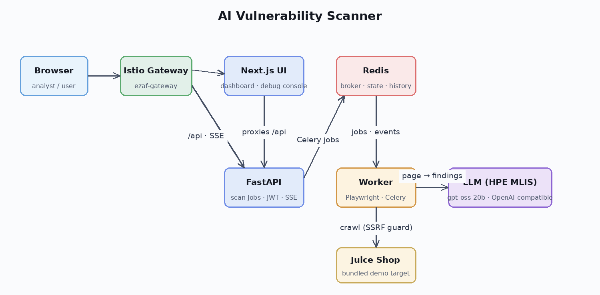
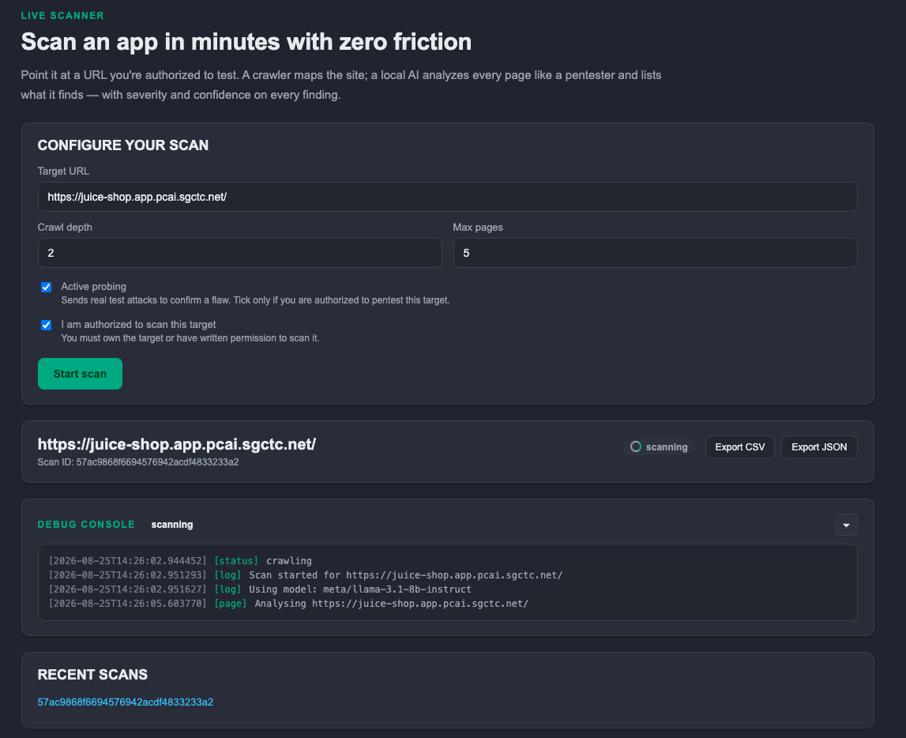
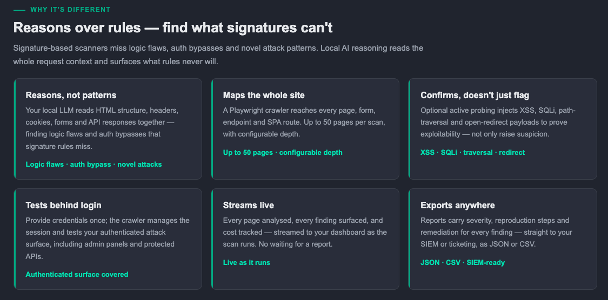

# AI Vulnerability Scanner Demo

| Owner                 | Name    | Email               |
| ----------------------|---------|---------------------|
| Use Case Owner        | Eric Yu | eric.yu@hpe.com     |
| PCAI Deployment Owner | Eric Yu | eric.yu@hpe.com     |

## Abstract

An AI-powered vulnerability scanner for web applications, built for PCAI. The user points it at a target URL, and a headless browser (Playwright) crawls the site while an **LLM served by HPE MLIS** analyzes every crawled page like a pentester — surfacing ranked findings with severity, confidence, evidence, reproduction steps, and concrete remediation guidance. Results stream live into a web dashboard with a debug console, and can be exported as CSV/JSON.

The application is a three-component stack — a Next.js dashboard, a FastAPI gateway, and a Playwright/Celery worker — backed by Redis for the Celery broker, scan state, and history. The LLM is an existing MLIS deployment (an OpenAI-compatible endpoint) that the user connects at deployment time; any compatible model can be swapped without rebuilding. The chart ships with **OWASP Juice Shop**, an intentionally vulnerable web app, as an in-cluster demo target, so a scan always has something to find.

This demo features:
* **HPE Machine Learning Inference Software (MLIS)** serving the analysis model:
  - [**openai/gpt-oss-20b**](https://huggingface.co/openai/gpt-oss-20b) as the pentester LLM (OpenAI-compatible `/v1` endpoint). Any other OpenAI-compatible model (Qwen, Nemotron, GPT-OSS variants, …) can be swapped by changing a single value.
* A **custom web application** to run and observe the scans, that includes:
  * A **scan dashboard**: target URL entry (pre-filled with the unit's bundled Juice Shop host, derived from `${DOMAIN_NAME}` — no per-unit rebuild), authorization checkbox, crawl depth / max pages / active-probing controls
  * A **live debug console** (server-sent events) streaming crawl and analysis events as they happen
  * A **findings view** with per-finding severity, confidence, evidence, repro steps and remediation, plus an overall risk score
  * **CSV / JSON export** of any scan, and a **recent scans** history persisted in Redis
  * A built-in **SSRF guard** that blocks private, link-local, and cloud-metadata targets by default
  * A **bundled OWASP Juice Shop** instance (Helm subchart) exposed on the gateway as the demo target
  * A pre-computed Juice Shop baseline scan injected as "history", so the dashboard shows real findings immediately after deployment, before the first live scan

**Recordings**:
* [**Demo Video [6 min]**](TODO: link added by the AI solution engineering team — the recording will be sent during the review)

## Description

### Overview

The main use of this demo is to show how an LLM can do first-pass security reviews of web applications without a human pentester. The user opens the dashboard, enters a target URL (by default the bundled Juice Shop, exposed on the PCAI gateway), and starts a scan. A Celery worker then crawls the target with a headless browser — up to the configured depth and page limit, optionally performing active probing (filling and submitting forms) — and sends the HTML of each page to the MLIS model with a pentester prompt. The model returns structured findings (severity, confidence, evidence, reproduction steps, remediation), which the worker validates, scores, and stores in Redis. The dashboard streams every step to the user through the live debug console, and the final report can be exported as CSV or JSON.

The LLM endpoint, its model name, and its API key are the only environment-specific settings. On the reference unit the model is `gpt-oss-20b` deployed with MLIS; the same chart works on any PCAI unit by pointing `llm.baseUrl` at whatever OpenAI-compatible endpoint is available there.

#### Architecture Diagram

### Workflow

#### Basic Demo Workflow

The actual demo workflow is quite simple, open the app from the **Tools & Frameworks** page of the PCAI console and check the preloaded state first:
* The dashboard already shows a **stored baseline scan of Juice Shop** in **Recent Scans** — open it and walk through the findings: severity, confidence, evidence, repro steps, remediation, and the overall risk score. This works out of the box and is the fastest way to show what the output looks like.
* For a live scan, enter the **Target URL** of the bundled Juice Shop (its gateway host, e.g. `https://juice-shop.<domain>/`) and tick **"I am authorized to scan this target"** to enable **Start scan**.
* Optionally enable **Active probing** and adjust **Crawl depth** / **Max pages** (defaults: depth 3, 50 pages).
* Click **Start scan**. The **Debug Console** opens automatically and streams live events: pages discovered, pages crawled, pages sent to the model, findings received.
* When the scan completes, review the ranked findings and use **Export CSV / JSON**. The scan also appears in **Recent Scans** and can be re-opened later (history lives in Redis).
* (Optional, demo-worthy) Point the scanner at an internal/private address and show the **SSRF guard** rejecting it — a security feature of the scanner itself.

For a second target, the same flow works with any authorized public URL (e.g. `https://owasp.org` as a quick smoke test); with the default allowlist, public targets are the only ones the scanner will touch.

### Application Interface

The dashboard during a live scan — configuration panel, scan status, live debug console and scan history:

The dashboard also carries a short landing page explaining the tool to a non-technical audience:

## Deployment

### Prerequisites

* An **existing OpenAI-compatible LLM endpoint** (e.g. an MLIS deployment of `gpt-oss-20b` or any other compatible model). **No additional GPU is required by this demo** — the scanner itself is CPU-only and reuses whatever model serving already exists on the unit.
* **PCAI AIE** with **Tools & Frameworks** enabled, and a namespace to deploy into (the reference deployment uses `ezai-services`).
* Registry access for the application images (`docker.io/eric021122/ai-vulnerability-scanner-{web,api,worker}:0.1.2` — public).
* In restricted environments, egress to the LLM namespace must be allowed for the worker pods.

### Installation and configuration

**1. Make sure the LLM model is deployed and has an API token**:

* Deploy any OpenAI-compatible model with MLIS (on the reference unit: `gpt-oss-20b`).
* Generate an API token for the deployment from the **Gen AI → Model Endpoints** page of AIE.
* Create a Kubernetes secret in the target namespace holding the key (on CS1 the chart expects `ai-vulnerability-scanner-llm`; copy the value from the serving namespace's access-token secret if you use the same pattern).

**2. Import the application**:
* Use the helm chart (`ai-vulnerability-scanner-0.1.8.tgz`) made available in this folder.
* The gateway hosts (app, Juice Shop) and the scan-target allowlist are built from the platform's `${DOMAIN_NAME}` placeholder and **adapt to any unit automatically**. The only values to provide are:
  * `llm.baseUrl`: the MLIS endpoint of the model deployment (e.g. `http://<model>-predictor.<namespace>.svc.cluster.local/v1`)
  * `llm.model`: the model name as served (e.g. `openai/gpt-oss-20b`)
  * `llm.thinkingEffort`: reasoning budget for reasoning models (`minimal`/`low`/`high`; `none` on the reference unit)
  * `llm.existingSecret`: the secret holding the API token from step 1 (or set `llm.apiKey` directly)
* `values-example-cs1.yaml` in the chart folder contains the exact reference values for the CS1 unit.
* No other value change is required; Juice Shop is enabled by default and exposed on its own gateway host so it can be opened in a browser.

The PCAI framework values screen (Tools & Frameworks) — the values above are what shows up there:

**3. Use the application to run the demo**:
* As explained in the Basic Demo Workflow section above and showcased in the demo recording.

**Note**:
* If you install the chart with plain `helm` outside PCAI, pass explicit hosts instead of relying on the placeholders: `--set ezua.virtualService.endpoint=<host> --set juice-shop.host=<host>`.

## Limitations

* The provided application is meant for **demo and authorized testing only** — do not point it at targets you are not authorized to scan, and the findings are a first-pass aid, not a substitute for a professional penetration test.
* **Single model**: one OpenAI-compatible model drives all analysis; quality and coverage depend on that model.
* **LLM serving**: a shared MLIS endpoint is stateful — under heavy burst load transient 5xx errors can occur. The application retries server errors and serializes analysis to minimize the impact.
* **No persistent storage**: scan history lives in Redis and is lost when Redis is reset.
* **Scan scope**: crawling is bounded by depth / page limits and the SSRF guard; large or deeply nested applications are only partially covered per scan.
