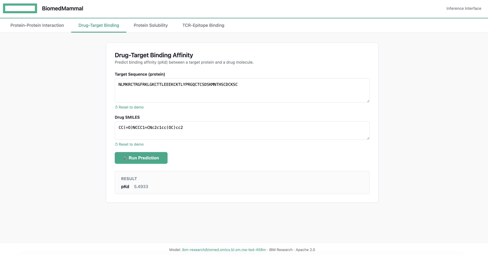
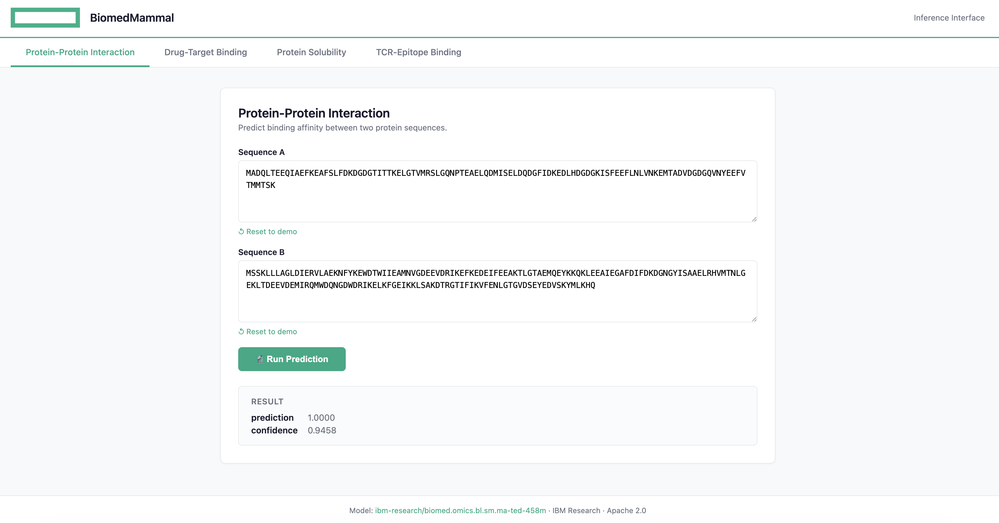
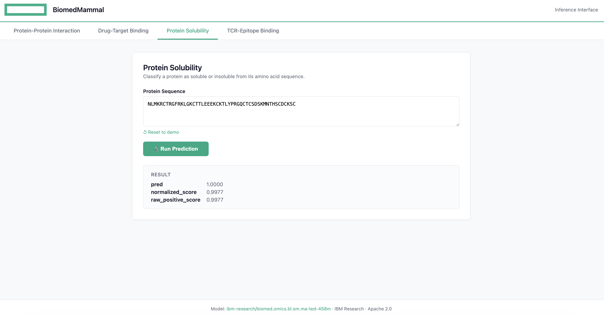
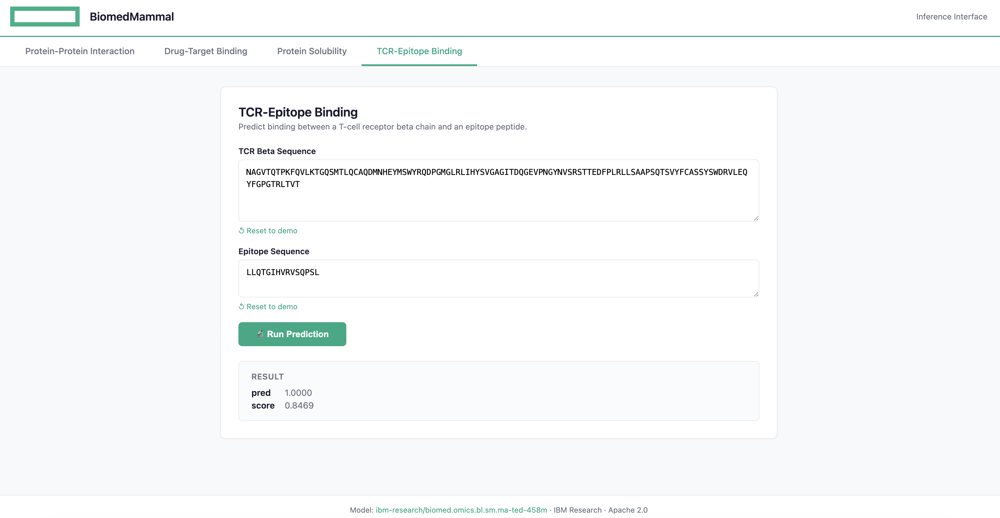

#  **Molecular Aligned Multi-Modal Architecture and Language** (MAMMAL) 
| Owner                 | Name              | Email                              |
| ----------------------|-------------------|------------------------------------|
| Use Case Owner              | Francesco Caliva | francesco.caliva@hpe.com |
| PCAI Deployment Owner       | Francesco Caliva     | francesco.caliva@hpe.com    

# Introduction

The `ibm/biomed.omics.bl.sm.ma-ted-458m` model is a biomedical foundation model trained on over 2 billion biological samples across multiple modalities, including proteins, small molecules, and single-cell gene data.
Designed for robust performance, it achieves state-of-the-art results over a variety of tasks across the entire drug discovery pipeline and the diverse biomedical domains.

Based on the **Molecular Aligned Multi-Modal Architecture and Language** (MAMMAL), a flexible, multi-domain architecture with an adaptable task prompt syntax.
The syntax allows for dynamic combinations of tokens and scalars, enabling classification, regression, and generation tasks either within a single domain or with cross-domain entities.


# MAMMAL Service

In this repository, we provide a BentoML inference service for the aforementioned model [ibm-research/biomed.omics.bl.sm.ma-ted-458m](https://huggingface.co/ibm-research/biomed.omics.bl.sm.ma-ted-458m), a 458M-parameter biomedical foundation model by IBM Research.

Supports **4 tasks** via a single `POST /predict` endpoint. CPU by default, GPU opt-in via `DEVICE=cuda`.

## Tasks

| Task | Inputs | Output | Model Source |
|---|---|---|---|
| `protein_protein_interaction` | `sequence_a`, `sequence_b` | `{prediction, confidence}` | Base model (zero-shot) |
| `drug_target_binding` | `target_sequence`, `drug_smiles` | `{pKd}` | Fine-tuned `...dti_bindingdb_pkd` |
| `protein_solubility` | `protein_sequence` | `{pred, normalized_score}` | Fine-tuned `...protein_solubility` |
| `tcr_epitope_binding` | `tcr_beta_sequence`, `epitope_sequence` | `{pred, score}` | Fine-tuned `...tcr_epitope_bind` |

## Deployment in HPE Private Cloud  

Within AI Essentials, use the import tools and frameworks wizard and import the [helm chart](charts/biomed-mammal-serve-0.1.3.tgz) to install the application.


### Example use

Predict drug target binding affinity:
 
Predict protein-protein interaction:
 
Predict protein solubility
 
Predict tcr epitope binding



### Development Notes
This repository had a strong contribution by [DeepSeek V4 Flash](https://recipes.vllm.ai/deepseek-ai/DeepSeek-V4-Flash), deployed on HPE Private Cloud AI using its Machine Learning Inference Softaware and used via [OpenCode](https://opencode.ai/) AI coding assistant.
## Local deployment 

```bash
cd biomed-mammal

# First-time setup on a new machine
python3.12 -m venv .venv
source .venv/bin/activate
pip install -r requirements.txt

# Build (pass HF_TOKEN for faster downloads)
HF_TOKEN=hf_your_token_here bentoml build

# Serve locally on CPU (models pre-cache at startup, then inference is instant)
bentoml serve
```


### Test each task

```bash
# Protein-protein interaction
curl -X POST http://localhost:3000/predict \
  -H "Content-Type: application/json" \
  -d '{
    "task": "protein_protein_interaction",
    "inputs": {
      "sequence_a": "MADQLTEEQIAEFKEAFSLFDKDGDGTITTKELGTVMRSLGQNPTEAELQDMISELDQDGFIDKEDLHDGDGKISFEEFLNLVNKEMTADVDGDGQVNYEEFVTMMTSK",
      "sequence_b": "MSSKLLLAGLDIERVLAEKNFYKEWDTWIIEAMNVGDEEVDRIKEFKEDEIFEEAKTLGTAEMQEYKKQKLEEAIEGAFDIFDKDGNGYISAAELRHVMTNLGEKLTDEEVDEMIRQMWDQNGDWDRIKELKFGEIKKLSAKDTRGTIFIKVFENLGTGVDSEYEDVSKYMLKHQ"
    }
  }'

# Drug-target binding
curl -X POST http://localhost:3000/predict \
  -H "Content-Type: application/json" \
  -d '{
    "task": "drug_target_binding",
    "inputs": {
      "target_sequence": "NLMKRCTRGFRKLGKCTTLEEEKCKTLYPRGQCTCSDSKMNTHSCDCKSC",
      "drug_smiles": "CC(=O)NCCC1=CNc2c1cc(OC)cc2"
    }
  }'

# Protein solubility
curl -X POST http://localhost:3000/predict \
  -H "Content-Type: application/json" \
  -d '{
    "task": "protein_solubility",
    "inputs": {
      "protein_sequence": "NLMKRCTRGFRKLGKCTTLEEEKCKTLYPRGQCTCSDSKMNTHSCDCKSC"
    }
  }'

# TCR-epitope binding
curl -X POST http://localhost:3000/predict \
  -H "Content-Type: application/json" \
  -d '{
    "task": "tcr_epitope_binding",
    "inputs": {
      "tcr_beta_sequence": "NAGVTQTPKFQVLKTGQSMTLQCAQDMNHEYMSWYRQDPGMGLRLIHYSVGAGITDQGEVPNGYNVSRSTTEDFPLRLLSAAPSQTSVYFCASSYSWDRVLEQYFGPGTRLTVT",
      "epitope_sequence": "LLQTGIHVRVSQPSL"
    }
  }'
```

## Configuration

| Env Var | Default | Description |
|---|---|---|
| `DEVICE` | `cpu` | Set to `cuda` for GPU inference |
| `HF_TOKEN` | *(none)* | HuggingFace token — speeds up model downloads during build or first startup |

### GPU support

```bash
# Local
DEVICE=cuda bentoml serve

# BentoCloud — set env var in deployment config
bentoml deploy . -n biomed-mammal   # requires env DEVICE=cuda

# Docker
docker run --gpus all -e DEVICE=cuda -p 3000:3000 fcaliva/biomed-mammal:latest
```

### HuggingFace Token

Models are public (Apache 2.0), so a token is optional. But passing one improves CDN throughput, especially for the 4 checkpoints (~7GB total).

The token is used in two places:

- **At build time** — `setup.sh` pre-caches models into the Docker image. Pass it during `bentoml containerize`.
- **At startup** — `service.py` pre-caches models via `snapshot_download()` on first boot. Pass it in `bentoml serve` or as a BentoCloud/K8s env var.

**Never hardcode the token** in source files. Use environment variables:

```bash
# Build
export HF_TOKEN=hf_your_token_here
bentoml build
bentoml containerize ...

# Local serve
export HF_TOKEN=hf_your_token_here
bentoml serve

# BentoCloud / K8s — set HF_TOKEN as a secret or env var
```

After the models are cached (either in the Docker image or on disk), the token is no longer needed for subsequent runs.

### Faster Downloads (hf-transfer)

By default, HuggingFace downloads each file sequentially in a single thread. The [`hf-transfer`](https://github.com/huggingface/hf-transfer) library uses a Rust-based parallel backend that can cut download time by 2-4x:

```bash
# Enable parallel downloads
export HF_HUB_ENABLE_HF_TRANSFER=1

# Then run build or serve as usual
HF_TOKEN=hf_your_token_here bentoml build
```

`hf-transfer` is included in `requirements.txt` and installed in `setup.sh`. It's lightweight with zero runtime overhead after downloads complete.

## Deploy to BentoCloud

```bash
bentoml cloud login
bentoml deploy . -n biomed-mammal
```

Recommended: configure `DEVICE=cuda` and a GPU instance type (e.g. `gpu.h100.1`) in the deployment settings.

## Containerize for K8s based deployment

```bash
# Build Docker image (models are pre-cached inside)
HF_TOKEN=hf_your_token_here bentoml containerize biomed_mammal_service:latest --platform linux/amd64

# Tag and push
docker tag biomed_mammal_service:latest fcaliva/biomed-mammal:latest
docker push fcaliva/biomed-mammal:latest
```

Use the image in a standard K8s Deployment with `nvidia.com/gpu: 1` and `DEVICE=cuda`. No PVC needed — models are baked into the image.

## Project Structure

```
biomed-mammal/
├── service.py          # BentoML @bentoml.service — pre-caches at startup, lazy model loading
├── task_helpers.py     # Exact inference code from the official biomed-multi-alignment repo
├── bentofile.yaml      # Build configuration
├── setup.sh            # Strips TF, pre-caches models at Docker build time
├── README.md           # This file
└── .bentoignore        # Excludes .venv/.env from build context
```

## How It Works

### Model Pre-caching

Models are downloaded **once** and cached at three levels:

1. **Docker image** — `setup.sh` runs at `bentoml containerize`, downloading all 4 checkpoints into `~/.cache/huggingface/hub/`. Every container starts with models ready.
2. **Startup** — `service.py`'s `__init__` calls `snapshot_download()` for each model. If already cached (from Docker or a previous run), this is a no-op.
3. **On-disk cache** — `~/.cache/huggingface/hub/` persists across `bentoml serve` restarts on the same machine.

This means **zero model downloads during inference** — no timeout risk, no HF dependency at request time.

### Lazy Model Loading

Model files are cached at startup, but models are only **loaded into GPU/CPU memory** on first request to each task. A task you never call uses zero RAM.

### Inference Correctness

`task_helpers.py` contains the **exact prompt construction and output parsing logic** from IBM's official `biomed-multi-alignment` repo — copied verbatim from their `data_preprocessing()` and `process_model_output()` static methods. No reimplementation risk.

### No TensorFlow Bloat

`setup.sh` removes TensorFlow after install (~3GB saved). All inference code paths are pure PyTorch.

### No Training Dependencies

Modules like `PyTDC`, `wget`, and `anndata` (used only for fine-tuning) are never imported at inference time.
