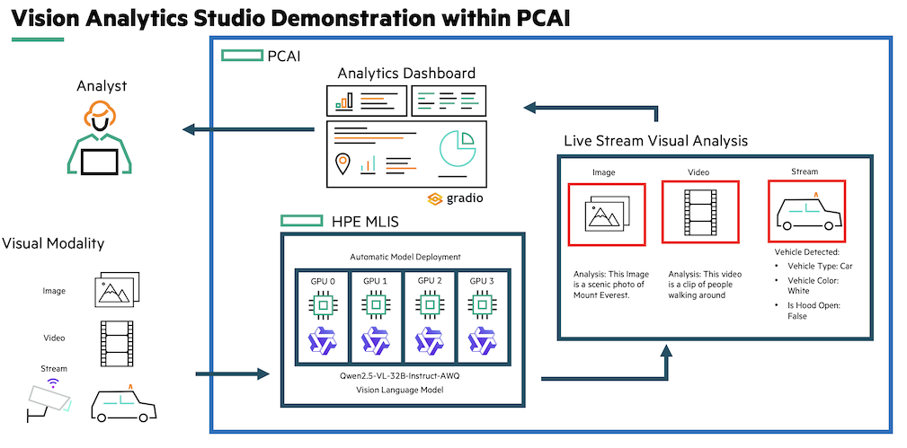

# Vision Analytics Demo on HPE Private Cloud AI

| Owner                       | Name                              | Email                                     |
| ----------------------------|-----------------------------------|-------------------------------------------|
| Use Case Owner              | Hoang Phan                      | hoang.phan@hpe.com                      |
| PCAI Deployment Owner       | Andrew Mendez                     | andrew.mendez@hpe.com                     |

This project demonstrates a powerful, interactive application to analyze images, videos, and real-time video streams using a Vision Language Model (VLM). The application is built with Gradio, containerized with Docker, and designed for seamless deployment on **HPE Private Cloud AI (PCAI)** using a reusable Helm chart.

Users can analyze an image, video clip, or connect a live rtsp stream with a  deployed VLM with a custom prompt to extract structured information.


---

### Context on Customer and Use Case

This demo is ideal for customers looking to analyze images, video, or live streams to automate manual visual inspection.

### Solution Overview and Demo Video



▶️ [Demo Video [TODO]]()

---

### Key Features
*   **VLM Configuration:** Configure the VLM's API endpoint and key directly within the Gradio UI, allowing for easy switching between different models or environments.
*   **Image Analysis Tab :** Upload an image and enter prompt to extract visual insights from image.
*   **Video Understanding Tab :** Upload an video and enter prompt to extract visual insights from image. Vision understanding is configure to select number of frame, framerate, and the amount of duration to analyze
*   **On-Demand Live RTSP Steam Analysis:** Capture a single frame from any live stream and send it to a Vision Language Model for analysis.
*   **Structured Data Extraction:** The VLM prompt in RSTP Stream Tab, its configurable to return structured data (e.g., vehicle type, color, status), which the application parses into a clean JSON object.
*   **Data Export:** Download the parsed JSON data for any analysis with a single click.
*   **HPE PCAI Optimized:** Packaged as a Helm chart that integrates with PCAI's Istio gateway and "Tools & Frameworks" deployment model.

---

## Prerequisites

### 1. Model Deployment in HPE PCAI

This application requires a Vision Language Model to be deployed and running within the HPE Machine Learning Inference Software Tool. The prompt is specifically tailored for:

*   **Model:** `Qwen/Qwen2.5-VL-32B-Instruct-AWQ`
*   **Details:** [Hugging Face Model Card](https://huggingface.co/Qwen/Qwen2.5-VL-32B-Instruct-AWQ)

Before deploying this application, you must:
1.  Deploy the `Qwen/Qwen2.5-VL-32B-Instruct-AWQ` model in your HPE PCAI environment.
2. Set the HUGGINGFACE_HUB_TOKEN in the Advanced Packaged Model Tab. 
2. When creating the packaged model, here is the configuration to have this model deployed on a single L40s:
`--model Qwen/Qwen2.5-VL-32B-Instruct-AWQ --port 8080 --quantization awq_marlin --dtype float16 \ --max-model-len 8192 --max-num-seqs 1` 
2.  Obtain the **API Base URL** from MLIS (the model's inference endpoint).
3.  Generate and copy an **API Key** from MLIS for accessing the model.

You will need the API Base URL and API Key to configure the application after it is deployed.

### 2. Local Development Tools

*   **Docker:** To build and push the application container image.
*   **Helm 3.x:** To package the Kubernetes deployment chart.
*   **`kubectl`:** (Optional) For inspecting the deployment in your Kubernetes cluster.

---

## Quickstart: Build and Deploy

The process involves three main steps: building the Docker image, packaging the Helm chart, and deploying it through the HPE PCAI user interface.

### Step 1: Build and Push the Docker Image

The application code is packaged into a Docker image which will be pulled by your Kubernetes cluster.

1.  Navigate to the `docker` directory:
    ```bash
    cd docker/
    ```

2.  Ensure you are logged into a Docker registry that your PCAI cluster can access (e.g., Docker Hub, a private registry).
    ```bash
    docker login
    ```

3.  Login to your dockerhub account to enable uploading docker images. Modify the `IMAGE_NAME="mendeza/vision_analytics_demo"` to your dockerhub username. Then you can execute the build script. This will build the image for the `linux/amd64` platform and push it to the registry. The default image name is `mendeza/vision_analytics_demo:0.0.1`.
    ```bash
    bash build.sh
    ```

### Step 2: Package the Helm Chart

The Helm chart contains all the Kubernetes manifests needed to run the application on PCAI.

1.  Navigate to the `helm` directory:
    ```bash
    cd helm/
    ```

2.  (Optional) Package the chart into a `.tgz` archive.
    ```bash
    helm package .
    ```

3.  This command will create a file named `vision-analytics-chart-0.1.0.tgz`. This is the file you will upload to PCAI.

### Step 3: Deploy via HPE Private Cloud AI

1.  Log in to your **HPE Private Cloud AI** console.
2.  Navigate to **Tools & Frameworks** from the side menu.
3.  Click **Import Framework**.

    *   **Step 1: Framework Details**
        *   **Framework Name:** `vision-analytics-chart`
        *   **Description:** `An interactive UI to analyze frames from MJPEG streams with a Vision Language Model.`
        *   Optionally, upload a logo.
        *   Click **Next**.

    *   **Step 2: Upload Package**
        *   Upload the `vision-analytics-chart-0.1.0.tgz` file you created in the previous step.
        *   Choose a **Namespace** to deploy into (e.g., your project's namespace).
        *   Click **Next**.

    *   **Step 3: Review & Deploy**
        *   The UI will display the contents of the `values.yaml` file.
        *   **IMPORTANT:** You must configure the ingress endpoint. Locate the `ezua.virtualService.endpoint` key and update its value to match your PCAI environment's domain. For example:
          `endpoint: "vision-app.${DOMAIN_NAME}"` To something like this:  `endpoint: "vision.my-namespace.ingress.pcai-cluster.hpecolo.net"`
        *   Review other values if needed (e.g., `replicaCount`, `resources`).
        *   Click **Deploy**.

---

## Using the Application

1.  Once the deployment is complete, navigate to **Imported Frameworks > Data Science** in PCAI to find and launch the application.
2.  The application will open in a new tab.

### Initial Configuration

Before you can analyze frames, you must configure the VLM endpoint:

1.  Expand the **Vision Model Configuration** accordion at the top.
2.  Enter the **API Key** and **API Base URL** that you obtained from your MLIS model deployment in the prerequisites.
3.  Click **Apply Configuration**. A status message will confirm if the connection was successful.

### Analyze an Image

1.  Select the **Image Understanding** tab.
2.  Upload an image file, and  configure the prompt to specify what you want the vision language model to do
    * default prompt: `Describe this image in detail. Include key objects, colors, text, and notable actions.`
    * The best prompt to use for this [image](assets/wildfire2.png) is: `Describe the scene in the photo.`
5.  When the model completes its analysis, it will send its response to the **LLM Response** field

### Analyze an video

1.  Select the **Video Understanding** tab.
2.  Upload a video file, and  configure the prompt to specify what you want the vision language model to do
    * default prompt: `Did a car run a redlight in this video?`
    * The best prompt to use for [video](assets/fmv_clip.mp4) is: `Describe the vehicles in this video.`
5.  When the model completes its analysis, it will send its response to the **LLM Response** field

### Analyzing a Stream

1.  Select the **RTSP Stream** tab.
2.  Enter an MJPEG stream URL and click **Start Stream**.
3.  Once the video is playing, you can click **Analyze Current Frame**.
4.  The application will capture the latest frame, send it to the VLM, and display the raw text output and the parsed JSON object below.
5.  Click **Save Parsed JSON** to download the results.
